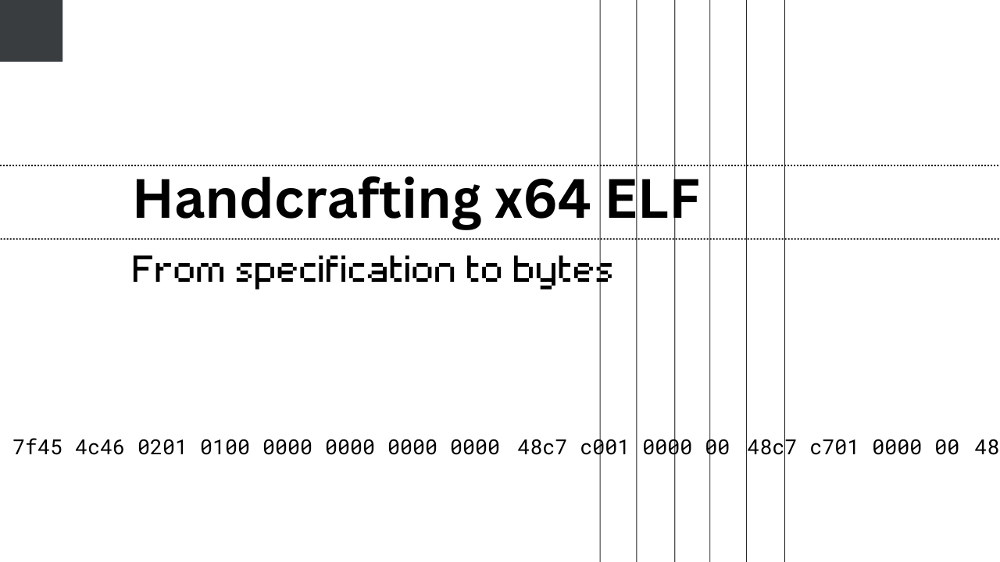

### Introduction

Let’s start by asking a question, _“How do I make a program without using a compiler?”._ Now if you ask _“why?”_, I’d try to give you plenty of reasons along the way but I assume you are here either because _“you have to”_ or _“you want to”_.

We will go through _“Compilation Process”_, _“ELF Specification”_, _“Encoding x86–64 assembly instructions”_ in brief and finally put it all together to create a basic program that prints **“Hello, Mom!”**.

You might say, _“All that for a simple hello-world program?”_, I’d say _“Take the red pill and start peeling away the layers of abstraction”_.

### Compilation Process

Often when the conversation begins about _“Compilation”_ or _“Compilers”_ they abruptly ends at _“Compiler is a program that takes your source code and converts it to machine code that is executed by the computer”_. Let’s try to dig a bit deeper into this idea.

> A `Compiler` is defined as a `Computer Program` that **_translates_**  
> _“Source Language”_ into _“Target Language”_.

In _GNU/Linux_ based environment, we often find ourselves using `gcc` program which is a “front-end” in _“GNU Compiler Collection”_ from _“GNU Project”_ to **compile** `C` source language into `machine` target language.

So, it translates from a language that we _(humans)_ can understand to a language that our CPU _(machine)_ can understand. Now this _“translation”_ happens in multiple steps or phases when we run the `gcc` program as we can see it being mentioned in the manual pages of `gcc` .

> When you invoke GCC, it normally does preprocessing, compilation, assembly and linking. — [man7.org/gcc1](https://man7.org/linux/man-pages/man1/gcc.1.html)

Refer to _Fig 1.1_ below to get an overview of this. Let’s go through each of the phases to introduce our protagonist, `ELF` `Executable` .

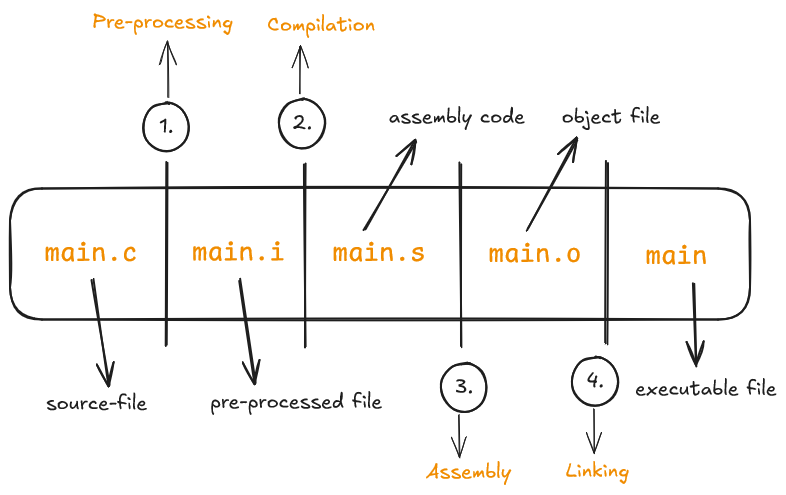

1.  `main.c` is a source file that we write in `C` programming language. It can be an impure `C` file if it contains `pre-processor` `directives` .
2.  `main.i` is a pure `C` file that is the result of `pre-processing` step which is done by `cpp` program. It resolves all `pre-processor` `directives` such as `#include` and `#define` .
3.  `main.s` is a processor-specific and human-readable `assembly code` file that is the result of `compilation` step which is done by `gcc` program.
4.  `main.o` is an `ELF` `relocatable` file produced as a result of `assembly` step which is done by `as ` program. It contains `machine code` but is not ready to be executed yet.  
    — “Relocatable” means that `instructions` inside the file is not meant to hold any assumption about memory location of `functions` used in the program code.   
     — One way to achieve this functionality is by leaving `symbolic references` in the file.  
     — These `references` must be resolved during the `Linking` phase or the `Loading` phase by the `Linker` or the `Loader` respectively.
5.  `main` is an `ELF` `executable` file produced as a result of `linking` step which is done by `Linker` program called `ld` that combines a number of `object` files, relocates their `data` and ties up `symbolic references`.  
     — `References` to `static` `libraries` are resolved by merging them into our program’s code.  
     — `References` to `dynamic` `libraries` are resolved by the `loader` when our program runs.

Refer to Fig 1.2 below to take a look at _symbolic references_ and what happens to them after the _“Assembly”_ phase and after the _“Linking”_ phase.

_Note :: Call to dynamic library function such as_ `printf` _is not resolved completely. It involves Procedure Linkage Table, Global Offset Table and Lazy Loading. You are encouraged to research this further._

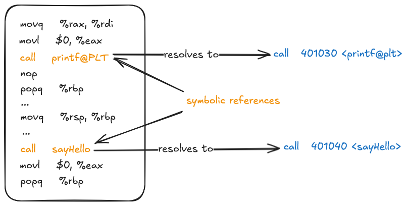

Refer to the `code snippet` below to try out the `programs` involved in various steps of compilation process and read through their outputs.

```c
#include <stdio.h>

void sayHello(void) {
  printf("%s", "Hello");
}

int main(void) {
  sayHello();
  return 0;
}
```

```sh
# Pre-processing
cpp main.c -o main.i
# Compilation
gcc -S main.i -o main.s
# Assembly
as main.s -o main.o
# Linking
ld main.o -o main /lib/x86_64-linux-gnu/crt1.o /lib/x86_64-linux-gnu/crti.o /lib/x86_64-linux-gnu/crtn.o /lib/x86_64-linux-gnu/libc.so -I /lib64/ld-linux-x86-64.so.2

# View Disassembly
objdump -D main.o -M intel
objdump -D main -M intel

# Debugging
## Break and Step through call to printf() function
gdb main
```

> An observation that we can make now is that `Compilation` process is a series of _translations_ performed successively from source to destination languages and every translation performed has an underlying logic.

At the end of this process what we get is called an `ELF` `Executable` file, a program that can run on our computers.

### ELF Specification in Brief

Let’s try to gain sufficient understanding about how this _ELF_ or _Executable and Linkable Format_ is supposed to be written in-order for it to be _executed_ or ran by the operating system.

Throughout this part, I will be taking direct references from [_Tool Interface Standard (TIS) Executable and Linking Format (ELF) Specification Version 1.2_](https://refspecs.linuxfoundation.org/elf/elf.pdf). Feel free to take a look in that for more details.

Along with that, please take a look at `/usr/include/elf.h` or [linux/elf.h](https://github.com/torvalds/linux/blob/master/include/uapi/linux/elf.h) for the definition of ELF file. It has values for entries that we eventually have to write to or you will see being used here. Now, lets get started.

> An executable file holds a program suitable for execution; the file specifies how exec(BA\_OS) creates a program’s process image.

An `ELF` file can participate in `Linking` process and/or in `Execution` process. It provide us with two ways to parse it or look at it, one from the eyes of a `Linker` during `Linking` process and one from the eyes of a `Loader` during `Execution` process.

Since we are currently interested in making a simple `Executable`, we can ignore the `Linking View` that it provides and try to assume ourselves in the role of a `Loader` and focus on the `Execution View` instead.

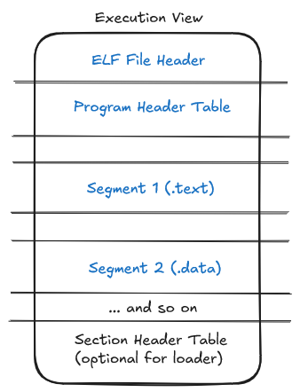

Here `Segments` have no specified order. Only the `ELF File header` has a fixed position in the file. `Loader` will use `ELF Header` to get an overview of the file and parse all other information about our `executable`.

#### Overview of Key Terms

*   A **_section header table_** contains information describing the file’s `sections`. Every `section` has an entry in the table; each entry gives information such as the `section` `name`, the `section` `size`, and so on.
*   Files used during `linking` must have a **_section header table_** ; other  
    object files _may or may not have one_.
*   `Sections` hold the bulk of object file information for the linking view: _instructions, data, symbol table, relocation information, and so on_.
*   A **_program header table_** is _an array of structures_, each describing a `segment` or other information the system needs to _prepare the program for execution_.
*   An object file `segment` contains one or more `sections`.
*   `Segment` is a term used to talk about _to-be-loaded_ `section` or `sections` in context of the `Execution View` .

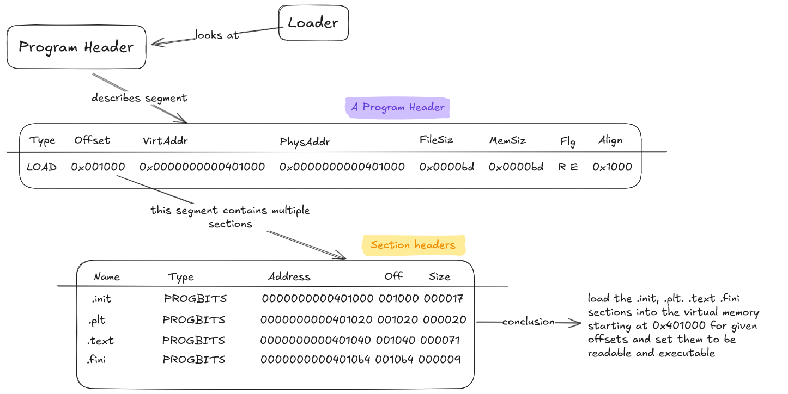

#### ELF File Header

> An ELF header resides at the beginning and holds a ‘‘road map’’ describing the file’s organization.

*   `e_ident`   
     — 16 bytes in size. Position \[0x00 to 0x0F\].  
     — 4 bytes _Magic Value +_ 1 byte _x64/x32_ + 1 byte _LSB/MSB_ \+ 1 byte ELF Version + 1 byte OS Version + 1 byte ABI Version + 7 bytes padding that is reserved for future use.  
     — Values for the above can be found at `/usr/include/elf.h` and more information at [man5/elf.h](https://man7.org/linux/man-pages/man5/elf.5.html).

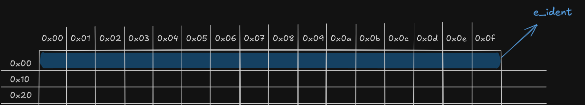

*   `e_type`   
     — 2 bytes in size. Position \[0x10 to 0x11\].  
     — Type of ELF File, for example `Executable` , `Relocatable` , `Core Dump` , etc.
*   `e_machine`   
     — 2 bytes in size. Position \[0x12 to 0x13\].  
     — Specifies the required architecture for the ELF file, for example `x86_64` , `ARM` , etc.
*   `e_version`   
     — 4 bytes in size. Position \[0x14 to 0x17\].  
     — Specifies object file version, for example `1` .

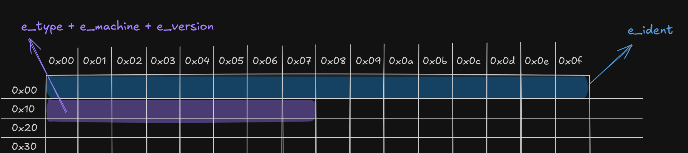

*   `e_entry`   
     — 8 bytes in size for x64. Position \[0x18 to 0x1f\].  
     — Specifies the _virtual address_ to which the _system_ first transfers control, thus starting the process.  
     — Written in _Little-endian_ or _LSB First_ order. For example, if the address is `0x4000a0` then it will be written as `\xa0\x00\x40` .  
     — Make sure it is _page-aligned_ i.e multiple of _0x1000._

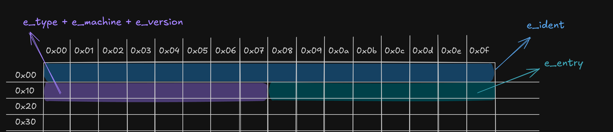

*   `e_phoff`   
     — 8 bytes in size for x64. Position \[0x20 to 0x27\].  
     — Specifies the _program header table_’s file offset in bytes.
*   `e_shoff`   
     — 8 bytes in size for x64. Position \[0x28 to 0x2f\].  
     — Specifies the _section header table_’s file offset in bytes. If the file has no _section header table_, this member holds zero.

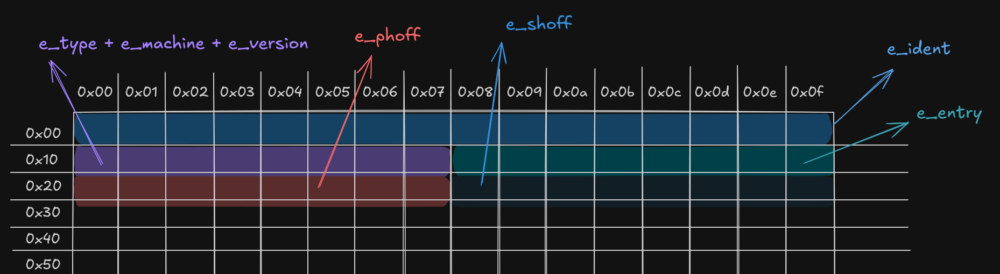

*   `e_flags`   
     — 4 bytes in size. Position \[0x30 to 0x33\].  
     — Provide room for flags specific to the architecture for which the binary is compiled.  
     — Look for `Elf64_Ehdr.e_flags` in `/usr/include/elf.h` for its values. I’ve seen it all `0s` in compiled binaries, so I will let it be that.
*   `e_ehsize`   
     — 2 bytes in size. Position \[0x34 to 0x35\].  
     — Specifies the ELF header’s size in bytes.  
     — `64-bytes` size in our case and probably in all.
*   `e_phentsize`   
     — 2 bytes in size. Position \[0x36 to 0x37\].  
     — Specifies the size in bytes of one entry in the file’s program header table; all entries are the same size.
*   `e_phnum`   
     — 2 bytes in size. Position \[0x38 to 0x39\].  
     — Specifies the number of entries in the _program header table_. Thus the  
    product of `e_phentsize` and `e_phnum` gives the table’s size in bytes.


*   `e_shentsize`   
     — 2 bytes in size. Position \[0x3a to 0x3b\].  
     — It specifies _section header_’s size in bytes. A section header is one entry in the section header table; all entries are the same size.
*   `e_shnum`   
     — 2 bytes in size. Position \[0x3c to 0x3d\].  
     — It specifies the number of entries in the _section header table_. Thus the product of `e_shentsize` and `e_shnum` gives the _section header table_’s size in bytes.   
     — If a file has no section header table, `e_shnum` holds the value zero.
*   `e_shstrndx`   
     — 2 bytes in size. Position \[0x3e to 0x3f\].  
     — It contains the index (in the _section header table_) of the `header` associated with a special _string table section_, called `.shstrtab`.  
     — If the file has no `section` name string table, this member  
    holds the value `0`.  
     — ` .shstrtab` is a dedicated `section` that contains a table of null-terminated ASCII strings, **which store the names of all the sections in the binary**.

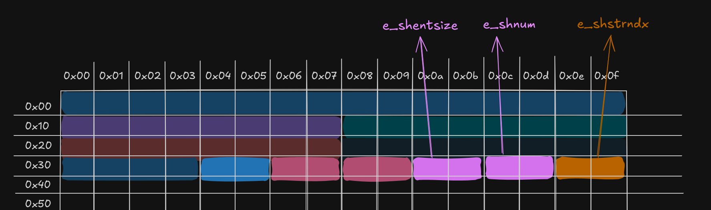

#### Program Header Table

> A program header table, if present, tells the system how to create a process image.

*   `p_type`   
     — 4 bytes in size. Position \[0x40 to 0x43\].  
     — Specifies what kind of `segment` this array element describes.  
     — For example, a `segment` can be of type `PT_LOAD` which tells that this `segment` is meant to be _loaded_ into the _virtual memory_ while setting up the process.
*   `p_flags`   
     — 4 bytes in size. Position \[0x44 to 0x47\].  
     — Specifies the runtime access _permissions_ for the `segment` . For example, if the `segment` is `Readable` , `Writable` or `Executable` .
*   `p_offset`   
     — 8 bytes in size. Position \[0x48 to 0x4f\].  
    — Specifies the offset from the beginning of the file at which the first byte of the `segment` resides.

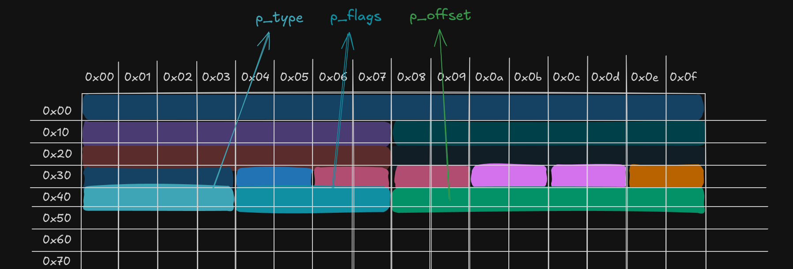

*   `p_vaddr`   
     — 8 bytes in size. Position \[0x50 to 0x57\].  
     — Specifies the _virtual address_ at which the first byte of the `segment` resides in memory.  
     —Written in _Little-endian_ or _LSB First_ order. For example, if the address is `0x400000` then it will be written as `\x00\x00\x40` .  
     — Important :: For **loadable** `segments`, the difference between the `p_vaddr` and the `p_offset` must be divisible by the _page size_ i.e `0x1000` bytes or `4096` bytes.  
    — `(p_vaddr — p_offset) % 0x1000 == 0` must hold _true_.
*   `p_paddr`   
     — 8 bytes in size. Position \[0x58 to 0x5f\]  
     — On systems for which _physical addressing_ is relevant, this field is reserved for the `segment`’s _physical address_.  
     —In modern _GNU/Linux_ based system all programs are executed with the help of _virtual memory_ and so this field is left unused.

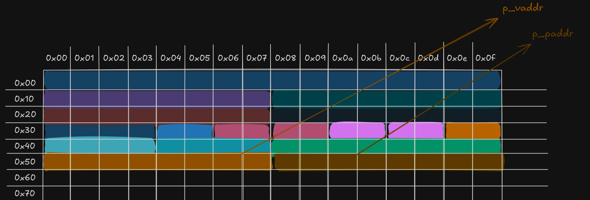

*   `p_filesz`   
     — 8 bytes in size. Position \[0x60 to 0x67\].  
     — Specifies the file size of the `segment` in bytes. It is measured from beginning of the file.
*   `p_memsz`   
     — 8 bytes in size. Position \[0x68 to 0x6f\].  
     — Specifies the size of the `segment` that is loaded in the virtual memory in bytes.  
     — It can be greater than `p_filesz` , for example in case of a `.bss` section.
*   `p_align`   
     — 8 bytes in size. Position \[0x70 to 0x77\].  
     — Specifies the value to which the `segments` are aligned in memory and in the file.  
     — Usually, `0x1000` bytes. This value should be written in Little-endian order i.e `\x00\x10` .

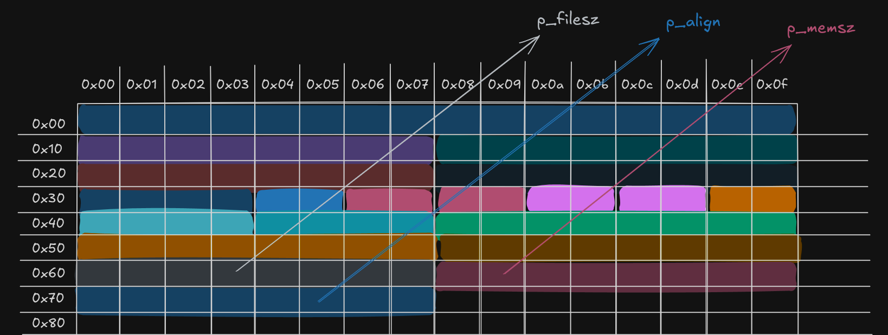

At this point we’ve gone through two components which we would require to write our own ELF `Executable` i.e `ELF File Header` and `Program Header Table` . It is time for us recap our goal and Fig 2.10 might help us see the overall portrait of our file.

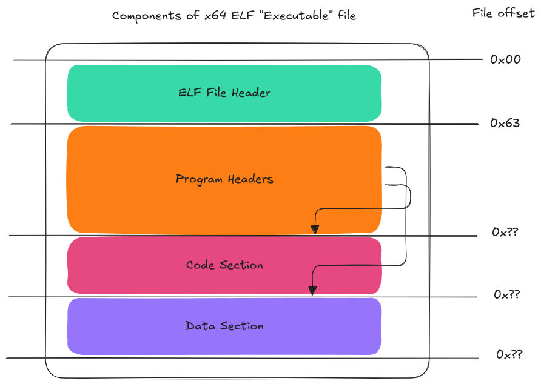

Take a look at commands given below to inspect an `ELF` file and observe what is discussed above with an `executable` of your choice.

```sh
# Read ELF File Headers
readelf -h main

# Read Program Headers, also observe Segment to Section/s mapping
readelf --segments --wide main

# Read Sections Headers
readelf --sections --wide main
```

Next component in our recipe for `ELF Executable` would be the contents of _“Code Section”_ and as the name implies, it will have _“code”_ that will be executed by our computer but wait, we are not using any high-level programming language. Remember, we rejected the use of `Compilers` to venture on this path. So, what will our _“code section”_ will have? Assembly!

Human-readable _assembly_ is essentially **mnemonics** for machine code (_binary instructions_) and we write it like any other language that is in “text” which is not really a cup of tea for our CPU to directly process and thus, we need to encode “written assembly” back to _binary instructions_. Thankfully, we have `hexadecimal` system to work with instead of `base-2` `1s` and `0s` to not make the process an eyesore to witness.

### Encoding x86-64 Assembly

As I mentioned in the _Introduction_ part, our program is going to be a simple one that will write _“Hello, Mom!”_ to the console.

For this part, please go through the relevant sections for the following reference/s.  
 — \[1\] [General Purpose and System Instructions, AMD64 Architecture Programmer’s Manual](https://www.amd.com/content/dam/amd/en/documents/processor-tech-docs/programmer-references/24594.pdf) **_—_ For \[1\], kindly refer to Unit2_, Unit 3_ and _Unit 4_.**

#### Calling `write()` system-call

```s
mov rax, 0x01;
mov rdi, 0x01;
mov rsi, 0x600000;
mov rdx, 0x0b;
syscall;
```

*   In the table below look for `write` `syscall` row.   
     — We need `0x01` in `rax`.   
     — We need `0x01` in `rdi`. Since we want to print it to `stdout` .  
     — We need size of our message in `rdx` , `Hello, Mom!` is `12` bytes long including null terminator.
*   `0x600000` is a placeholder value for now since we have yet to determine or set virtual memory address at which our `data section` would end up at and that will be put into `rsi` register.

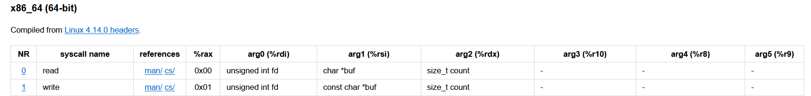

#### Calling `exit()` system-call

```s
mov rax, 0x3c;
mov rdi, 0x00;
syscall;
```

*   In the table below look for `exit` `syscall` row.  
     — We need `0x3c` in `rax`.  
     — We need `error` `code` in `rdi` which is `0` for us meaning `no error` .

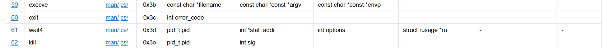

Now that we have the _assembly code_ ready. Let’s start by going through how _instructions_ are laid out in encoding process.

> An instruction is encoded as a string between one and 15 bytes in length. The entire sequence of bytes that represents an instruction, including the basic operation, the location of source and destination operands, any operation modifiers, and any immediate and/or displacement values, is called the instruction encoding.

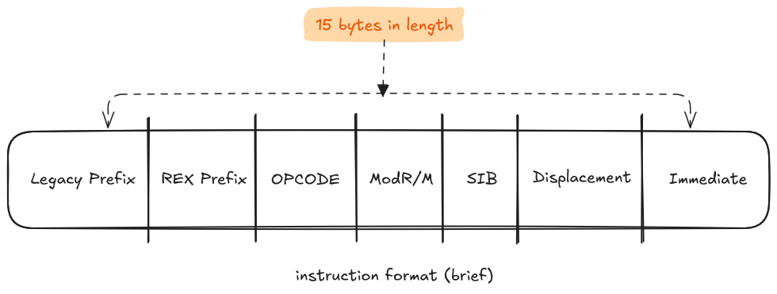

*   `Legacy Prefix`   
    — It modifies an instruction’s default address size, operand size, etc.  
     — We won’t be playing around with this for now.
*   `REX Prefix`   
     — It can be used in 64-bit mode to access the AMD64 _register_ number and size extensions.  
     — We will use this one to access and work with `64-bit` _registers_.
*   `OPCODE`   
     — It is a single byte that specifies the basic operation of an _instruction_.  
     — We will use it to specify our _instruction_ such as `mov` , `syscall` , etc.
*   `ModR/M`   
     —It specifies a `register` or an `opcode` `extension` and a `register` or a `memory address` .  
     — We can use it to specify _registers_ involved with our _instruction_.
*   `SIB`   
     — It is scale-index-base (SIB) byte, which is used to specify indexed _register-indirect_ forms of memory addressing.  
     — It helps with `base + (index * scale) + displacement` form of addressing.  
     — We will not be using this for now.
*   `Displacement`   
     — It is a `1, 2, 4, or 8` byte offset added to the calculated address in the `SIB` form.  
     — We will not be using this for now.
*   `Immediate`   
     — It is an immediate value. For example, `0x1337` or `0xcafebabe` .  
     — It is encoded in `8-bit` , `16-bit` , `32-bit` , `64-bit` forms.

#### Mod R/M and REX

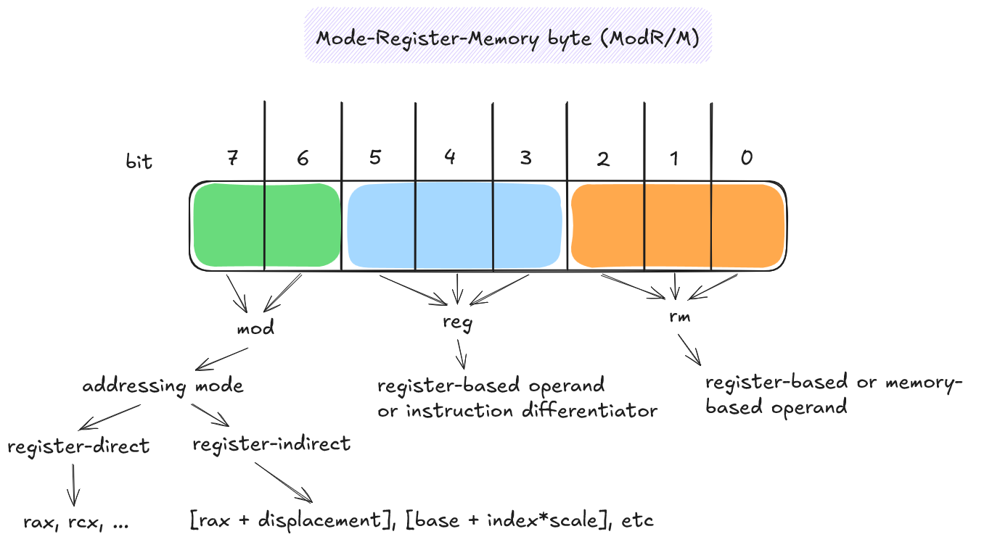

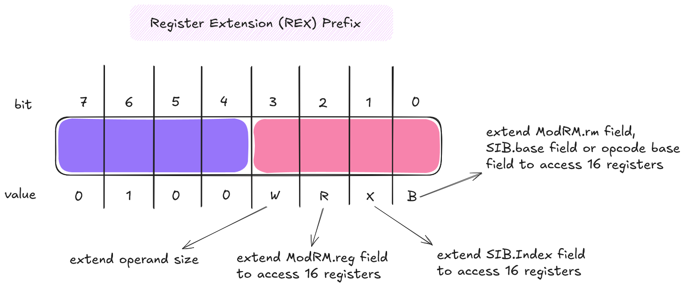

*   **Refer to** [**wiki.osdev.org/ModR2.FM**](https://wiki.osdev.org/X86-64_Instruction_Encoding#ModR.2FM) to know about all possible values used in encoding for each of the above fields and also for `REX` prefix.
*   To know about this _encoding byte_ in detail, please read from **Page-17 of of the mentioned** [**_\[1\]st manual_**](https://www.amd.com/content/dam/amd/en/documents/processor-tech-docs/programmer-references/24594.pdf)**.**
*   We will work primarily with this _byte_ to specify the registers we need.

Now, let’s work through encoding each instruction.

```s
mov rax, 0x01;
```

*   First, let’s find out the `opcode` for `mov` . **It is in _Page 234–235_ of the mentioned** [**_\[1\]st manual_**](https://www.amd.com/content/dam/amd/en/documents/processor-tech-docs/programmer-references/24594.pdf)**.**
*   We are moving an `immediate` value into a `register` so let’s look for a relevant `opcode` form of `mov` .

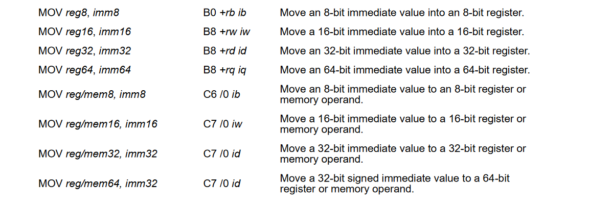

*   We see that `B8` and `C7` are available `opcodes` for what we want to do.
*   But what do these `/0` `id` in conjunction with `C7` and `+rq` `iq` in conjunction with `B8` mean?
*   Let’s take a look at **_2.5.2 Opcode Syntax_ in _Page 52_ of mentioned** [**_\[1\]st manual_**](https://www.amd.com/content/dam/amd/en/documents/processor-tech-docs/programmer-references/24594.pdf)**_._**

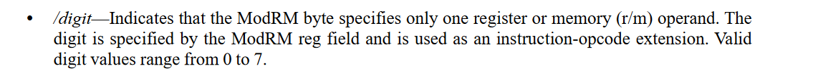

*   `/0` or `/digit` form tells us about two things. First, it implies that the instruction encoding for `ModR/M` byte specify either one `register` or `memory` operand. Second, the `digit` part which is the value of `ModR/M` ‘s `reg` field will act as an _opcode extension_ that can be used to distinguish one _instruction_ from another.
*   For example, both `TEST` and `NOT` instructions have opcode `F7` but different `/digit` or `ModR/M` ‘s `reg` field value to differentiate between the two.
*   Next, we have `id` and `iq` that we can find on the same _page_. These are used to specify an `immediate` value and in the form of `ix` where `x` represents different size of `immediate` values. `q` stands for `quad-word` or `8 bytes` while `d` stands for `double-word` or `4 bytes` .
*   As mentioned, `multi-byte` value starts with `low-order` byte first. For example, `0xcafebabe` will be `\xbe\xba\xfe\xca` .

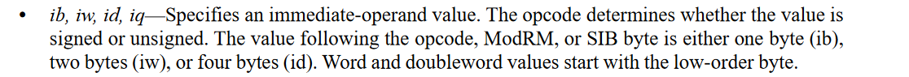

*   Lastly, we have notation `+rq` that can also be found on the same _page_. These are used to specify the _value (register-code)_ you can add to the `opcode` value to make it operate on a specific `register` .
*   For example, `B8` will use `eax` register as `destination` (without `REX` prefix). If you want it to use `ecx` register as `destination` then you can add `0x01` to `0xB8` which results in `B9` instruction that will operate on `ecx` . Please take a look at `Table 2-2` **as mentioned in the** [**_Manual_**](https://www.amd.com/content/dam/amd/en/documents/processor-tech-docs/programmer-references/24594.pdf) for more values to specify different registers.

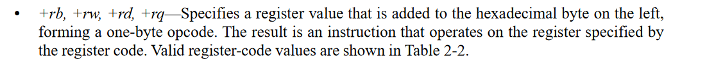

*   Okay, now let’s review our understanding of `B8` opcode and `C7` opcode for `MOV` instruction. `B8 +rq iq` will move a `8-bytes` `immediate` value   
    ( `iq` ) into a `register` specified by adding `register-code` to the `opcode` . So, two parts are present `opcode + immediate value` .
*   `C7 /0 id` will move a `4-bytes` immediate value ( `id` ) into either a `register` or a `memory (effective memory address)` operand using  
    `ModR/M` byte with `ModRM.reg` field set to `0` . So, three parts are present `opcode + ModR/M byte + immediate value` .
*   So, which one shall we use? `B8` opcode utilize less `bytes` and is rigid while `C7` utilize more `bytes` and is flexible. Well, It doesn’t really matter for us, for now.
*   I will use `C7` to show the use of `ModR/M and REX Prefix` properly. Feel free to diverge with me for this point.
*   Take a look at tables given at [**wiki.osdev.org/ModR2.FM**](https://wiki.osdev.org/X86-64_Instruction_Encoding#ModR.2FM) to calculate `ModR/M` value to specify registers we want to work with.

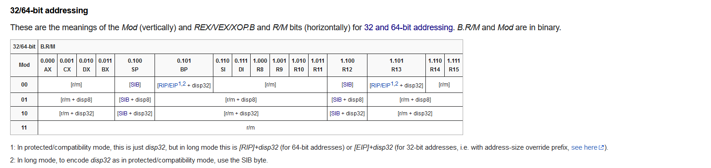

*   We know from the definition of `C7` opcode that `ModRM.reg` value is going to be set to `0b000` .
*   We want to use `register-direct` addressing i.e we want to use `registers` as operand so we will set `ModRM.mod` value to `0b11` .
*   Lastly, we want to put `immediate` value into `eax` register so therefore we will set `ModRM.rm` value to `0b000` . So, our `ModR/M` value at this point is `0b11000000` or `0xC0` .
*   Then we need to add `REX` `prefix` to our `instruction` `encoding` to use `64-bit` registers.

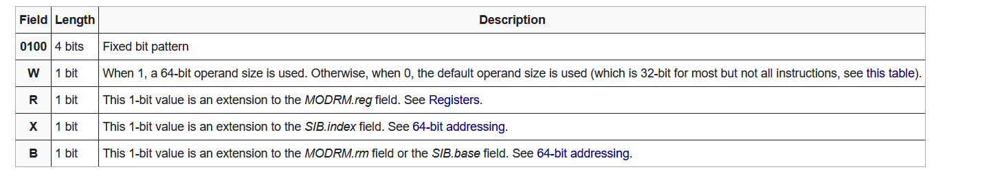

*   Starting `4-bits` of our `REX` `prefix` byte is fixed to `0b0100` . Then, we need to set `REX.W` value to `1` to extend `operand size` to `64-bits`. We know this by looking at the given table or from [the manual](https://www.amd.com/content/dam/amd/en/documents/processor-tech-docs/programmer-references/24594.pdf) **_Page 23, 1.4.4 Operand Addressing in 64-bit Mode._**
*   So, our `REX` `prefix` value is `0x01001000` or `0x48` . Thus, encoding of assembly instruction `mov rax, 0x01` is `\x48\xC7\xC0\x01\x00\x00\x00` .

```s
mov rdi, 0x01;
mov rsi, 0x600000;
mov rdx, 0x0b;
```

*   For remaining instructions, only difference will be in `registers` in use as `destination` `operand` . We will be playing with `ModR/M` byte for that.


*   To get `rdi` , we need to set `ModRM.rm` field to `111` . To get `rsi` , we need to set `ModRM.rm` field to `110` . To get `rdx` , we need to set `ModRM.rm` field to `010` . I hope you can see that in the given table.
*   Encoding for `mov rdi, 0x01` is `\x48\xC7\xC7\x01\x00\x00\x00` . Encoding for `mov rsi, 0x600000` is `\x48\xC7\xC6\x00\x00\x00\x06` . Encoding for `mov rdx, 0x0b` is `\x48\xC7\xC2\x0b\x00\x00\x00` .

```s
syscall;
```

*   Our final instruction `syscall` , if you look it up in the [the manual](https://www.amd.com/content/dam/amd/en/documents/processor-tech-docs/programmer-references/24594.pdf) at _Page 475_ then we will find its `opcode` which we can use.

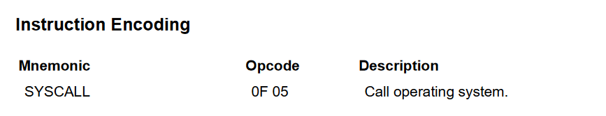

*   Encoding for `syscall` , obviously… turns out to be `\x0F\x05` .
*   Therefore, our complete encoding for `write()` syscall is the following.

```s
\x48\xc7\xc0\x01\x00\x00\x00 ==> mov rax, 0x01;
\x48\xc7\xc7\x01\x00\x00\x00 ==> mov rdi, 0x01;
\x48\xc7\xc6\x00\x00\x60\x00 ==> mov rsi, 0x600000;
\x48\xc7\xc2\x0C\x00\x00\x00 ==> mov rdx, 0x0C;
\x0f\x05                     ==> syscall;
```

*   Similarly for `exit()` syscall, it will be the following. _Make sure you practice it out before copy-pasting._

```s
\x48\xc7\xc0\x3c\x00\x00\x00 ==> mov rax, 0x3c;
\x48\xc7\xc7\x00\x00\x00\x00 ==> mov rdi, 0x00;
\x0f\x05                     ==> syscall;
```

That was surely a lot but we’ve achieved quite a feat. We can now encode basic assembly instructions manually, by hand. How amazing it is. If we spend more time on reading and experimentation, we can train ourselves to encode more complex assembly instructions.

Now, before you realised we have our `code section` content ready to be used. Except for ofcourse, we still need a value for placeholder `0x600000` memory address that is supposed to point to our `data section` .

Speaking of contents for `data section` , it will simply be a string  
 `Hello, Mom!` with a null terminator `\x00` byte.

Let’s start writing out bytes according to the _specification_ we studied before and put an end to this madness.

### Raw Bytes to ELF Executable

In short, we need to write the `ELF File Header` that will direct our `Loader` to everywhere else in our program file. Along with that we need `Program Headers` to describe `segments` that will specify how and where one or more `section/s` are loaded in the `virtual memory` . Finally we will have `code section` that will simply be a `section` with `instructions` that `CPU` will execute and `data section` with our message `string` . This wraps up an overview of our simple `ELF` `Executable` .

#### Bytes for ELF File Header

*   `e_ident`   
     — Bytes \[0x00 to 0x03\] are known as `magic bytes` and in `files` it is used to identify unique type or format of a given file. For `ELF` file, it is `0x7F 0x45 0x4C 0x46` .  
     — Byte \[0x04\] is known as `ELF Class` which specifies if the `ELF` ‘s architecture is `64bits or 32bits` . Here `0x02` value is to specify it is `64bits` .  
     — Byte \[0x05\] specifies `endianess` of the architecture, whether it is `LSB` or `MSB` . Here `0x01` specifies `LSB` or `Little-Endian` .  
     — Byte \[0x06\] specifies the `ELF Version` . Here `0x01` is used to specify `EV_CURRENT` which is the only valid value as of writing this.  
     — Byte \[0x07\] specifies `Application Binary Interface (ABI) version` which is `0x00` for `System-V ABI` .  
     — Bytes \[0x08 to 0x0F\] are padding bytes, left for future use.

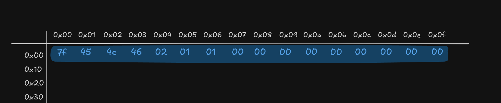

*   `e_type + e_machine + e_version`   
     — Bytes \[0x10 to 0x11\] specifies `ELF Type` . Here, `0x02 0x00` means `Executable file` .  
     — Bytes \[0x12 to 0x13\] specifies `ELF Architecture` . Here, `0x3E 0x00` means `AMD x86–64 architecture` .  
     — Bytes \[0x14 to 0x17\] specifies `ELF Version` . Here, `0x01 0x00 0x00 0x00` means `Current Version` .

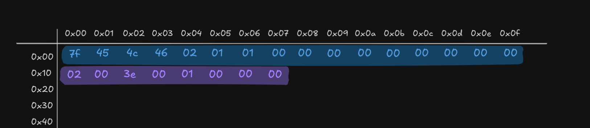

*   `e_entry`   
     — Bytes \[0x18 to 0x1F\] specifies `Virtual Memory Address` where our program begins execution.  
     — It should point to beginning of the `code section` where our instructions are present.   
    — **We will determine this after we’ve written our** `Program Header` **for** `code section` **.**

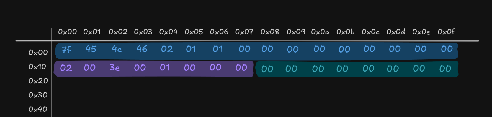

*   `e_phoff`   
     — Bytes \[0x20 to 0x27\] specifies beginning file `offset` of `Program Header Table` .  
     — **We will determine this after we’ve written our first** `Program Header` **.**

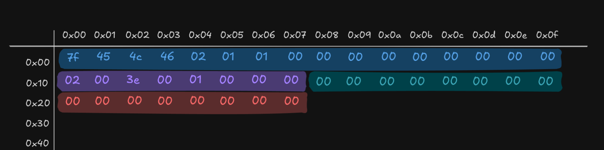

*   `e_shoff`   
     — Bytes \[0x28 to 0x2F\] specifies the beginning file `offset` of `Section Header Table` .  
     — Value of this field will be all `0s` since we won’t be writing `section headers` .


*   `e_flags` + `e_ehsize`   
     — Bytes \[0x30 to 0x33\] will be all `0s` since we don’t need to specify any `flags` for our purposes.  
     — Bytes \[0x34 to 0x35\] will be `0x40 0x00` or `64-bytes` since that will be the size of our `ELF Header Table` as we’ve seen previously while discussing `ELF Executable Specification` .

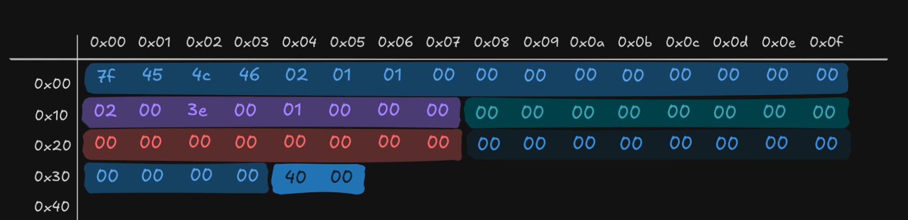

*   `e_phentsize` + `e_phnum`   
     — Bytes \[0x36 to 0x37\] will be `0x3 0x00` or `56` bytes for the size of one `Program Header` as observed previously.  
    — Bytes \[0x38 to 0x39\] will be `0x02 0x00` or `2` because we will need two `Program Headers` , one for `Code Section` and one for `Data Section` .   
     — Why two? Well… because I wanted to separate permission for segments of `Code` and `Data` sections.

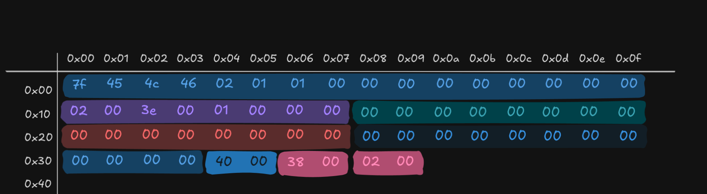

*   `e_shentsize` + `e_shnum` + `e_shstrndx`  
     — Bytes \[0x3A to 0x3B\] and Bytes \[0x3C to 0x3D\] will be `0x00 0x00` because we don’t have any `Section Headers` .  
     — Bytes \[0x3E to 0x3F\] will be `0x00 0x00` because we don’t have any `String Table Section` .

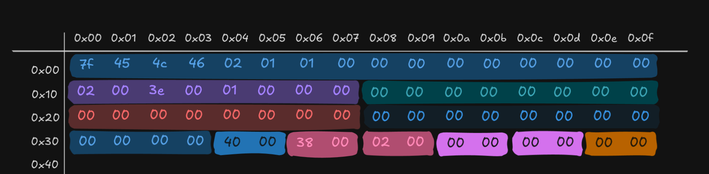

Now that concludes our `ELF File Header` but **remember,** `e_entry` **and** `e_phoff` **is yet to be determined.**

#### Bytes for Program Headers

*   Our first `Program Header` will be for `Code Section` .
*   `p_type` + `p_flags`   
     — Bytes \[0x40 to 0x43\] has value `0x01 0x00 0x00 0x00` and the value implies that this `segment` is meant to be _loaded_ into the memory.  
     — Bytes \[0x44 to 0x47\] has value `0x05 0x00 0x00 0x00` and the value implies that this `segment` when _loaded_ should have `Readable` and `Executable` permissions.

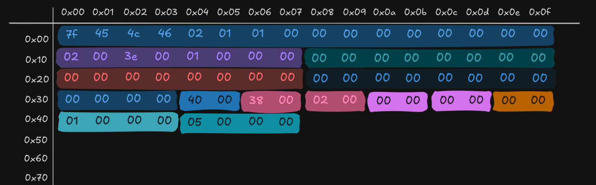

*   `p_offset` + `p_vaddr`   
     — Bytes \[0x48 to 0x4F\] will specify file `offset` at which our `section` or specifically `code section` is located at.  
     — Bytes \[0x50 to 0x57\] will specify `virtual` `memory` `address` at which we want this `segment` to load at.  
     — Recall from earlier, for **loadable** `segments`, the difference between the `p_vaddr` and the `p_offset` must be divisible by the _page size_ i.e `0x1000` bytes or `4096` bytes.  
     — **We will determine these values when we will write our** `Code Section` **.**

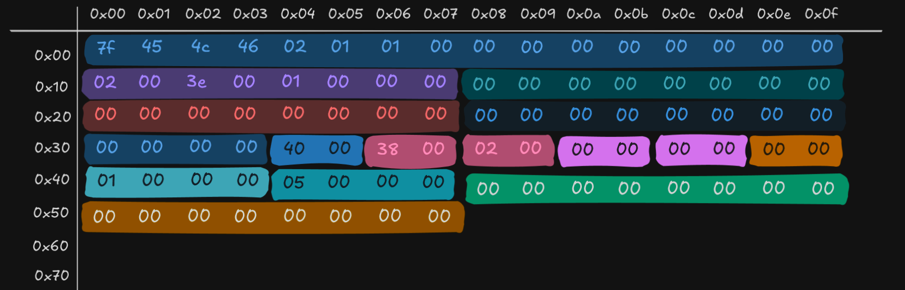

*   `p_paddr` + `p_filesz` + `p_memsz`   
     — Bytes \[0x58 to 0x5F\] will specify `Physical Memory Address` of our `header` but it is not used and hence set all to `0s` .  
     — Bytes \[0x60 to 0x67\] will specify `size` of the `segment` in the file. It has value `0x2e 0x00 0x00 0x00 0x00 0x00 0x00 0x00` because size of our `code section` is `46-bytes` or `0x2e` .  
    — Bytes \[0x68 to 0x6F\] will specify `size` of the `segment` in memory. It has value `0x2e 0x00 0x00 0x00 0x00 0x00 0x00 0x00` .  
     — `p_filesz and p_memsz` should be equal two or greater than the actual `size` of the `segment` .

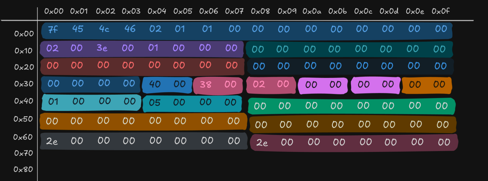

*   `p_align`   
     — Bytes \[0x70 to 0x77\] has value `0x1000` or `4096` bytes because _that is what god deemed it to be_.  
     — We used `0x1000` as its value since it is required to have `(p_vaddr — p_offset) % 0x1000 == 0` anyways.  
     — Remember, it is written in `little-endian` format.

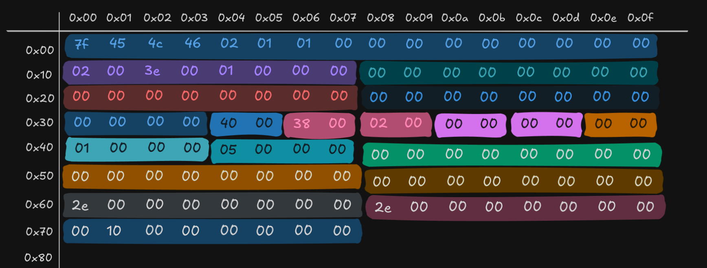

With that, we conclude our first `Program Header` . **Again, remember** `p_offset` **and** `p_vaddr` **are yet to be determined in this part.**

We will repeat the whole process for second `Program Header` . As I mentioned, we will have two `Program Headers` . One will be for `Code Section` and another will be for `Data Section` since I want to seperate out their `permissions` when they are _loaded_ into the memory.

In our `Program Header (for Code Section)` we have permissions set to `READABLE + EXECUTABLE` but in our `Program Header (for Data Section)` we have permissions set only to `READABLE` i.e `0x04 0x00 0x00 0x00` . Also, size of our `Data Section` is `12-bytes` or `0x0C` so that change is also reflected below.

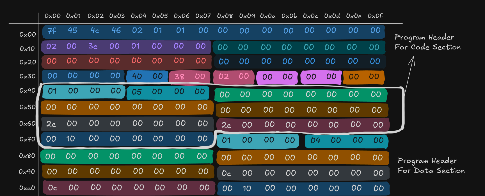

#### Bytes for Data Section

*   Our message is `Hello, Mom!` i.e of `0xC` bytes in size including `\x00` .
*   `Hex` encode the `ASCII` string and we will get `4865 6c6c 6f2c 204d 6f6d 2100` and that is our content for `Data section` which will be apended after the `Code Section` .

#### Bytes for Code Section

*   Since, we’ve written all `Program Headers` , it is safe to say that `e_phoff` **for** `code section` **is equals to** `0x40` **i.e Beginning of our** `Program Headers` **in the file.**
*   With the help of our _diagram or bytes we’ve written up till now,_ we can determine that our `Code Section` will now start from `0xb0` file `offset` and therefore our `p_offset` **for** `code section` **will be** `0xb0` .
*   We will also set `p_vaddr` **to be** `0x4000b0` , because of two reasons. First, [Stackoverflow — Why Linux GNU Linker chose 0x400000 as start address](https://stackoverflow.com/questions/14314021/why-linux-gnu-linker-chose-address-0x400000) but wait, aren’t we using `0x40000b0` , why `b0` ?
*   Second reason is because `p_vaddr` must be equal to `p_offset` , modulo `p_align` or `p_vaddr % p_align == p_offset` as specified here in [2–2 Program Headers Book I: ELF (Executable and Linking Format)](https://refspecs.linuxfoundation.org/elf/elf.pdf) and mentioned above.
*   And since our `code section` loads up at `0x4000b0` , it will also be our `e_entry` field. Thus, setting `e_entry` **to** `0x4000b0` .
*   After making the changes mentioned above also while adding our `code section` .

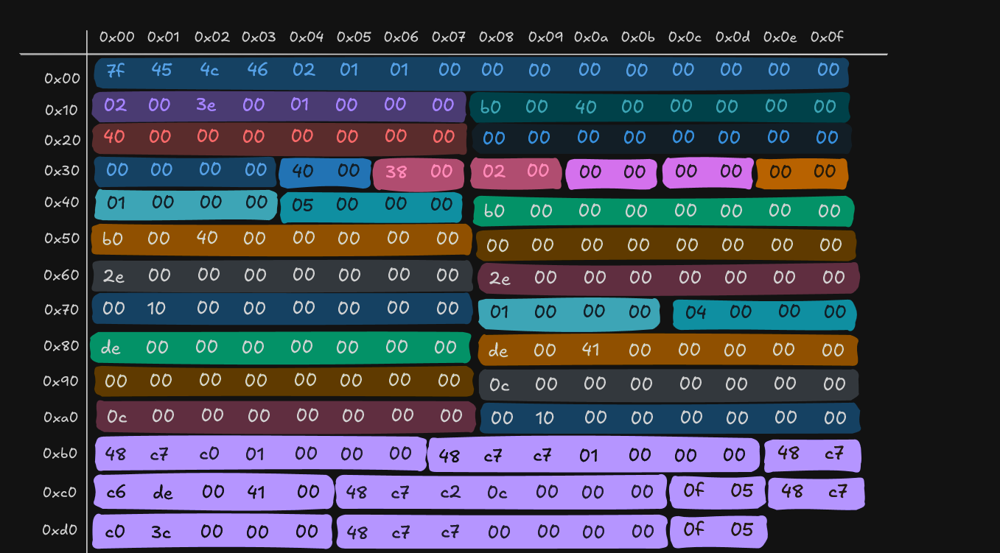

*   Since our `Code Section` ends up at `0xdd` , our `Data Section` can be appended from `0xde` . Hence, `p_offset` **for** `data section` **is** `0xde` and we can load it at `0x4100de` and therefore `p_vaddr` **for** `data section` **to be set** `0x4100de` . Why extra `0x10000` in `0x4100de`instead of `0x4000de`? **So that two** `segments` **don’t overlap!**
*   Finally, wrapping it up by adding `data section` and the complete bytes that should be written for our simple executable is the following figure.

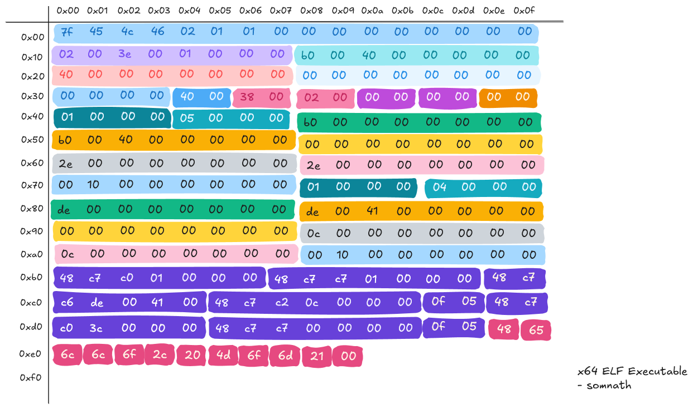

#### Echo the bytes

```sh
echo -ne "\x7f\x45\x4c\x46\x02\x01\x01\x00\x00\x00\x00\x00\x00\x00\x00\x00\x02\x00\x3e\x00\x01\x00\x00\x00\xb0\x00\x40\x00\x00\x00\x00\x00\x40\x00\x00\x00\x00\x00\x00\x00\x00\x00\x00\x00\x00\x00\x00\x00\x00\x00\x00\x00\x40\x00\x38\x00\x02\x00\x00\x00\x00\x00\x00\x00\x01\x00\x00\x00\x05\x00\x00\x00\xb0\x00\x00\x00\x00\x00\x00\x00\xb0\x00\x40\x00\x00\x00\x00\x00\x00\x00\x00\x00\x00\x00\x00\x00\x2e\x00\x00\x00\x00\x00\x00\x00\x2e\x00\x00\x00\x00\x00\x00\x00\x00\x10\x00\x00\x00\x00\x00\x00\x01\x00\x00\x00\x04\x00\x00\x00\xde\x00\x00\x00\x00\x00\x00\x00\xde\x00\x41\x00\x00\x00\x00\x00\x00\x00\x00\x00\x00\x00\x00\x00\x0c\x00\x00\x00\x00\x00\x00\x00\x0c\x00\x00\x00\x00\x00\x00\x00\x00\x10\x00\x00\x00\x00\x00\x00\x48\xc7\xc0\x01\x00\x00\x00\x48\xc7\xc7\x01\x00\x00\x00\x48\xc7\xc6\xde\x00\x41\x00\x48\xc7\xc2\x0c\x00\x00\x00\x0f\x05\x48\xc7\xc0\x3c\x00\x00\x00\x48\xc7\xc7\x00\x00\x00\x00\x0f\x05\x48\x65\x6c\x6c\x6f\x2c\x20\x4d\x6f\x6d\x21\x00" > world
```

```sh
chmod +x world
```

```sh
./world
```

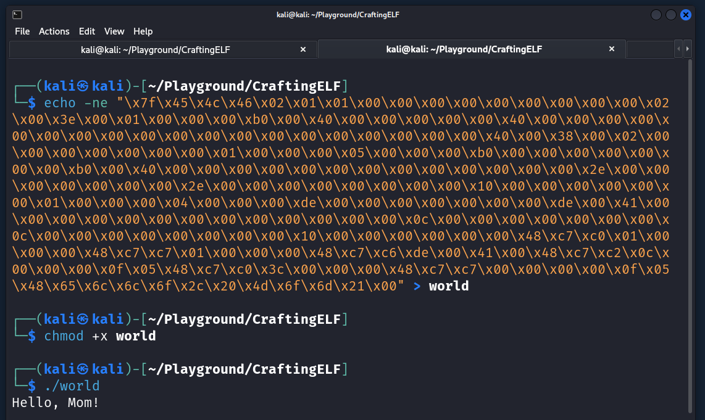

### Reference

*   [https://wiki.osdev.org/ELF](https://wiki.osdev.org/ELF)
*   [https://refspecs.linuxfoundation.org/elf/elf.pdf](https://refspecs.linuxfoundation.org/elf/elf.pdf)
*   [https://www.chromium.org/chromium-os/developer-library/reference/linux-constants/syscalls/#x86\_64-64-bit](https://www.chromium.org/chromium-os/developer-library/reference/linux-constants/syscalls/#x86_64-64-bit)
*   [https://www.amd.com/content/dam/amd/en/documents/processor-tech-docs/programmer-references/24594.pdf](https://www.amd.com/content/dam/amd/en/documents/processor-tech-docs/programmer-references/24594.pdf)
*   [https://wiki.osdev.org/X86-64\_Instruction\_Encoding#ModR/M\_and\_SIB\_bytes](https://wiki.osdev.org/X86-64_Instruction_Encoding#ModR/M_and_SIB_bytes)