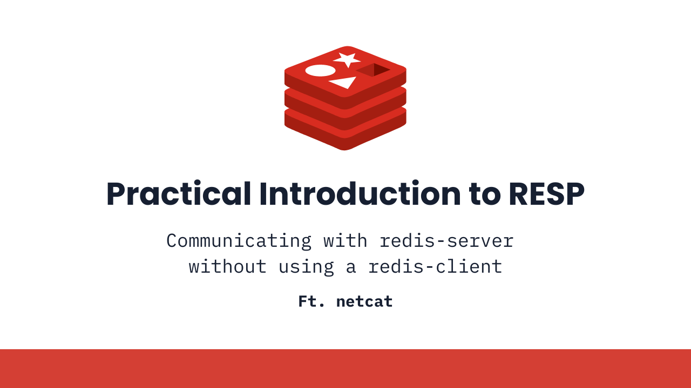
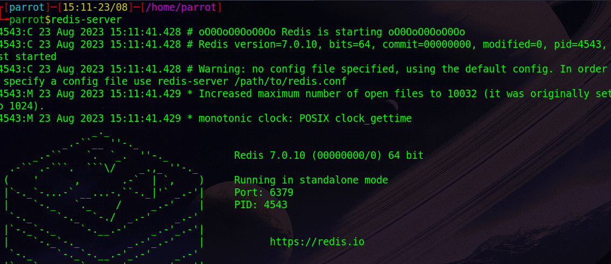
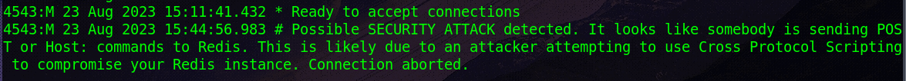
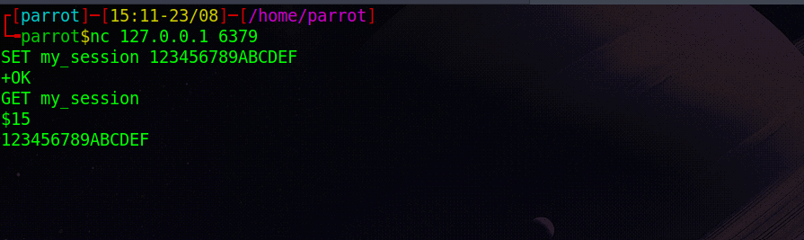
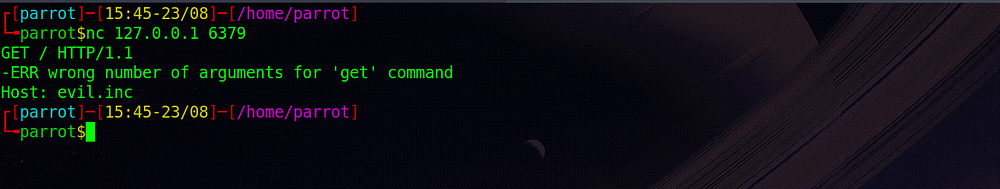
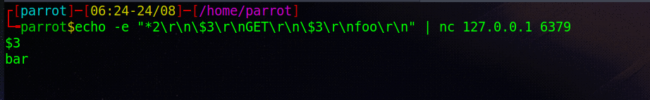
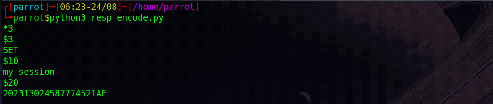

A practical introduction to Redis Serialization Protocol (RESP) to be able to communicate with any Redis-server without using a Redis-client.



## Prerequisite

1.  Installation of [Redis-db](https://redis.io/docs/getting-started/installation/install-redis-on-linux/)
2.  Installation of `ncat ` or `nc`
3.  Basic understanding of `HTTP ` Protocol

## Our First Contact

First, let’s start our `redis-server` . Most of the time, it should automatically be started when we install it but for our purpose let’s just stop it by typing:

```sh
sudo systemctl stop redis
```

Now, let’s start our `redis-server` manually by typing:

```sh
redis-server
```



Our `redis-server` has been successfully started and is running on   
`port 6379`on which is the default port for `redis` .

Next, use `nc` to connect to our `redis-server` .

```sh
nc 127.0.0.1 6379
```


Now, we are ready to interact with our `redis-server` . You can follow along by typing the following commands and we will build on top of this.

```sh
SET my_session 123456789ABCDEF
GET my_session
```


`SET` is a `redis` command which is used to “set” value of a key.

`GET` is a `redis` command which is used to “get” the value of a key.

`my_session` is the “key” here whose “value” is `123456789ABCDEF` . This “value” is `15 bytes` long.

Now, let’s take a look at responses we got in turn from our `redis-server` .

`+OK` is an example of `simple strings` , simple enough , but what in the world is going on with `$` dollar sign and our value in the next line. This is where `RESP` comes into the picture but before we take a look at using `RESP` as a protocol to communicate with our `redis-server` , let’s take a look at what happens when we try to communicate with `redis` using a protocol that isn’t `RESP` .

Any first thought when I tell you to think about some other protocol? Dread it, run from it but `HTTP` is always lurking in the crowd that makes up the internet.

## Communicating with Redis over HTTP

A simple `HTTP` request look like this:

```sh
GET / HTTP/1.1
Host: evil.inc
Accept: */*
```

Let’s try sending it to our `redis-server` , for simplicity let’s send it one by one and observe the response we get back from the `redis-server` .


Since `GET` is a valid `redis` command, it works fine but then it throws an exception. This error is pretty reasonable since we know that `GET` command accepts only `1`argument and here we’ve sent it `3`.

Something weird happens in the case of `Host:` , `redis-server` flat out disconnects us. Wonder what happened behind the scenes 😴



This was done back in `2017` to prevent `SSRF` attack by `redis` . Through this simple demonstration, I perhaps satisfied your curiosity of what happens when you try to communicate with `redis-server` using a protocol which it does not understand. But is that it? No!

You can actually communicate with `redis-server` over `HTTP` but you must do so in a way that you get your job done before `Host:` comes up as part of your valid `HTTP` request.

Think about it, if you can inject your `redis` instruction before `Host:` comes up then you can actually communicate with `redis-server` . But, I believe this is a story for another day. Let’s move on to understand `RESP` and all those weird `$` dollar signs.

We need to discuss one more thing before we move onto `RESP` and that is `CRLF` .

> The term CRLF refers to **C**arriage **R**eturn (ASCII 13, `\r`) **L**ine **F**eed (ASCII 10, `\n`). They’re used to note the termination of a line, however, dealt with differently in today’s popular Operating Systems. For example: in Windows both a CR and LF are required to note the end of a line, whereas in Linux/UNIX a LF is only required. In the HTTP protocol, the CR-LF sequence is always used to terminate a line.

You can learn more about CRLF on [OWASP](https://owasp.org/www-community/vulnerabilities/CRLF_Injection).

Long story short, just remember that “ `CRLF` is used to note the termination of a line”.

## Basics of RESP

*   **Redis clients** use a protocol called **REdis Serialization Protocol (RESP)**.
*   RESP can **serialize** different data types including integers, strings, and arrays. It also features an error-specific type.
*   A **client** sends a **request** to the Redis **server** as an **array of strings**.
*   The array’s **contents** are the **command** and its **arguments** that the **server** should **execute**.
*   The server’s reply type is command-specific.
*   RESP is binary-safe and **uses prefixed length** to **transfer bulk data** so it does not require processing bulk data transferred from one process to another.

## Using RESP

*   In RESP, **the first byte** of data determines its **type**. Subsequent bytes constitute the type’s contents.
*   The `\r\n` (CRLF) is the protocol's _terminator_, which **always** separates its parts.

Let’s take a look at previous example and try to analyze the responses in detail and understand some of many data types that RESP provides to us to work with.





1.  `+OK` is an example of `simple strings` . Encoding of each `simple string` starts with `(+)` character, followed by a string. `simple string` must not contain `\r` or `\n` and must be terminated by `\r\n` . In our case, `+OK` actually is `+OK\r\n ` as proper `RESP` encoded data and hence it is a `simple string` of `5 bytes` .
2.  `-ERR` is an example of `simple errors` . Similar to `simple strings` , these starts with `(-)` character but one must remember that main difference between `simple strings` and `simple errors` are the fact that `clients` treat `simple errors` as an “exception”.
3.  `$15` followed by the “value” of a “key” in the next line, is an example of `bulk strings` . Encoding of each `bulk string` starts with `$` (dollar sign) as its **first byte** and after that an un-signed `base-10` value and here it is `15` which defines the number of bytes of our actual content and then with a CRLF `\r\n` after which our `data` comes in and then a final CRLF `\r\n` .

One more important data-type we’ve left and that is `arrays` . Remember when they said “Client send commands to `redis-server` as `RESP Arrays` ?”. We must learn what `arrays` are and how can we properly `RESP` encode them and then we will be fluent enough to talk to our `redis-server` .

## Arrays and Commands

*   Just as `client` can send commands to `redis-server` as `arrays` , `redis-server` can also reply back in `arrays` and this is something we’ve been seeing all along through our demonstrations, go along for now and then go above to spot them.
*   `arrays` in `RESP` starts with `(*)` “asterisk” as its `first byte` immediately followed by `unsigned` `base-10` digit or digits to describe the “number of elements” the array will contain after which you have CRLF `\r\n` terminator and then an additional data-type definition for subsequent elements that the array will have.

Now that you know most of what you need to know to be able to write your own `RESP` encoded commands that will be understood by any `redis-server` , Let’s get our hands dirty by writing and understanding examples of commands in `RESP` that we will want to use:

```sh
# RESP Encoded Valid Redis Command to "GET" value of key "foo" using nc
echo -e "*2\r\n\$3\r\nGET\r\n\$3\r\nfoo\r\n" | nc 127.0.0.1 6379

# Actual RESP Encoded Valid Redis Command without extra (\) for bash to escape
*2\r\n$3\r\nGET\r\n$3\r\nfoo\r\n
```

Let’s understand this `RESP` encoded `redis` command:

1.  `*2` => (\*) to begin our array definition followed by number of elements i.e 2 then our usual CRLF `\r\n` .
2.  `$3` => ($) to begin our bulk string definition followed by length of our string then our usual CRLF `\r\n` .
3.  `GET` which is a valid `redis` command followed by our usual CRLF `\r\n` .
4.  `$3` => ($) to begin our `bulk string` definition followed by length of our string then our usual CRLF `\r\n` .
5.  `foo` which is a `key` which we’ve previously defined followed by our usual CRLF `\r\n` .

Notice that extra `\` I put before `$` , that is just to make sure our `bash` treat it as an escaped character not a part of its syntax, **you do not have to do** this when writing actual `RESP` encoded `redis` command sequence.

And of-course, output of this command:



Let’s automate this `RESP` encoding process using `python`

```py
def resp_encode(cmd_arr):
    cmd = ""
    cmd += "*" + str(len(cmd_arr)) # Array definition
    for arg in cmd_arr:
        cmd += "\r\n" + "$" + str(len(arg)) # Bulk String definition
        cmd += "\r\n" + arg
    cmd += "\r\n" # Terminating CRLF
    return cmd

cmd_arr = ["SET", "my_session", "202313024587774521AF"]
encoded_cmd = resp_encode(cmd_arr)
print(encoded_cmd)
```



I believe this is enough for a kick-starter that will help you talk to `redis-server` without using any `client` or rather if you want to develop your own `redis client` . Whatever use you make of this knowledge, have fun🍃

## Roll Credits

I recommend you to read from Official [Redis RESP Specification](https://redis.io/docs/reference/protocol-spec/), if you want to go ahead and learn about `RESP` in a complete manner. A lot of what I’ve learnt directly came from that documentation.