A write-up on “new-housing-portal” by _r2uwu2_ challenge featured in LACTF-2024 in the category of “web”.

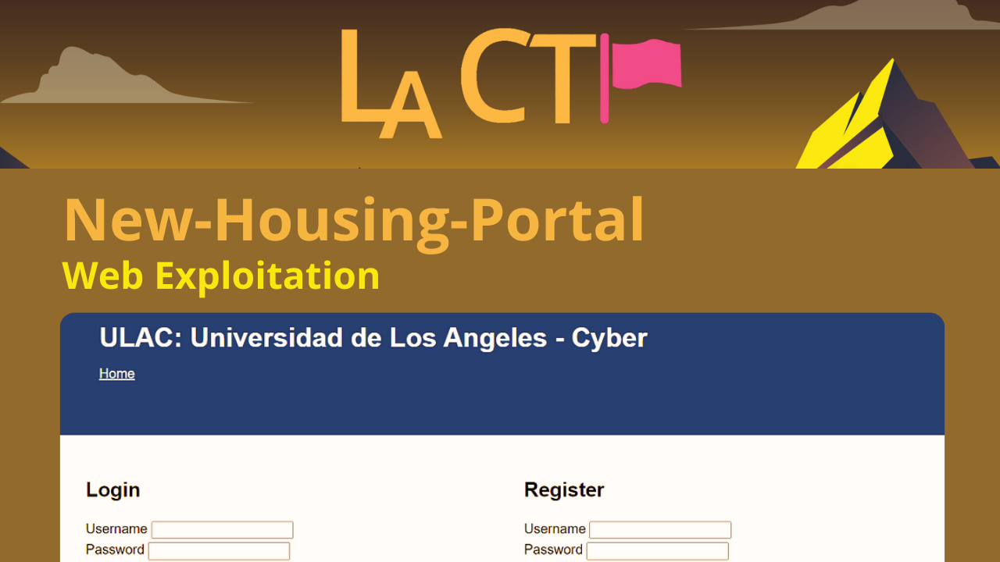

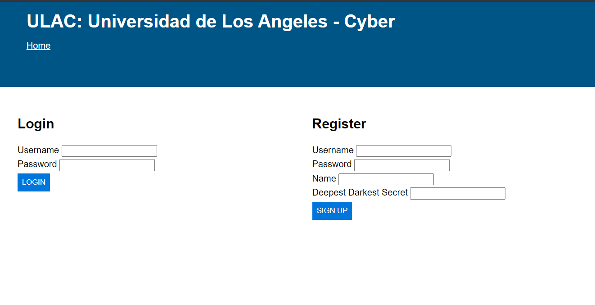

## Analysis
We begin by statically analyzing the source code provided to us.

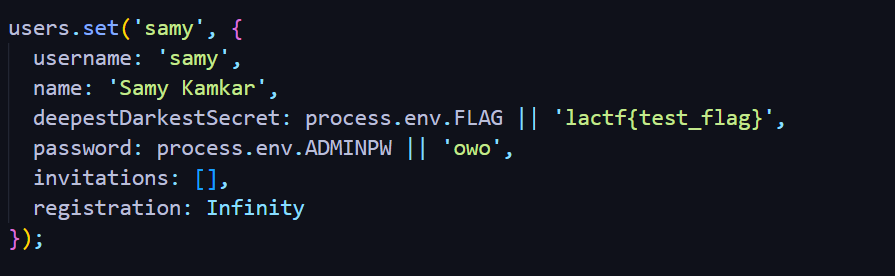

Our goal is to get the flag which “_samy_” named _user_ holds for us. Notice that variable “_deepestDarkestSecret_” is holding this value for us. Now, we must find where is this value being used.

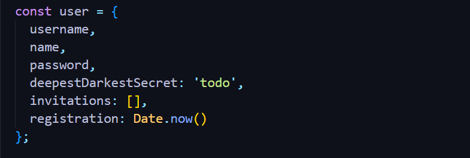

Also notice, when we “register” ourselves on the website, we get assigned a explicitly defined string literal of “_todo_” in our “_deepestDarkestSecret_” member variable. This means that we **do not control** this value. We only control our **username**, **name** and **password**.

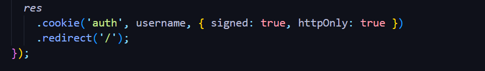

Also notice that “_auth_” cookie that is being stored has set “_httpOnly_” flag to be _true_. MDN describes the flag as follows:

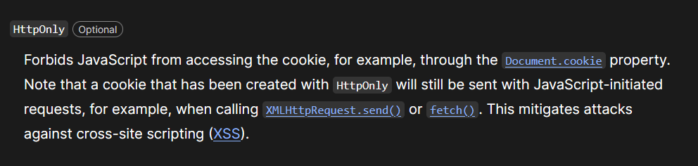

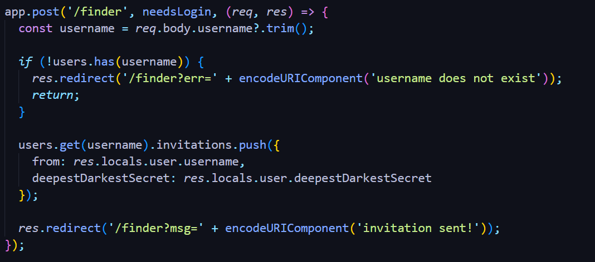

Our first encounter with the usage of “_deepestDarkestSecret_” value can be seen in this endpoint. `/finder` endpoint is used to “_invite_” other “_user_” through their “_username_”.

`Person A` invites `Person B` means `Person B` will get to see `Person A` ‘s `deepestDarkestSecret` value. Let’s find where we actually see this value.

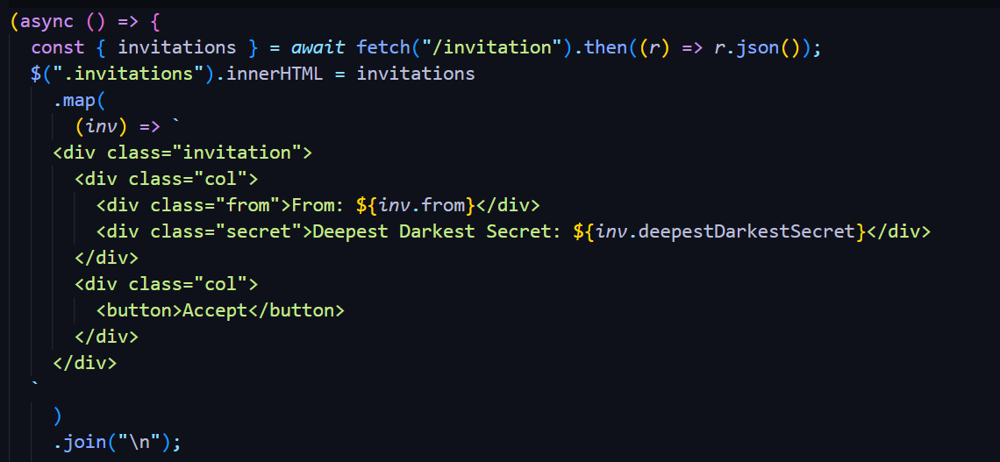

In the `/request` part of the website, we see “_username_” and “_deepestDarkestSecret_” of the “_Invitee_” i.e `the person who invited` .

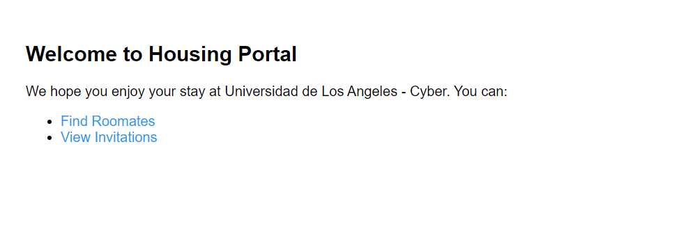

Let’s say we have two users “_fax_” and “_wax_”. Now, “_fax_” **will invite** “_wax_”.

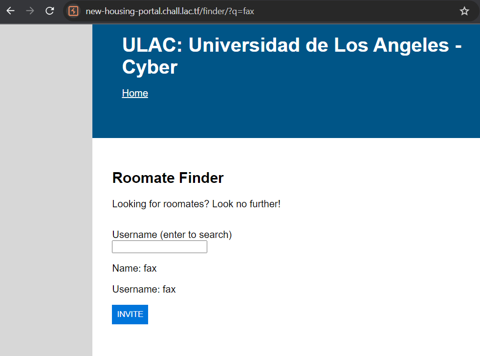

Once we hit the “_invite_” button, user “_fax_” will have an invite from “wax” in their `/request` part of the website.

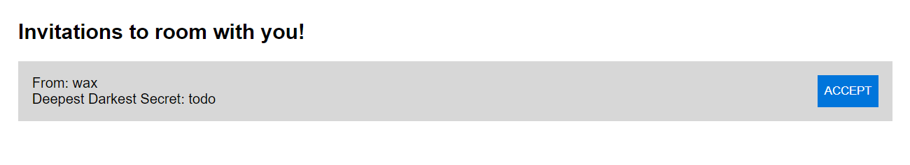

From here it becomes clear that to get _flag_, that is to get `deepestDarkestSecret` of our victim `samy` , **we must somehow make** `samy` **user invite us.** _Cross-site-scripting_ aka `XSS` enters into the picture.

I’ve been dropping every bit of information that we need in-order to execute this attack up until now.

Let’s think about the interaction between `What we control?` and `What we see?` . Think for a bit. Re-read this article if you are still unsure.

We control `username` , `name` and we see both in the request to `/finder/?q=username` .

To test and see if we can execute `javascript` through the mentioned parameter on the `/finder` page, lets try the following.

1.  Register an account with the `username` of `dragon <img src=x onerror=alert(1337)` and a normal account.
2.  Using that account, send an `invite` to the `normal` account.
3.  Visit `/finder/?q=dragon <img src=x onerror=alert(1337)` using the normal account.

![Registering an account [ Burp-Suite Tool ]](image-12.png)

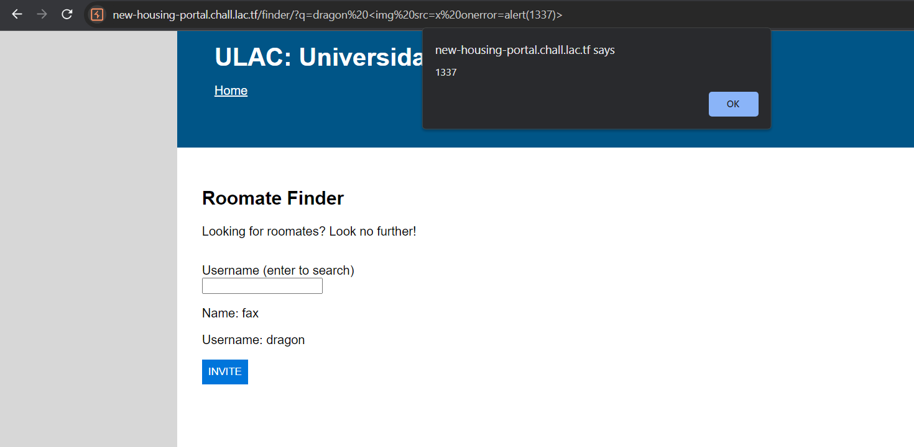

Boom! We now know that there is a `XSS` vulnerability out in the wild.

## Exploitation
Now, instead of “alerting” our `samy` , we have to `auto-click` into that `INVITE` button and send our _user_ an invite and get his `deepestDarkestSecret` .

We can select the button as follows and then use `click()` method to simulate “click on the button” and submit our _invite._

Repeat the same steps as above and check your `malicious` user-account, it will have the `deepestDarkestSecret` of the `target` user.

![Registering an account [ Burp-Suite Tool ] [2]](image-15.png)

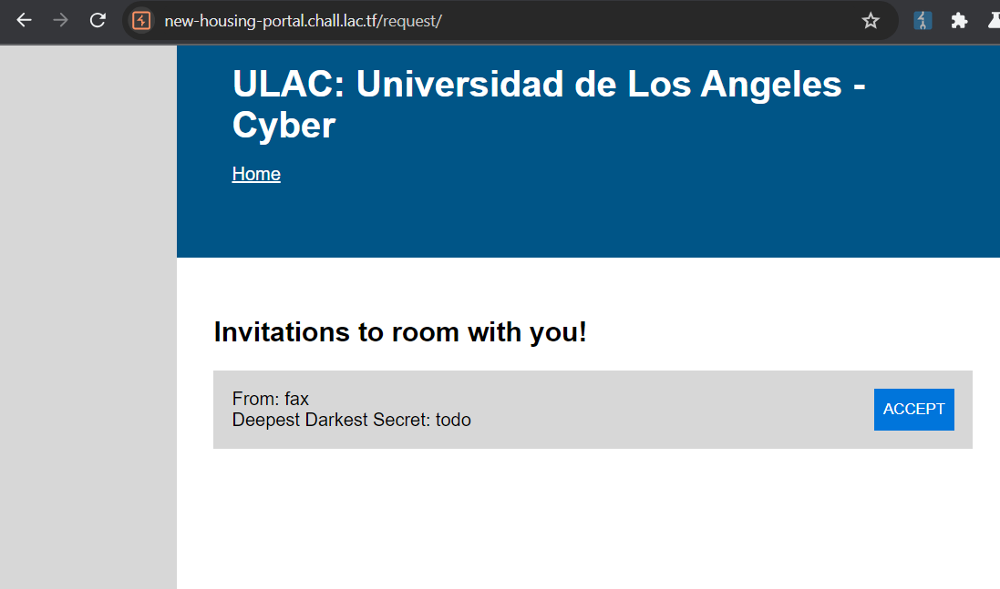

And **we have our payload ready to be sent** to the `admin bot` provided to us by them which will make a bot with account of `samy` visit the `link` provided by us.

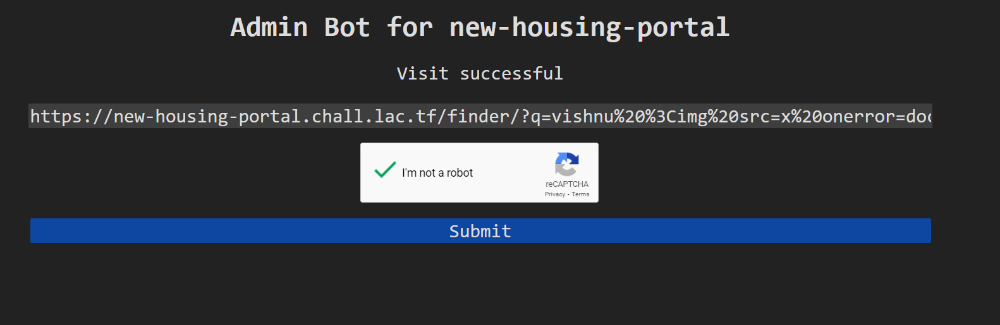

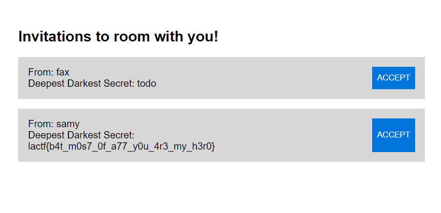

**Congratulations! We solved this challenge.**

I hope you enjoyed my courtesy for this _write-up_. If you’ve already solved this, let me know what was your approach. Thank you!

🍃 Happy Hacking!