This article covers the Redis-injection in a challenge of _corCTF 2024_ where in-validated input is combined with the usage of a critical database specific redis-client method.

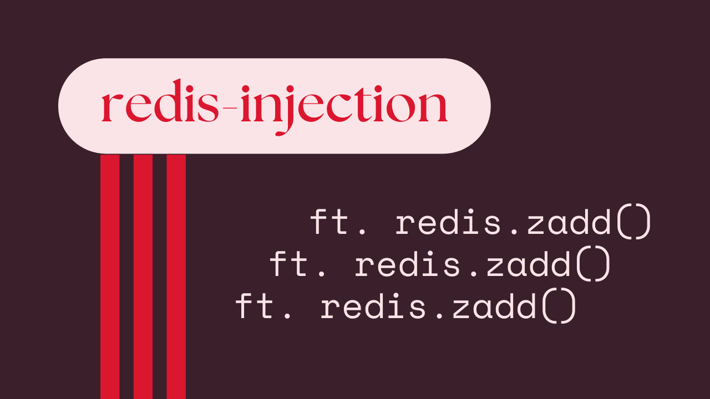

**If you are only interested in the vulnerability** [**Click Here**](https://medium.com/@dassomnath/redis-injection-ft-ioredis-zadd-041a976fe4d3#ec6b)

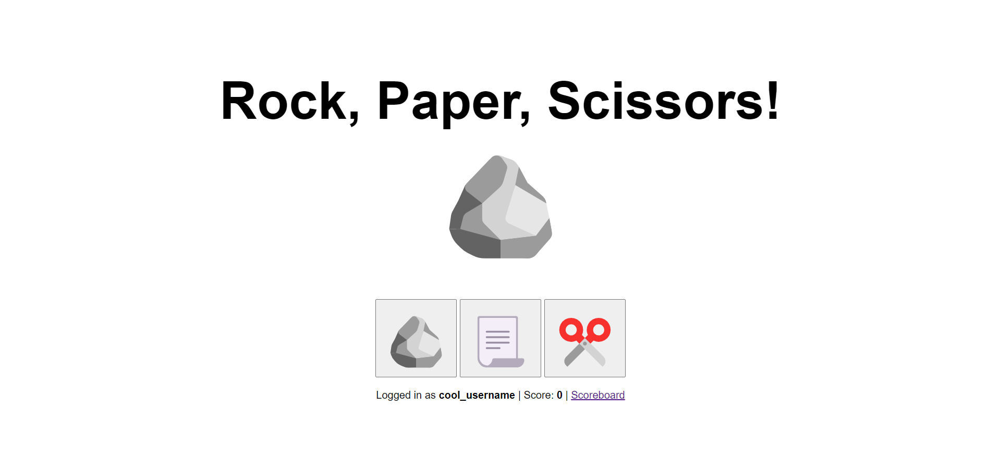

It is always a good idea to start working on a challenge by taking a high-level overview of the application. We should go ahead and interact with the application, capture various requests and responses for our web-proxy and essentially understand how it works from a user’s point of view.

## Overview of the application

The following events we have observed ::

*   When the app is first loaded in a new session, it asks us for a `username`. It then sends a `POST` request to `/new` endpoint with our username. After that, the request returns response that `set-cookie` our `session` token.

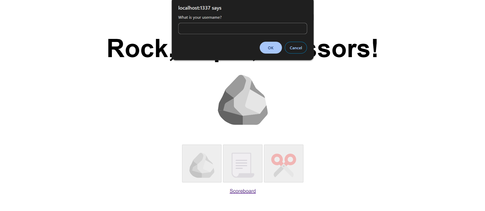

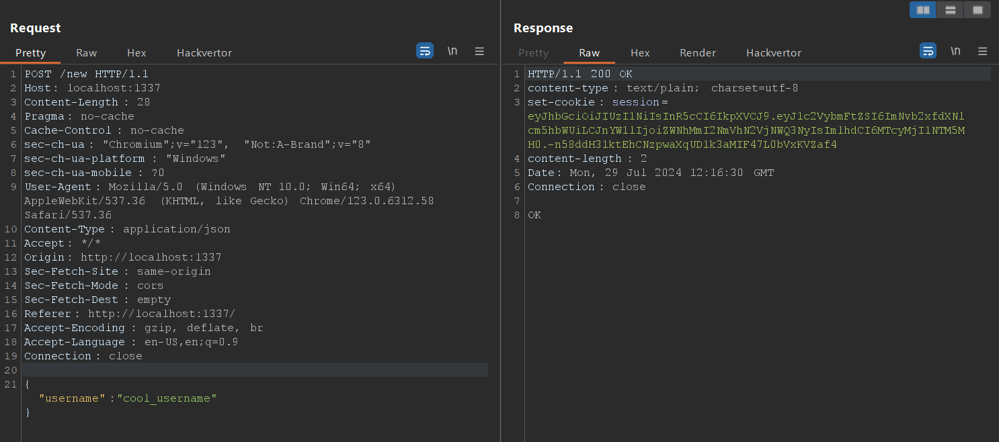

*   It also saves our `username` into `local-storage` of the browser and then starts the game. Once we choose our “move”, it sends a `request` to   
    `/play` endpoint which returns the `response` about whether we “won” or we lost and game has “ended”.

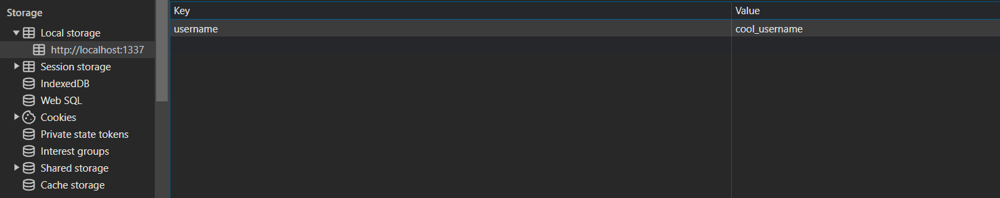

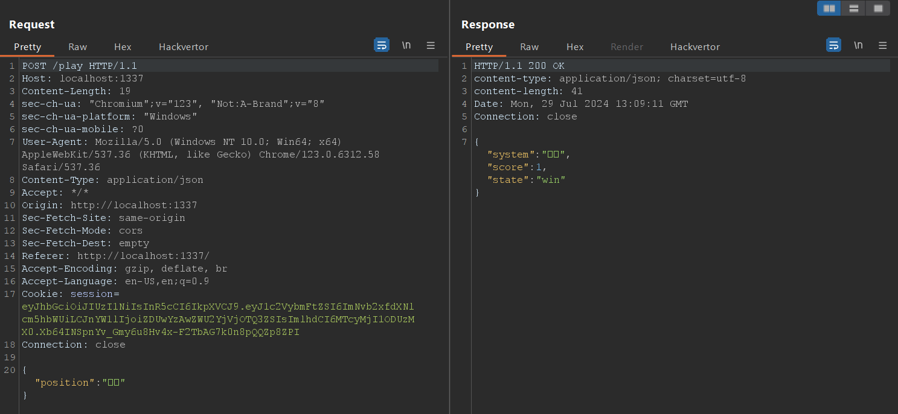

*   There is also a `scoreboard.html` page that shows us the “scoreboard”. In this page, we can observe a player with `username` `FizzBuzz101` that has scored `1336` .

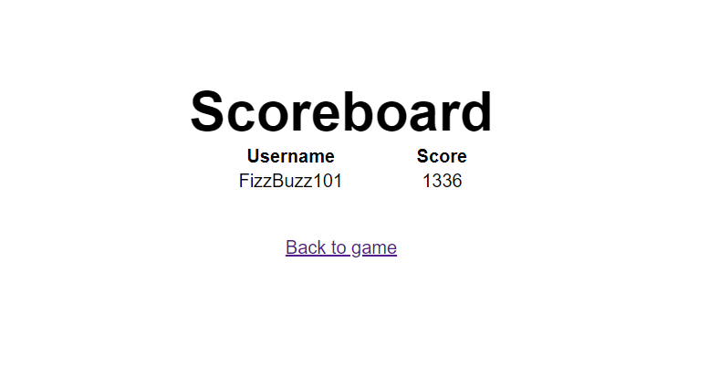

Once we have the basic overview of application and we also understand it’s flow. It’s time to analyze the provided `source-code` .

## Digging into the source

One should start by taking a look at `package.json` or something similar to figure out the `version` of various `libraries` that is being used by an application to see if any `vulnerability` is publicly-known or is being discussed upon. As of writing this article, I am not aware of any such publicly-known `vulnerability` .

In our case, `package.json` also gives a nice overview of the `tech-stack` that is being utilized for our target application. Here, they are using `fastify` which is a `web-framework` for building `Node.js` applications and `ioredis` which is a `redis-client` for `Node.js` applications.

```json
{
  "dependencies": {
    "@fastify/cookie": "^9.3.1",
    "@fastify/jwt": "^8.0.1",
    "@fastify/static": "^7.0.4",
    "fastify": "^4.28.1",
    "ioredis": "^5.4.1"
  },
  "type": "module"
}
```

Let’s move ahead and take a look at this application’s `server` code file named `index.js` ::

```js
import Redis from "ioredis";
import fastify from "fastify";
import fastifyStatic from "@fastify/static";
import fastifyJwt from "@fastify/jwt";
import fastifyCookie from "@fastify/cookie";
import { join } from "node:path";
import { randomBytes, randomInt } from "node:crypto";
```

As can be seen above, first few lines of the `index.js` is importing necessary libraries and methods to use.

*   `Redis` will be used to setup a `redis-client` instance that will interact with `redis-server` in the `back-end` .
*   `fastify` will be used to set-up the `server` that `front-end client` application will interact with.
*   `fastifyStatic` is a plugin used to serve multiple _static_ directories under a single prefix.
*   `fastifyJwt` is a utility library that provides `JWT` authentication and will be used to maintain and validate user’s game `sessions` .
*   `fastifyCookie` is another utility library that helps with maintaining browser `cookies` for the application.
*   `join` is a `Node.js` `path` function that joins all given `path` segments.
*   `randomBytes` and `randomInt` from `node::crypto` generates cryptographically strong pseudorandom data or integer values.

```js
const winning = new Map([
  ["🪨", "📃"],
  ["📃", "✂️"],
  ["✂️", "🪨"],
]);

app.register(fastifyStatic, {
  root: join(import.meta.dirname, "static"),
  prefix: "/",
});

app.register(fastifyJwt, {
  secret: process.env.SECRET_KEY || randomBytes(32),
  cookie: { cookieName: "session" },
});

app.register(fastifyCookie);

await redis.zadd("scoreboard", 1336, "FizzBuzz101");
```

*   `winning` stores `associative` `key:value` pair in a `Map` data-structure. This is used to check for winning “move”. For example, if game chose “🪨” (rock) then `winning` may be used to get “📃” (paper) and then compare it against `user's` choice to decide “win” or “end”.
*   `app.register(...)` sets up additional plugins or related libraries.
*   `redis.zadd(...)` is used to set `key` that is `scoreboard` to   
    `1336, "FizzBuzz101"` in the `redis` database. It seems like this is where we are getting a `user` named `FizzBuzz101` who has scored `1336` in our `scoreboard.html` page.

```js
app.post("/new", async (req, res) => {
  const { username } = req.body;
  const game = randomBytes(8).toString("hex");
  await redis.set(game, 0);
  return res
    .setCookie("session", await res.jwtSign({ username, game }))
    .send("OK");
});
```

*   `app.post(...)` triggers when a `POST` request to sent to `/new` endpoint.
*   It extracts `username` from `req.body` i.e our `request's body payload` .
*   It sets `game` string constant equal to a random `8-bytes` `hex` value.
*   It then uses `redis.set(...)` method to set `key` called `game` equal to `0` .
*   Finally, it returns `response` that sets `cookie` in our browser that is a `jwt` `signed` `token` which contains our `username` and current `game` `id` .

```js
app.post("/play", async (req, res) => {
  try {
    await req.jwtVerify();
  } catch (e) {
    return res.status(400).send({ error: "invalid token" });
  }
  const { game, username } = req.user;
  const { position } = req.body;
  const system = ["🪨", "📃", "✂️"][randomInt(3)];
  if (winning.get(system) === position) {
    const score = await redis.incr(game);

    return res.send({ system, score, state: "win" });
  } else {
    const score = await redis.getdel(game);
    if (score === null) {
      return res.status(404).send({ error: "game not found" });
    }
    await redis.zadd("scoreboard", score, username);
    return res.send({ system, score, state: "end" });
  }
});
```

*   `app.post(...)` triggers when a `POST` request is sent to `/play` endpoint.
*   First, it tries to verify our `jwt` `token` using `req.jwtVerify()` . If any error then it returns `Status Code : 400` otherwise it continues.
*   It then extracts our `game` `id` and `username` from `req.user` i.e basically from `session` cookie that has `jwt` `token` which it received from our side.
*   It then extracts `position` from `req.body` that is our “move”.
*   `system` constant contains choice made by the game that is randomly selected using index of value `randomInt(3)` .
*   Next, it checks for `winning` `condition` and if it `matches` then it `increments` the `value` of `key` called whatever `game` variable contains by `1` using `redis.incr(game)` method. After that, it sends back our `response` with `state:"win"` .
*   Otherwise, if it doesn’t match then it stores the value from `key` called `game` into `score` constant after that deletes the _key:value_ pair from redis database using `redis.getdel(game)` method.
*   If `score == null` then it means there was no `game` session.
*   Next `res.zadd(...)` is again used to set `scoreboard` key with value `score, username` as provided.
*   Finally, it returns the `response` with `state:"end"` .

```js
app.get("/flag", async (req, res) => {
  try {
    await req.jwtVerify();
  } catch (e) {
    return res.status(400).send({ error: "invalid token" });
  }
  const score = await redis.zscore("scoreboard", req.user.username);
  if (score && score > 1336) {
    return res.send(process.env.FLAG || "corctf{test_flag}");
  }
  return res.send("You gotta beat Fizz!");
});
```

*   `app.get(...)` triggers when a `GET` request is to sent to `/flag` endpoint.
*   First, it tries to verify our `jwt` `token` using `req.jwtVerify()` . If any error then it returns `Status Code : 400` otherwise it continues.
*   It retrieves score from `scoreboard` key using `redis.zscore(...)` and stores it into `score` constant.
*   It then checks if retrieved `score` exists and if it does then is it `greater than` “1336”. If it is then it returns the `flag` and if it is not then it continues and returns the message “You gotta beat Fizz!”.

## Pitfalls

*   One might be tempted to set their `username` to `FizzBuzz101` and then try to `increment` their score.
*   It does not work because of the application’s way of handling `game` session and setting `score` .
*   The following line initially sets up our `game` session when we send our `username` to `/new` endpoint which is later stored in a `session` cookie that contains `jwt` with `game` and `username` as payloads.

```js
const game = randomBytes(8).toString("hex");
await redis.set(game, 0);
return res
    .setCookie("session", await res.jwtSign({ username, game }))
    .send("OK");
```

*   Then if we “win ” then the following lines `increment` our score

```js
const { game, username } = req.user;
const { position } = req.body;
const system = ["🪨", "📃", "✂️"][randomInt(3)];
if (winning.get(system) === position) {
   const score = await redis.incr(game);
   ...
}
```

*   If we “lose” then the following lines gets our `score` from the `key` called `game` and then deletes it. Only after that, it adds it to the `scoreboard` .

```js
const score = await redis.getdel(game);
await redis.zadd("scoreboard", score, username);
```

*   We can set ourselves to become `FizzBuzz101` user and have ourselves the score of `1336` but we need a `score` that is `greater than 1336` and to `increment` it we need to increment `FizzBuzz101` ‘s `game` session score which is only temporary and in the `scoreboard` , only the final score is set once we “lose” and that score is derived from `game` key’s value.
*   `Score` set in `scoreboard` is the final state of a user’s `game` session and therefore it cannot be `incremented` once a `game` session is over and any attempt to do so will only `overwrite` their previous `scoreboard` value.

## Research and Vulnerability

A very common mantra that is recited during `web` `pentesting` is ::

> “What do we control?” and “Where are they being used?”

*   We control `username` that we first `input` and is persisted with `jwt` `token` in `session` cookie that is consumed by the application. We also control `position` that is our `choice` or “move” in the game.
*   `position` is used at the following occasion ::

```js
if (winning.get(system) === position) {...}
```

*   `username` is used at the following occasions ::

```js
// 1. inside app.post("/new", ...)
return res
    .setCookie("session", await res.jwtSign({ username, game }))
    .send("OK");

// 2. inside app.post("/play", ...)
await redis.zadd("scoreboard", score, username);

// 3. inside app.get("/flag", ...)
const score = await redis.zscore("scoreboard", req.user.username);
```

*   Since, there is a strict `===` type-check, we can let go of any   
    `type-juggling` ideas for `position` variable to bypass the `checking condition` . Learn more about this on [freecodecamp.org/loose-vs-strict-equality-in-javascript](https://www.freecodecamp.org/news/loose-vs-strict-equality-in-javascript/).
*   `First` use of `username` input tells us that our input is being stored inside `session` cookie in the payload of `jwt` `token` . There is no `sanitization` in place meaning whatever we enter for the `username` persist throughout our session.
*   `Second` use of `username` input should point us towards learning more about `redis.zadd(...)` method. Let’s dig a bit deeper into that.
*   An example use of `redis.zadd(...)` can be found in the `Readme` for `ioredis` library at [https://github.com/redis/ioredis?tab=readme-ov-file#basic-usage](https://github.com/redis/ioredis?tab=readme-ov-file#basic-usage).


```js
redis.zadd("sortedSet", 1, "one", 2, "dos", 4, "quatro", 3, "three");
redis.zrange("sortedSet", 0, 2, "WITHSCORES").then((elements) => {
  // ["one", "1", "dos", "2", "three", "3"] 
 // as if the command was `redis> ZRANGE sortedSet 0 2 WITHSCORES`
  console.log(elements);
});
```

*   The above tells us that `redis.zadd(...)` method can be used to add one or “more than one” member for the `key` .
*   To verify this, let’s take a look at [https://github.com/redis/ioredis/blob/main/lib/utils/RedisCommander.ts#L10362](https://github.com/redis/ioredis/blob/main/lib/utils/RedisCommander.ts#L10362)

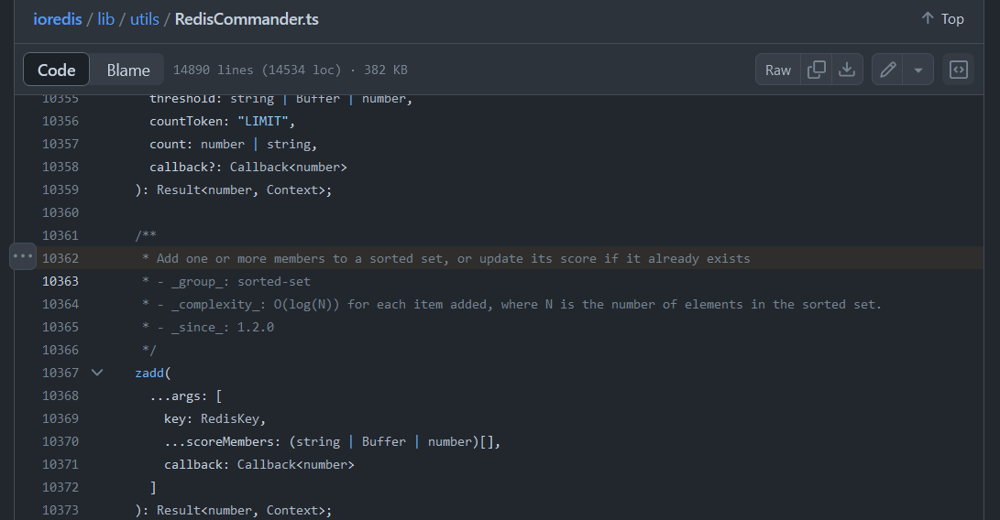

*   The same can also be found more easily on [https://redis.github.io/ioredis/classes/Redis.html#zadd](https://redis.github.io/ioredis/classes/Redis.html#zadd).

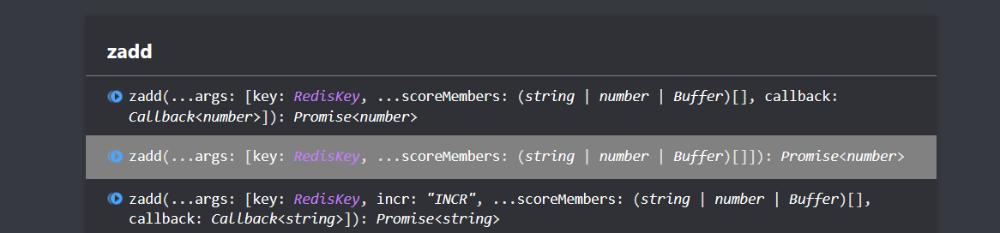

*   So, we know that `redis.zadd(...)` is used to add our `score`, `username` as members for `key` called `scoreboard` in our `target` application. Thus, having the ability of adding “more than one” member i.e “multiple members” can potentially allow us to “add our own values” given that our `input` goes properly into the method’s `argument` without any _validation._
*   `Third` use of `username` input tells us that the `username` from our `jwt` `token` is being used to fetch for `score` .

## Exploitation

*   Now, our goal becomes to add “extra members”. From what we have learnt so far, the flow of using `redis.zadd(...)` goes like `redis.zadd("scoreboard", score, username)` and we control `username` , so if we put more than one `value` in `username` then we will be able to add our own “members”.
*   It will be like `[score1, username1, score2, username2]` . Thus, providing an `array` as our `username` seems sensible in this case. Let’s debug and take a look at how our various inputs behave ::

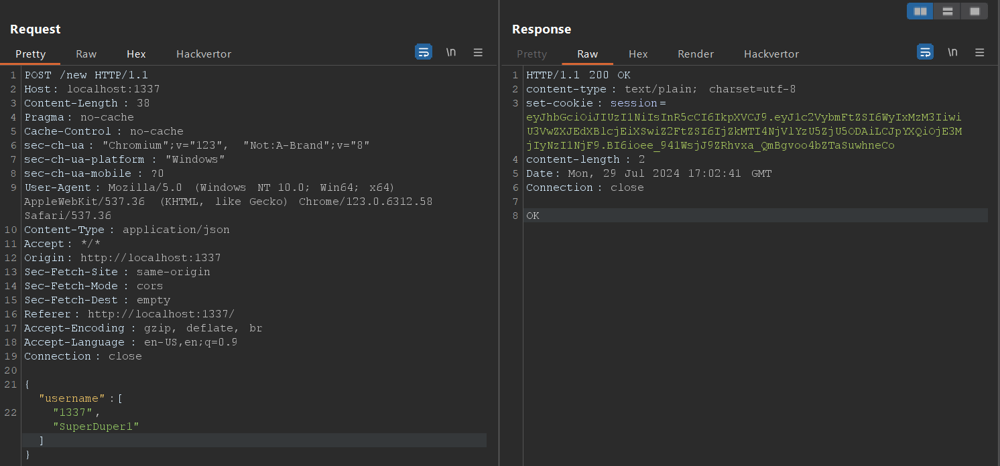

*   First, we will try to modify our `username` input point to be an `array` ::

```js
{"username":["1337", "SuperDuper1"]}
```

*   Then we will copy the `session` token in the response and use it to send a request at `/play` endpoint ::

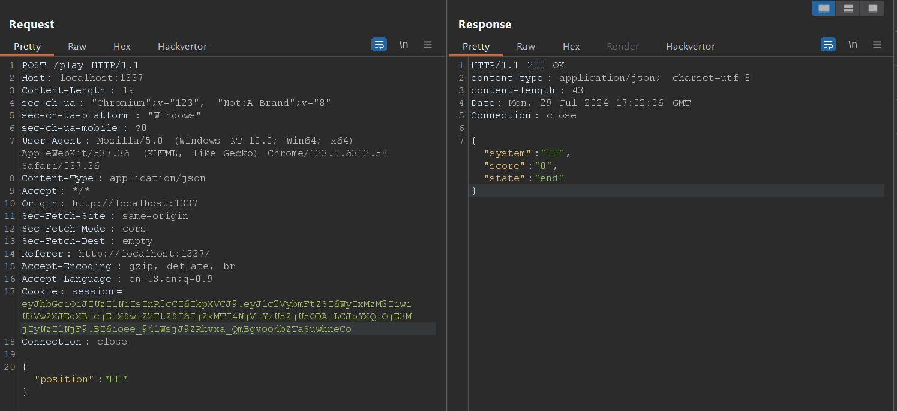

*   Everything seems okay so far. Let’s check our debug console.

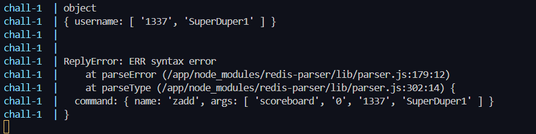

*   We can see that we are able to `inject` our desirable values into the `arguments` for `redis.zadd(...)` function but a  
     `ReplyError: RR syntax error` occurred.
*   In here, we made a mistake with the way we entered our values. Recall that `args` should contain `[score1, username1, score2, username2]` but instead it currently has `[score1, score2, username2]` .

_Note :: The above was a mistake which I made in a hurry and spend stupidly long minutes to figure out, I decided to keep it in to show you that_   
**“it is what it is”.**

*   Let’s fix our mistake with the following payload ::

```js
{"username":["TrialGuy1", "1337", "SuperDuper1"]}
```

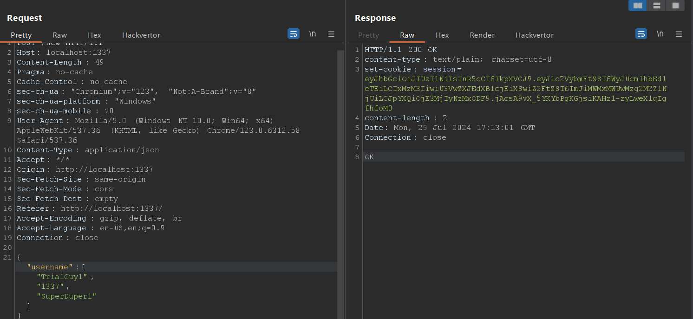

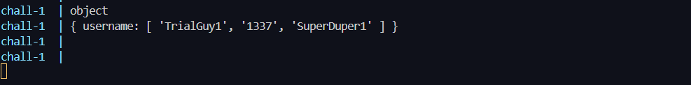

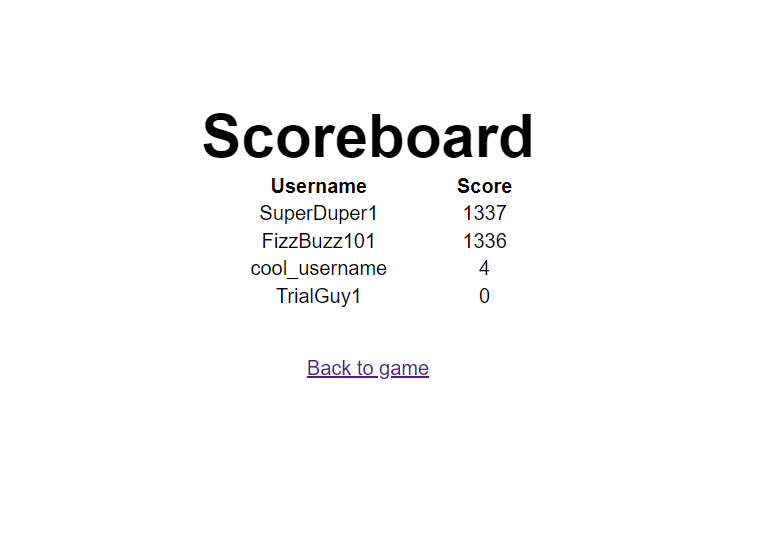

*   Chipped it in. It worked 😆. Now, let’s get our flag in the deployed-instance.
*   Also, to get the `flag` remember the `Third` use of our `username` input. Our `username` is coming from our `JWT` `Token` and thus, make sure to generate a `token` with the `injected` `username` to get the `flag` .

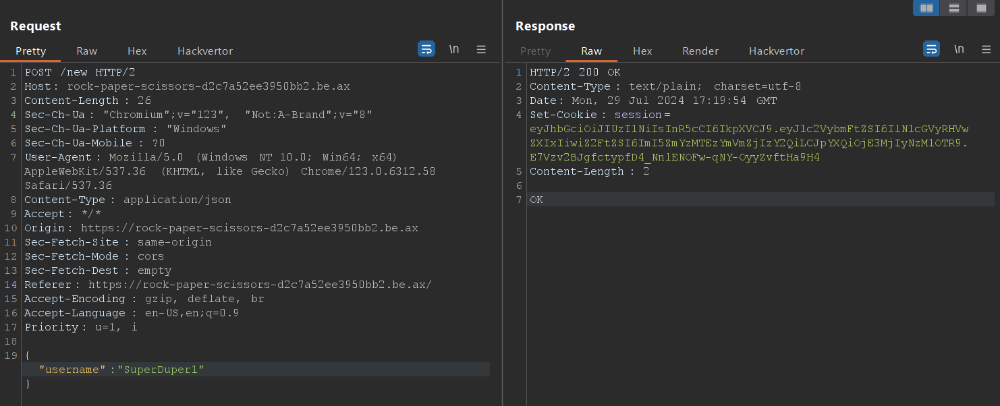

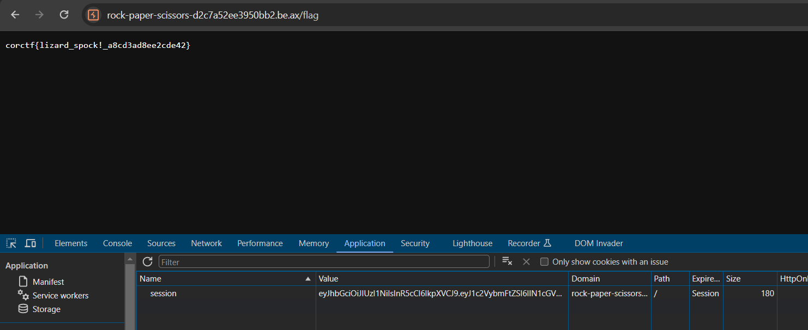

```sh
corctf{lizard_spock!_a8cd3ad8ee2cde42}
```

## Remediation

*   Validate the input you are expecting.
*   Here, one can use [https://www.npmjs.com/package/yup](https://www.npmjs.com/package/yup "https://www.npmjs.com/package/yup") for Object-Schema validation.