This article covers a few anomalies while parsing query in Express.js and how Javascript operate with different data-types that I encountered while solving a challenge from [Anveshanam](https://www.anveshanam.net/) CTF 2024. Another aspect of writing this article for me is to cover how to approach a code-review task.

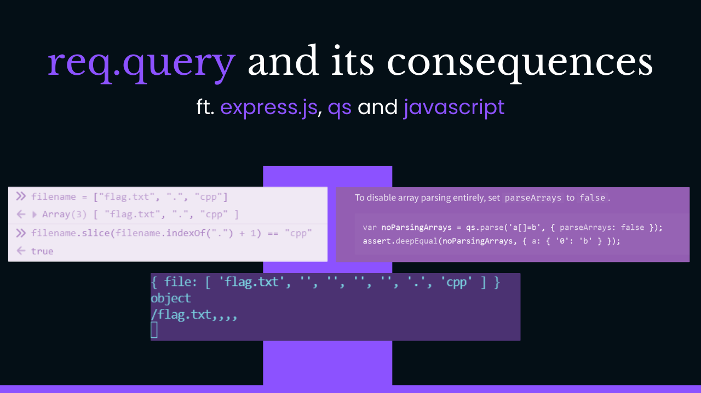


## Exploitation
It is a good idea to take a high-level overview of the web application by interacting with it directly. Our goal in this part is to figure out what “features” are made available to us by the website. Each “feature” counts as a point-of-attack.

Inspecting the page source-code in the browser or by clicking on the “links” in the home-page reveals the following endpoint that seems to fetch files from the server.

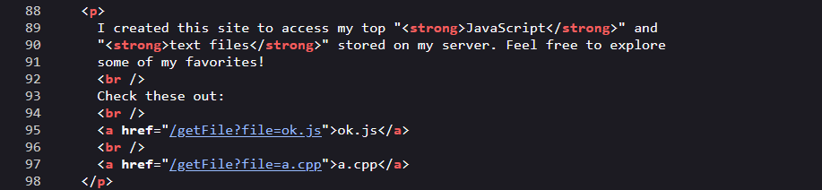

Okay, so we have discovered a “**feature**” whose behavior is to “**fetch**” files from the “**server**” and as we can observe in the above snapshot of the page-source that `URL Query` is taking a `parameter` called `file` whose value is expected to be a `filename` . In this case, we can see `file=ok.js` and `file=a.cpp` .

This should prompt us to think about `File Inclusion Vulnerability` and we can try some basic payloads such as `../../etc/passwd` or `....//....//etc/passwd`

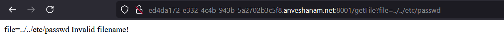

And you would realize that those payloads are not working. So, we can conclude that there must be some check in place and therefore we will not blindly throw random payloads at it because we have the source-code to later analyze this behavior.

Also, if we simply try “fetching” for `flag.txt` . We see that it is also checking for `filetype` . We can also try for `null-bytes` and other tricks but they are not going to work as far as I’ve tried.


By interacting with the web application, we now know the `feature` that is being offered to us and that is to `fetch` `files` using `filename` from the `server` through the `URL Query` `param` . We also concluded that there is a check on `filename` and `file-type` , preventing us to `arbitrarily` access `files` on the `server` .

Now, let's take a look at files in the source code that was provided to us ::

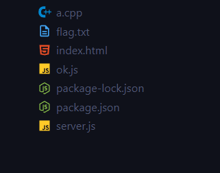

*   `a.cpp` and `ok.js` — are some files which we can access.
*   `flag.txt` — seems to be our `target` file that we have to `fetch` .
*   `index.html` — HTML source code for browser to render.
*   `package.json` — Provides us with dependency listings and version ranges of used `npm` libraries.
*   `package-lock.json` — Is responsible for resolving and documenting the precise dependencies of used libraries.
*   `server.js` — seems to be the main `entry` point for the application.

Let’s start by inspecting the `entry` point of the application i.e `server.js` file ::

```js
const express = require("express");
const path = require("path");
const fs = require("fs");

const app = express();

const PORT = 80;

app.listen(PORT, () => {
  console.log(`Listening on port ${PORT}`);
});
```

The above chunk of the code seems to import `libraries` that will be utilized by the `server` application and also the `server` will be listening on port `80`. With this part, we know that we are dealing with `express.js` based `node.js` `server` application.

```js
app.get("/getFile", (req, res) => {...}
```

As we’ve previously encountered the `getFile` endpoint of the application above, now we will dive into its inner working piece-by-piece. Make sure that you are able to recall everything we’ve learnt about this `endpoint` above.

```js
let { file } = req.query;

if (!file) {
  res.send(`file=${file}\nFilename not specified!`);
  return;
}
```

So we are extracting `file` `object` from `req.query` object then we are checking whether `file` `object` exists and if it doesn’t then we `res.send()` a response back and `return` i.e `terminate` the execution of further code.

Let’s setup our own running instance of this application using the provided `source-code` to debug it and see the behind-the-scenes. Once our setup is ready, we can try adding debug code such as `console.log()` to inspect values.

```js
console.log(req.query);
```

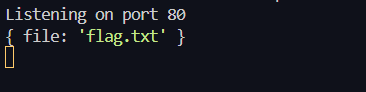

In the above snapshot, we can see what application sees in `req.query` when we send it a request with `getFile?file=flag.txt` . We might need to add more of such `debug` statements to continue our research about the `application` behavior when given the `source-code` .

`req.query` is where our `input` resides which is then extracted and stored in `file` variable therefore we must carefully observe parts of the code where our `input` is being used.

Let’s continue our `code-review` by moving to the next part of the `server.js` `code` .

```js
try {
  if (file.includes(" ") || file.includes("/")) {
    res.send(`file=${file}\nInvalid filename!`);
    return;
  }
} catch (err) {
  res.send("An error occured!");
  return;
}
```

In the above code, we can see that it is checking whether our `input` includes `space` or `/` and if it does then it is sending back a response using `res.send()` function and after that it is terminating the further execution using `return` statement. `catch` block is to handle for any unexpected `errors` which in this case simply sends a generic response and terminates the further execution.

```js
if (!allowedFileType(file)) {
  res.send(`File type not allowed`);
  return;
}
```

Next block as we can see above is using a `function` called `allowedFileType` which seems to return a `boolean` value and it takes our `file` as an `input` and if it returns `false` then `!false` becomes `true` and therefore executing this `if-else` statement which sends back a response using `res.send()` and after that terminates the further execution.

Now, lets take a look at `allowedFileType` function ::

```js
function allowedFileType(file) {
  const format = file.slice(file.indexOf(".") + 1);
  ...
}
```

`format` variables stores the result of `string` manipulation that is being performed on our `input` `file` . We can observe the behavior of `slice` and `indexOf` method ::

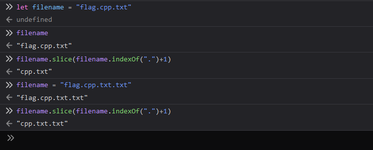

We can also read about these `methods` in the `MDN documentation` ::

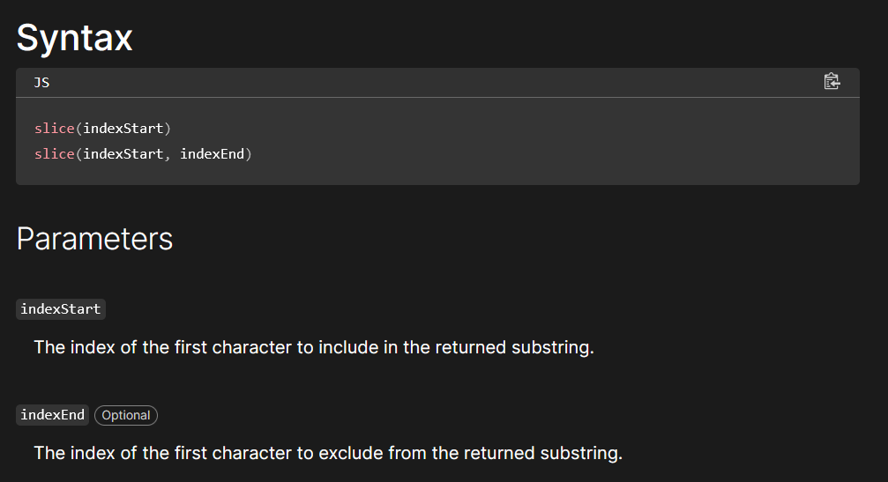

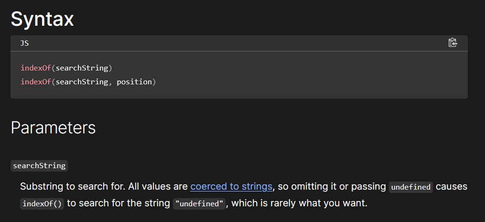

Moving onto the next code block of `allowedFileType()` function ::

```js
if (format == "js" || format == "ts" || format == "c" || format == "cpp") {
  return true;
}

return false;
```

In the above code, it is checking that the `extension` of our `file` is equals to the provided `extension` names. Remember, our goal is to `fetch` `flag.txt` file.

Moving onto the next code block of `server.js` ::

```js
if (file.length > 5) {
  file = file.slice(0, 5);
}
```

The above checks whether the length of our `file` object is above `5` and if it is then it will `slice` it down to have only `5` elements or characters. We can observe this below ::

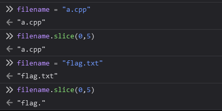

And the last chunk of code for `server.js` ::

```js
const returnedFile = path.resolve(__dirname + "/" + file);

fs.readFile(returnedFile, (err) => {
  if (err) {
    if (err.code != "ENOENT") console.log(err);
    res.send("An error occured!");
    return;
  }

  res.sendFile(returnedFile);
});
```

After all the “checks”, it is going to resolve the `filename` using our `input` i.e `file` and then it will essentially `fetch` the file.

Looking at this at first glance may not reveal any specific issues with the code-base itself. Let’s try to break down the application’s `components` , ask ourselves a few questions ::

*   `What this application is built with?` , well the answer to this is `Express.js` and there are no other `external` libraries used.
*   `What are we trying to achieve here?` , well perhaps the `flag.txt` file.
*   `Where our input i.e file variables ends up into?` , well `path.resolve()` function that fetches me the file.
*   `What is preventing us to put whatever filename we want into that variable?` , well the `checks` that are in place.
*   `What our goal becomes here?` , well to `bypass the checks` !!

Since we can see no issues with the way the `filter/check` `logic` is written for the application, we might need to take a step back and observe where our input is coming from exactly. Well, isn’t it `req.query` object? Yes, but what is it?

To continue our research, lets dive into the documentation for the `req.query` in `express.js` ::

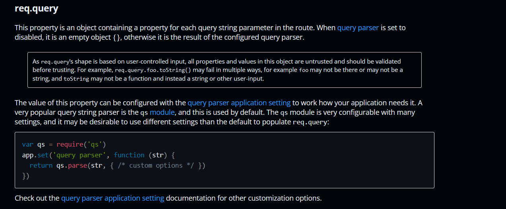

An important point to highlight in the description of `req.query` is ::

```
A very popular query string parser is the qs module, 
and this is used by default.
```

Now, we ask ourselves `what qs library is doing?` or `what can we do with qs library?` . It is always a good-idea to simply head over to the `library` ‘s documentation and read about what is does and how it behaves.

Please, go through the documentation and read examples as to how `qs` parses the `URL Query` :: [_https://www.npmjs.com/package/qs_](https://www.npmjs.com/package/qs)

After going through the documentation, you might’ve realized that `qs` can parse `rich-objects` such as `objects` or `arrays` beyond the simple `string` .

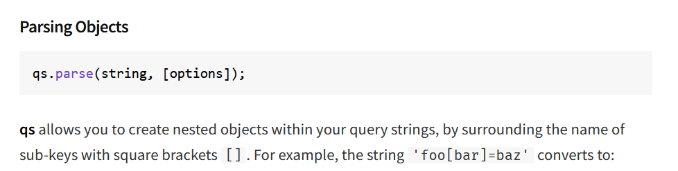

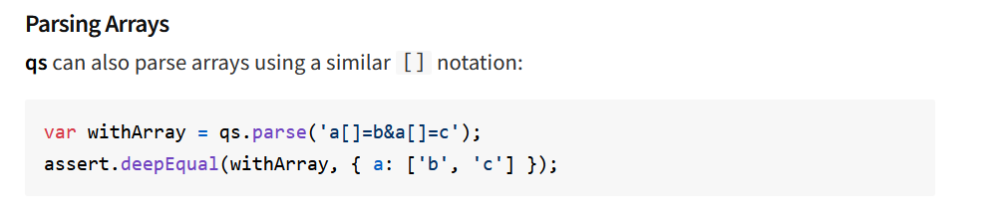

Another common strategy in bypassing `filters` is to try using different `data-types` in place of what the application expects. Here, the application expects `file` to be of type `string` and therefore it will use `string` `methods` on it but what if we pass some other `data-type` to `file` variable.

From our debugging, we can observe what type our `file` variable is ::

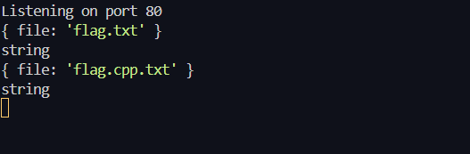

Now, we have all the recipe to move forward towards our solution. To review ::

*   We know something is up with `qs` npm library since we know that `qs` can parse beyond `string` `data-type` .
*   We know that unexpected `data-type` can result in different behavior by the application.

So, what happens if you throw-in an “array” that is being treated as a “string” by the application code?

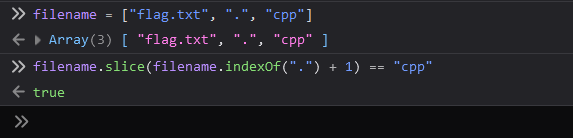

Quite weird? Well, it is a feature!!

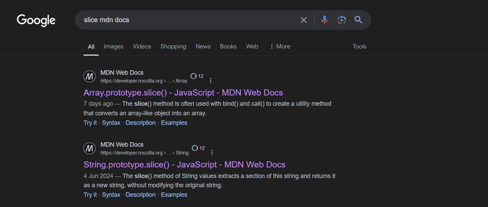

Now, what happens if we try to concatenate a “string” object with an “array”?

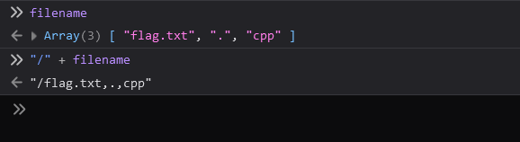

Now, lets head back to our `source-code` and see where these two `quirks` of `Javascript` comes in handy ::

```js
if (format == "js" || format == "ts" || format == "c" || format == "cpp") {
  return true;
}
```

```js
const returnedFile = path.resolve(__dirname + "/" + file);
```

```js
if (file.length > 5) {
  file = file.slice(0, 5);
}
```

If we are able to pass in `Array` into the `file` variable that is our input to the application, we can bypass the `format` check and after that we know our input is going to get `concatenated` with a `string` making the result gibberish like we’ve seen above in the browser output and thus it makes exploitation impossible.

But since we have help from within the application’s `logic` i.e the third snippet of code above that `slice` out `4` elements and thus given enough elements in our `input` `array` , we can make sure that our `filename` remains intact.

Now, lets cook the payload using all the knowledge that we have now ::

1.  Find a way to pass in the `input` as an `array` . This is where `qs` is going to help us.
2.  Push enough buffer elements into the `input` `array` to leverage the `.slice(0,5)` piece of code which will make our `filename` remain intact.

From the `qs` documentation, we can see how to pass in an `array` ::


Let’s try something like this and see the response ::

```js
getFile?file[]=flag.txt&file[]=.&file[]=cpp
```

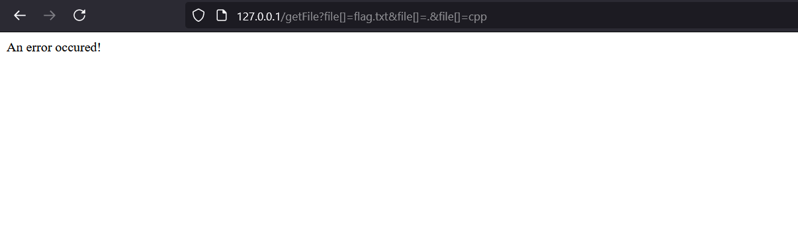

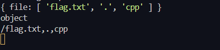

Next problem is with our `filename` that will not be resolved by the `OS` . To fix this, we will leverage the `slice(0,5)` method ::

```js
getFile?file[]=flag.txt&file[]=&file[]=&file[]=&file[]=&file[]=.&file[]=cpp
```

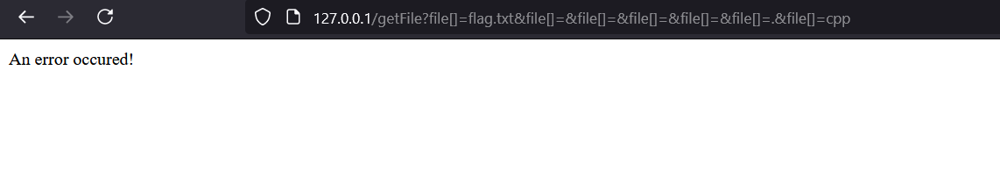

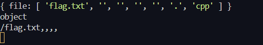

Now, we need to think of a way to remove extra `,` and we can do that by traversing directories. `path.resolve()` will resolve our provided `path` so we don’t have to care about `/,,,,` ::

```js
getFile?file[]=&file[]=&file[]=&file[]=&file[]=/../flag.txt&file[]=.&file[]=cpp
```

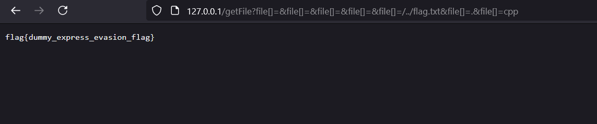

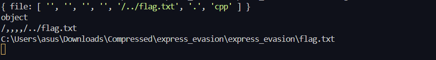

🍃 Congratulations! We’ve `fetched` the `flag.txt` file.

## Remedies

Make sure to use `===` (triple equals) for `data-type checking` and not just `value` .

Also, make sure to disable `rich-objects` to be `parsed` ::

For example, to disable `parsing` `arrays` in the `qs` settings ::

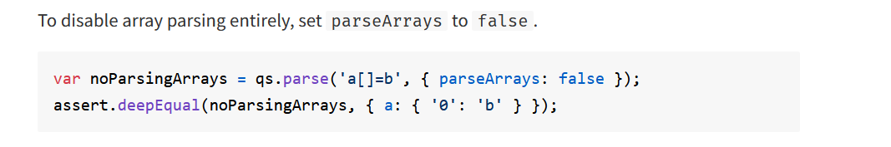